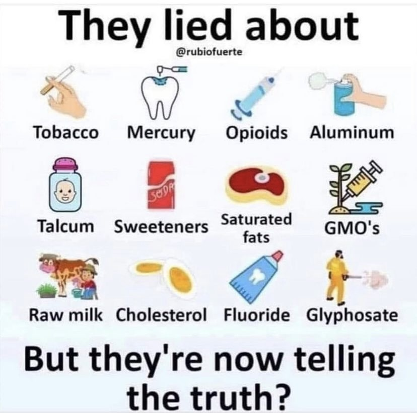
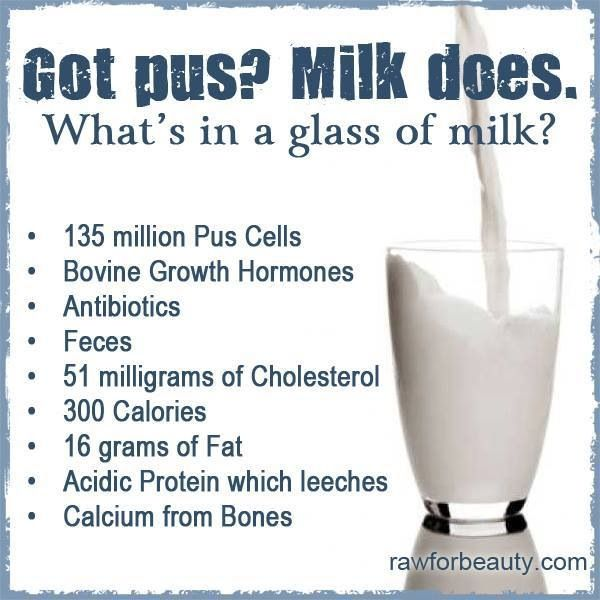
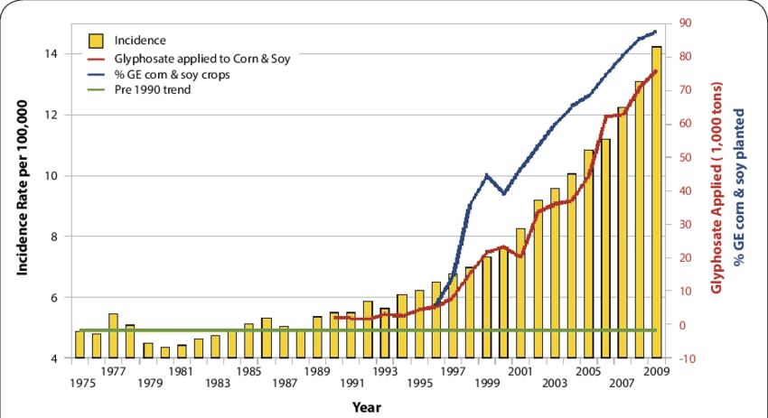
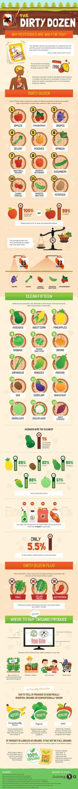

# Avoid

## Wal-mart great value brand

[fish in great value brand products](https://www.instagram.com/reel/C2qs-bHrDYQ/)

## Skin, pores, free radicals

- lotions
- soaps
- cleaning agents
- gloves

### Chemicals to Avoid in Hand Lotion

Several harmful or toxic chemicals found in hand lotion ingredients to avoid include parabens, phthalates, formaldehyde, and mineral oil. Parabens, such as methylparaben, ethylparaben, propylparaben, and butylparaben, are preservatives that can disrupt hormones and potentially contribute to breast cancer  Phthalates are used to enhance fragrance longevity and can lead to reproductive problems, hormone disruption, and other health issues  Formaldehyde, a known carcinogen, is used as a preservative and can cause skin irritation, allergies, and respiratory problems  Mineral oil, a petroleum byproduct, may contain carcinogenic PAHs and can interfere with the endocrine system, affecting immunity

### Toxic Chemicals in Hand Lotions

Research has shown that hand lotions can contain harmful or toxic chemicals that may be absorbed through the skin and cause adverse health effects. A study published in the New York Times highlighted that many personal care products, including body lotions, contain chemicals linked to various health issues such as hormone disruption, cancer, and respiratory problems

In a specific study on hand creams during the COVID-19 pandemic, researchers found that the median content of mercury in hand creams was 4.067 µg/kg, which, while within normal range, could pose a health risk with long-term exposure Mercury is a toxic element that can be absorbed through the skin, especially when it is irritated or damaged, as might occur from frequent hand washing and use of disinfectants.

Additionally, a study examining cosmetic products found that parabens, which are commonly used as preservatives in lotions, were present in almost 15% of the products tested. Parabens are linked to hormone disruption and breast cancer

Other harmful chemicals found in hand lotions include phthalates, which are associated with skin irritation, adverse reproductive outcomes, and asthma Retinyl palmitate, a vitamin A derivative, is also commonly found in lotions and has been shown to accelerate tumor development when exposed to sunlight

These findings suggest that it is important to be cautious about the ingredients in hand lotions and to choose products that are free from harmful chemicals to minimize potential health risks.

## Honey

- honey is sometimes adulterated with plain water and other sugars including hfcs (high fructose corn syrup)

## Endocrine Disruptors

Xenoestregens (BPA/BPS), Phtalates, Plastic, Parabens, PVC

## Frozen Foods

Frozen foods can be convenient, but they often come with potential health risks. Here are some of the main dangers associated with frozen foods, particularly regarding sodium content and chemical additives like PFAs (per- and polyfluoroalkyl substances):

### 1. High Sodium Content

- **Preservation**: Many frozen foods, especially processed ones like frozen dinners, pizzas, and snacks, are high in sodium. Sodium is often used as a preservative and flavor enhancer.
- **Health Risks**: High sodium intake can lead to increased blood pressure, cardiovascular disease, and other health issues. The American Heart Association recommends limiting sodium intake to less than 2,300 mg per day, ideally around 1,500 mg for most adults.

## 2. Added Sugars and Unhealthy Fats

- **Flavor Enhancement**: To improve taste, many frozen foods contain added sugars and unhealthy fats, including trans fats, which are linked to heart disease.
- **Caloric Density**: These added ingredients can make frozen foods calorie-dense without providing essential nutrients.

## Coloring

[carmine color, natural red 4, cochineal extract](https://www.facebook.com/reel/1206039707134669)

## Diet Soda

- Phenylalanine is one of the breakdown products of aspartame, an artificial sweetener commonly used in diet sodas.
- 4-methylimidazole (4-MI), which is a byproduct of the caramel coloring process used to give sodas their brown color.

## metabolic disease

### 3. Preservatives and Additives

- **Chemical Additives**: Frozen foods often contain preservatives like BHA, BHT, and sodium nitrite, which can have adverse health effects when consumed in large amounts.
- **Long-term Effects**: Some studies suggest a correlation between high intake of certain preservatives and health issues, including hormonal disruption and increased cancer risk.

### 4. PFAs (Per- and Polyfluoroalkyl Substances)

- **Chemical Coatings**: PFAs are often used in food packaging (like microwave popcorn bags) and can leach into food. They are resistant to heat, water, and oil, making them useful for packaging but also problematic for health.
- **Health Risks**: PFAs have been linked to various health issues, including immune system effects, hormone disruption, and increased risk of certain cancers. They are persistent in the environment and the human body, leading to long-term exposure concerns.

### 5. Loss of Nutritional Value

- **Freezing Process**: While freezing preserves food for longer periods, the process can lead to a loss of some vitamins and nutrients, particularly in fruits and vegetables. For example, vitamin C and certain B vitamins can degrade during freezing.
- **Cooking Methods**: How frozen foods are prepared (e.g., microwaving) can also affect their nutritional quality. Overcooking can lead to further nutrient loss.

### 6. Risk of Contamination

- **Microbial Growth**: Although freezing inhibits bacterial growth, it doesn't kill all bacteria. Improper thawing or reheating can allow bacteria to multiply, leading to foodborne illnesses.
- **Cross-contamination**: Frozen foods can be at risk for cross-contamination during processing, handling, or preparation.

### Conclusion

While frozen foods can offer convenience and a longer shelf life, it's essential to read labels carefully and be mindful of sodium content, preservatives, and potential contaminants like PFAs. Opting for whole, minimally processed frozen foods (like plain frozen vegetables or fruits) can help mitigate some of these risks. Preparing fresh meals whenever possible is generally the healthiest option.

## Dairy

### Sugar Alternative

- Acesulfame potassium (Sweet One, Sunett).
- Advantame.
- Aspartame (NutraSweet, Equal).
- Neotame (Newtame).
- Saccharin (Sweet'N Low).
- Sucralose (Splenda).
- Luo han guo (Monk Fruit in the Raw).
- Purified stevia leaf extracts (Truvia, PureVia, others).

### High Fructose Corn Syrup

## BREAD

Based on the article "Ranking The Healthiest Breads, From Best To Worst" from HuffPost and additional information regarding bread and inflammation, we can classify breads into two groups: **Super-Healthy Breads** and **Not Healthy Breads**.

### Super-Healthy Breads

1. **Whole Grain Bread**
   - **Nutritional Benefits:** Contains all parts of the grain, providing fiber, vitamins, and minerals.
   - **Inflammation Impact:** Whole grains are associated with reduced inflammation and lower risk of chronic diseases (Harvard Health).

2. **Whole Wheat Bread**
   - **Nutritional Benefits:** Similar to whole grain, it retains nutrients from the wheat kernel.
   - **Inflammation Impact:** When labeled as 100% whole wheat, it can help manage inflammation (American Heart Association).

3. **Sprouted Grain Bread (Ezekiel)**
   - **Nutritional Benefits:** Higher protein and fiber due to sprouting process; lower sodium.
   - **Inflammation Impact:** Whole grains and legumes in sprouted bread can help reduce inflammation (Journal of Nutrition).

4. **Sourdough Bread**
   - **Nutritional Benefits:** Fermented, aiding in better nutrient absorption; lower glycemic index.
   - **Inflammation Impact:** Fermentation may lower inflammatory responses compared to regular bread (Nutrients Journal).

5. **Rye Bread**
   - **Nutritional Benefits:** Good for gut health and high in fiber.
   - **Inflammation Impact:** Rye can help reduce inflammatory markers in the body (European Journal of Clinical Nutrition).

6. **Pumpernickel Bread**
   - **Nutritional Benefits:** Contains whole rye berries, rich in fiber.
   - **Inflammation Impact:** Can lower harmful gut bacteria and reduce inflammation (American Journal of Clinical Nutrition).

### Not Healthy Breads

1. **White Sandwich Bread**
   - **Nutritional Drawbacks:** Low in fiber and nutrients; primarily made from refined flour.
   - **Inflammation Impact:** Refined carbs can spike blood sugar and promote inflammation (Cleveland Clinic).

2. **Bagels**
   - **Nutritional Drawbacks:** Very dense; equivalent to consuming multiple slices of bread.
   - **Inflammation Impact:** High in refined carbs, leading to potential inflammation (Harvard Health).

3. **Brioche**
   - **Nutritional Drawbacks:** High in calories and refined flour.
   - **Inflammation Impact:** Contributes to spikes in blood sugar and inflammation (Nutrition Reviews).

4. **Flour Tortillas**
   - **Nutritional Drawbacks:** Often made with refined flour and may contain preservatives.
   - **Inflammation Impact:** Similar to white bread, their low nutritional value can lead to inflammation (Journal of the Academy of Nutrition and Dietetics).

5. **Potato Bread**
   - **Nutritional Drawbacks:** Limited nutritional value, similar to white bread.
   - **Inflammation Impact:** Contains refined flour which can lead to inflammation (Mayo Clinic).

6. **White Pita**
   - **Nutritional Drawbacks:** Similar to white sandwich bread in terms of nutrient loss.
   - **Inflammation Impact:** Low in fiber, leading to potential blood sugar spikes and inflammation (American Heart Association).

### Conclusion

Choosing breads that are whole grain or sprouted can provide significant health benefits and help manage inflammation. In contrast, breads made from refined flours should be consumed sparingly, as they can contribute to inflammation and other health issues. Always look for whole grain options to ensure you are making a healthier choice.

## Wrong Dietary Fat Sources

### Obesity

## Glyphosate

Glyphosate’s use in the U.S. has skyrocketed since 1996, the year Monsanto introduced genetically engineered seeds that could survive being sprayed with higher quantities of herbicides.

- Today, almost 90% of corn, cotton and soybean crops are modified to be tolerant to glyphosate and other chemical treatments used by farmers, U.S. Department of Agriculture data shows.
- Glyphosate residues have also been detected in air and rain samples, according to a study from the University of Minnesota.

## Food Dyes

## Artificial Sweeteners

## Toxic farming practices

Various studies have reported pesticide levels in both human blood and urine, which are further found to be associated with multiple diseases, including cancer, diabetes, hormonal disorders, asthma, metabolic diseases, and neurotoxicity. Furthermore, prolonged exposure to pesticides was also found to have teratogenic effects resulting in a reduction in birth weight, abnormal growth, diseases, and mortality

- Fragrance of food is gone in industrialized america

Toxic farming practices can significantly impact both the environment and human health, particularly in the context of fresh produce in the U.S. Here are some common practices:

- Opting for organic produce
- supporting local farms that practice sustainable methods

### Mono-crop agriculture

the practice of growing a single crop species over a large area, has several significant biological harms:

- **Reduced Biodiversity:**
  - **Loss of Habitat:** Large monoculture fields eliminate natural habitats for a wide range of organisms, including insects, birds, small mammals, and even larger animals.
  - **Limited Food Sources:** The lack of diverse plant life reduces food availability for many species, disrupting the entire food chain.
  - **Increased Vulnerability to Pests and Diseases:** When a single crop dominates, it creates ideal conditions for pests and diseases to thrive and spread rapidly. This often leads to increased reliance on harmful pesticides.

- **Soil Degradation:**
  - **Nutrient Depletion:** Continuously growing the same crop depletes specific soil nutrients, making the land less fertile over time.
  - **Erosion:** Monoculture often involves practices like tilling, which can increase soil erosion, leading to loss of topsoil and reduced water retention.
  - **Reduced Soil Microbiome:** The lack of diverse plant roots and organic matter in monoculture systems can negatively impact the beneficial soil microorganisms that are crucial for healthy soil.

- **Water Pollution:**
  - **Nutrient Runoff:** Excessive use of fertilizers in monoculture can lead to nutrient runoff into waterways, causing algal blooms and oxygen depletion, harming aquatic life.
  - **Pesticide Contamination:** Pesticides used in monoculture can contaminate water sources, posing risks to both human and wildlife health.

- **Increased Reliance on Pesticides:**
  - **Pest and Disease Outbreaks:** As mentioned, monoculture increases the risk of pest and disease outbreaks.
  - **Pesticide Resistance:** The overuse of pesticides can lead to the evolution of pesticide-resistant pests, requiring even stronger and more harmful chemicals.

- **Reduced Pollinator Health:**
  - **Lack of Diverse Pollen Sources:** Monoculture landscapes often lack the diverse floral resources that pollinators like bees and butterflies need for survival and reproduction.

### Sulfur Dioxide

### 1. **Pesticide Use**

- **Synthetic Pesticides:** Many conventional farms use synthetic pesticides that can be harmful to human health and the ecosystem. These chemicals can remain on produce, leading to potential exposure.
- **Neonicotinoids:** These are particularly concerning because they can harm pollinators like bees and have been linked to neurological issues in humans.

### 2. **Chemical Fertilizers**

- **Nitrogen and Phosphorus Overuse:** Excessive use of chemical fertilizers can lead to nutrient runoff, causing water pollution and harming aquatic ecosystems.
- **Soil Degradation:** Continuous use can degrade soil health, reducing its ability to retain moisture and nutrients.

### 3. **Monoculture Practices**

- **Lack of Crop Diversity:** Growing a single crop over large areas can lead to soil depletion, increased vulnerability to pests, and reliance on chemical inputs to manage these issues.
- **Ecosystem Disruption:** Monocultures can disrupt local ecosystems, reducing biodiversity and harming beneficial insects.

### 4. **Irrigation Practices**

- **Over-Irrigation:** Excessive irrigation can lead to salinization of the soil and depletion of local water resources.
- **Contaminated Water Sources:** Using water from polluted sources for irrigation can introduce harmful pathogens and chemicals into food crops.

### 5. **Soil Management Issues**

- **Soil Erosion:** Poor practices can lead to erosion, reducing soil fertility and increasing sediment in waterways.
- **Lack of Organic Matter:** Failing to incorporate organic matter depletes soil quality and reduces its ability to support healthy crops.

### 6. **Use of Antibiotics**

- **Livestock Antibiotics:** In some cases, antibiotics are used in plant farming as well, which can lead to antibiotic resistance and impact food safety.

### 7. **Synthetic Growth Hormones**

- **Hormone Treatments:** Some farms may use synthetic growth hormones to accelerate growth, which raises concerns about long-term health effects on consumers.

### 8. **Poor Labor Practices**

- **Exploitation of Workers:** Toxic farming practices often extend to labor conditions, where workers may be exposed to harmful chemicals without adequate protection.
- **Health Risks:** Workers in these environments face serious health risks, which can indirectly affect the safety of the produce.

## Laundry

Guppyfriend washing bag: These specialized bags capture microplastics during washing, preventing them from entering the wastewater system. You can find these online or at eco-friendly stores.

- When washed, polyester fabrics can shed microplastics, tiny plastic fibers that can enter water systems and potentially harm wildlife.

### Aflatoxins

**What Are Aflatoxins?**
Aflatoxins are toxic compounds produced by certain molds (Aspergillus species) that can grow on crops. They are particularly concerning because they are potent carcinogens.

**Health Risks:**

- Aflatoxins can cause liver damage, immune system suppression, and are linked to liver cancer. They can also affect growth and development in children.

**Foods to Avoid:**

- **Nuts**: Particularly peanuts and tree nuts (like pistachios) can be contaminated if not properly stored.
- **Grains**: Corn, rice, and wheat are susceptible to aflatoxin contamination, especially if stored improperly in warm, humid conditions.
- **Dried Fruits**: Certain dried fruits may harbor mold and aflatoxins.
- **Spices**: Some spices, particularly those sourced from regions with high humidity, can be contaminated.

### Prevention Strategies

1. **Choose Safe Sources**: Purchase food from reputable suppliers. Look for products tested for heavy metals and aflatoxins.
2. **Proper Storage**: Store grains, nuts, and seeds in cool, dry places to prevent mold growth and contamination.
3. **Diversify Your Diet**: Eating a wide variety of foods can help minimize the risk of exposure to any one contaminant.
4. **Wash and Cook Foods**: Washing vegetables and cooking food can reduce some levels of contaminants, though it may not eliminate them entirely.

### Conclusion

Being mindful of heavy metals and aflatoxins in your diet is crucial for long-term health. By avoiding certain high-risk foods and ensuring safe food practices, you can significantly reduce your exposure to these harmful compounds. Always stay informed about food safety guidelines and choose foods that are less likely to be contaminated.

## Acrylamide

Acrylamide is linked to an increased risk of cancer in some studies, although other scientists question the connection ([39Trusted Source](https://pubmed.ncbi.nlm.nih.gov/25403648/)).

Some people choose to limit their [acrylamide intake](https://www.healthline.com/nutrition/acrylamide-in-coffee) as much as possible ([40Trusted Source](https://www.fda.gov/food/chemical-contaminants-food/acrylamide-and-diet-food-storage-and-food-preparation)).

Some olive varieties -- especially ripe black olives -- may contain high amounts of acrylamide as a result of processing ([41Trusted Source](https://www.ncbi.nlm.nih.gov/pmc/articles/PMC7555664/), [42Trusted Source](https://pubmed.ncbi.nlm.nih.gov/25989363/), [43Trusted Source](http://www.fda.gov/food/foodborneillnesscontaminants/chemicalcontaminants/ucm053549.htm), [44Trusted Source](https://www.ncbi.nlm.nih.gov/pubmed/25110929)). Olive producers are investigating ways to reduce the amount of acrylamide that forms during processing.

mycotoxins, which are toxic substances produced by certain molds that can grow on grains like barley.
