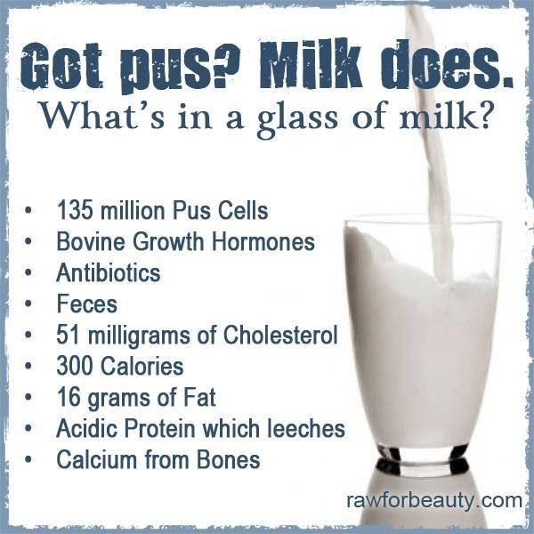
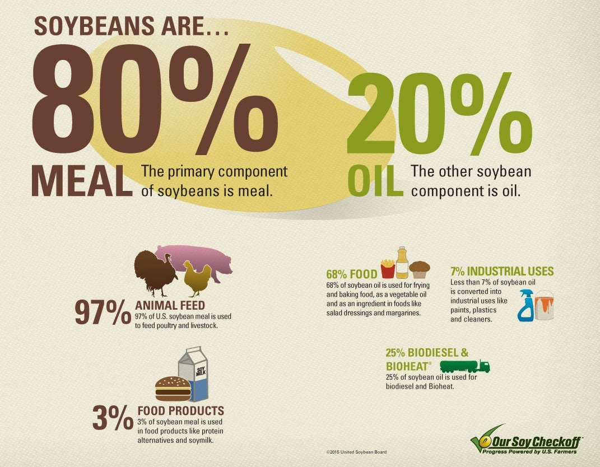
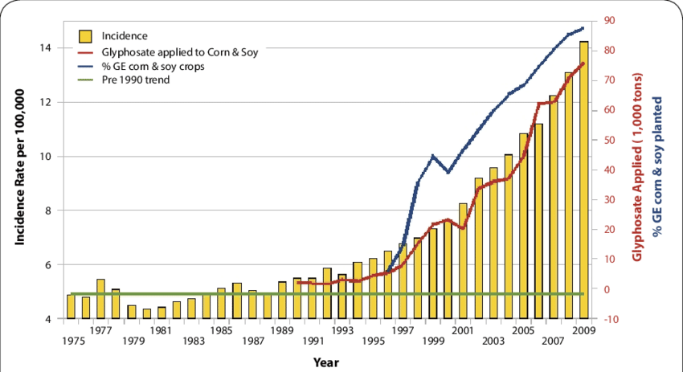

# Avoid

## highly palatable (HP) foods

- HP food motivation and intake and identify specific subjective and neuroendocrine responses that may play a role in HP snacking with implications for weight gain and obesity risk.
- biobehavioral processes that may promote HP food craving and intake.

## Wal-mart great value brand

[fish in great value brand products](https://www.instagram.com/reel/C2qs-bHrDYQ/)

## Soy Protein Isolates

Foods to Avoid with Soy Isolate

Based on the provided search results, here's a summary of foods to avoid or be cautious with when consuming Soy Protein Isolates (SPI) due to potential heavy metal contamination:

1. **Plant-based protein powders**: SPI is often found in plant-based protein powders, particularly those made from soybeans. A study by the Clean Label Project found that 40% of 134 plant-based protein powders tested contained elevated levels of heavy metals, including lead, mercury, cadmium, and arsenic.
2. **Certified organic products**: Surprisingly, certified organic products were twice as likely to contain high levels of heavy metals as non-organic products. This may be due to the use of contaminated soil or water in organic farming practices.
3. **Whey protein powders with plant ingredients**: Whey protein powders that contain plant ingredients, such as soy or pea protein, may also be contaminated with heavy metals. A study found that 5 out of 5 top-rated whey protein powders with plant ingredients contained low levels of heavy metals.
4. **Foods with hexane processing**: SPI is often produced using hexane, a solvent that can leave behind residues of heavy metals like aluminum and other chemicals. Foods that contain SPI, such as protein bars or supplements, may be contaminated with these residues.

The science behind the potential harm of heavy metals in SPI is as follows:

- **Toxicity**: Heavy metals like lead, mercury, cadmium, and arsenic are toxic to the human body and can cause a range of health problems, including kidney damage, neurological disorders, and cancer.
- **Bioaccumulation**: Heavy metals can accumulate in the body over time, leading to increased exposure and potential harm.
- **Phytates**: SPI contains phytates, which can reduce the body's ability to absorb essential minerals like iron and zinc.

To minimize exposure to heavy metals from SPI, consider the following:

- Choose whey protein powders without plant ingredients or those that have undergone rigorous testing for heavy metal contamination.
- Opt for products from reputable manufacturers that use non-hexane processing methods.
- Limit your consumption of plant-based protein powders and choose certified non-GMO and non-organic options.
- Consider consulting with a healthcare professional or registered dietitian for personalized guidance on protein powder selection.

Remember that individual tolerance to heavy metals can vary, and it's essential to prioritize your overall health and well-being by making informed choices about your diet and supplement use.

## Skin, pores, free radicals

- lotions
- soaps
- cleaning agents
- gloves

## Honey

- honey is sometimes adulterated with plain water and other sugars including hfcs (high fructose corn syrup)

## Endocrine Disruptors

Xenoestregens (BPA/BPS), Phtalates, Plastic, Parabens, PVC

## Frozen Foods

Frozen foods can be convenient, but they often come with potential health risks. Here are some of the main dangers associated with frozen foods, particularly regarding sodium content and chemical additives like PFAs (per- and polyfluoroalkyl substances):

### 1. High Sodium Content

- **Preservation**: Many frozen foods, especially processed ones like frozen dinners, pizzas, and snacks, are high in sodium. Sodium is often used as a preservative and flavor enhancer.
- **Health Risks**: High sodium intake can lead to increased blood pressure, cardiovascular disease, and other health issues. The American Heart Association recommends limiting sodium intake to less than 2,300 mg per day, ideally around 1,500 mg for most adults.

## 2. Added Sugars and Unhealthy Fats

- **Flavor Enhancement**: To improve taste, many frozen foods contain added sugars and unhealthy fats, including trans fats, which are linked to heart disease.
- **Caloric Density**: These added ingredients can make frozen foods calorie-dense without providing essential nutrients.

## metabolic disease

Foods with Added Sugars to Avoid

Consuming foods with added sugars has been linked to an increased risk of metabolic disease, including insulin resistance, type 2 diabetes, and metabolic syndrome. Here are some common foods to limit or avoid:

- **Processed meats**: Cured meats like hot dogs, bacon, and deli meats are high in sodium, which contributes to high blood pressure, and often contain added sugars.
- **Packaged foods**: Many processed foods, such as packaged snacks, frozen meals, and instant soups, contain added sugars, refined carbohydrates, and unhealthy fats.
- **Fast food**: Fast food meals often combine high amounts of sugar, salt, and unhealthy fats, increasing the risk of metabolic disease.
- **Baked goods**: Cakes, muffins, cookies, and pastries are high in added sugars and refined carbohydrates, which can lead to insulin resistance and metabolic problems.
- **Sweetened beverages**: Soda, sports drinks, and sweetened teas and coffee drinks are major sources of added sugars in the diet.
- **Fruit juices**: While fruit is a healthy choice, fruit juices are often high in sugar and lack the fiber found in whole fruit.
- **Granola and energy bars**: Many commercial granola and energy bars contain added sugars, making them a poor choice for those seeking to reduce sugar intake.

**Why Added Sugars Contribute to Metabolic Disease**

Consuming high amounts of added sugars can:

- Disrupt insulin signaling and lead to insulin resistance
- Increase inflammation and oxidative stress
- Contribute to weight gain and obesity
- Raise blood pressure and cholesterol levels
- Increase the risk of developing type 2 diabetes, metabolic syndrome, and cardiovascular disease

**Tips for Reducing Added Sugars**

1. **Read labels**: Check food labels for added sugars, which may be listed as "sugar," "high fructose corn syrup," "honey," or "maple syrup."
2. **Choose whole foods**: Focus on whole, unprocessed foods like fruits, vegetables, whole grains, lean proteins, and healthy fats.
3. **Limit processed foods**: Avoid or limit packaged and processed foods, which often contain added sugars.
4. **Cook from scratch**: Prepare meals from scratch using whole ingredients to control sugar content.
5. **Gradually reduce sugar intake**: If you're used to consuming high amounts of sugar, gradually reduce your intake to give your taste buds time to adjust.

By avoiding or limiting foods with added sugars and focusing on whole, nutrient-dense foods, you can reduce your risk of metabolic disease and promote overall health.

### 3. Preservatives and Additives

- **Chemical Additives**: Frozen foods often contain preservatives like BHA, BHT, and sodium nitrite, which can have adverse health effects when consumed in large amounts.
- **Long-term Effects**: Some studies suggest a correlation between high intake of certain preservatives and health issues, including hormonal disruption and increased cancer risk.

### 4. PFAs (Per- and Polyfluoroalkyl Substances)

- **Chemical Coatings**: PFAs are often used in food packaging (like microwave popcorn bags) and can leach into food. They are resistant to heat, water, and oil, making them useful for packaging but also problematic for health.
- **Health Risks**: PFAs have been linked to various health issues, including immune system effects, hormone disruption, and increased risk of certain cancers. They are persistent in the environment and the human body, leading to long-term exposure concerns.

### 5. Loss of Nutritional Value

- **Freezing Process**: While freezing preserves food for longer periods, the process can lead to a loss of some vitamins and nutrients, particularly in fruits and vegetables. For example, vitamin C and certain B vitamins can degrade during freezing.
- **Cooking Methods**: How frozen foods are prepared (e.g., microwaving) can also affect their nutritional quality. Overcooking can lead to further nutrient loss.

### 6. Risk of Contamination

- **Microbial Growth**: Although freezing inhibits bacterial growth, it doesn't kill all bacteria. Improper thawing or reheating can allow bacteria to multiply, leading to foodborne illnesses.
- **Cross-contamination**: Frozen foods can be at risk for cross-contamination during processing, handling, or preparation.

### Conclusion

While frozen foods can offer convenience and a longer shelf life, it's essential to read labels carefully and be mindful of sodium content, preservatives, and potential contaminants like PFAs. Opting for whole, minimally processed frozen foods (like plain frozen vegetables or fruits) can help mitigate some of these risks. Preparing fresh meals whenever possible is generally the healthiest option.

## Dairy

## Sugar

### slows muscle/injury recovery

There is evidence suggesting that high sugar intake can slow down injury healing and muscle soreness recovery. Here's how:

- **Increased inflammation:** Consuming too much sugar, particularly refined sugar and added sugars, can contribute to inflammation in the body [1]. Inflammation is a natural part of the healing process, but excessive inflammation can hinder tissue repair.
- **Reduced blood flow:** High blood sugar levels can stiffen arteries and reduce blood flow [2]. This limits the delivery of essential nutrients and oxygen to the injured area, which are crucial for healing.
- **Impaired immune function:** Sugar can potentially weaken the immune system's ability to fight off infection and promote healing [3].

**Here's what the research suggests:**

- Studies haven't directly looked at the effect of sugar on muscle soreness recovery, but the link between sugar and inflammation suggests it might play a role.
- Research on diabetic wounds (where high blood sugar is a constant factor) shows delayed healing [4].

**Overall, limiting added sugar intake can likely benefit injury healing and muscle recovery by:**

- Reducing inflammation
- Improving blood flow
- Supporting a healthy immune system

For optimal healing, focus on a balanced diet rich in:

- **Lean protein:** Provides building blocks for tissue repair.
- **Fruits and vegetables:** Deliver essential vitamins, minerals, and antioxidants.
- **Whole grains:** Offer sustained energy and fiber.

**Remember:** While sugar may slow healing, it's not the sole factor. Consult a healthcare professional for personalized guidance on injury recovery and a healthy diet.

### Sugar Alternative

- Acesulfame potassium (Sweet One, Sunett).
- Advantame.
- Aspartame (NutraSweet, Equal).
- Neotame (Newtame).
- Saccharin (Sweet'N Low).
- Sucralose (Splenda).
- Luo han guo (Monk Fruit in the Raw).
- Purified stevia leaf extracts (Truvia, PureVia, others).

### High Fructose Corn Syrup

## BREAD

Based on the article "Ranking The Healthiest Breads, From Best To Worst" from HuffPost and additional information regarding bread and inflammation, we can classify breads into two groups: **Super-Healthy Breads** and **Not Healthy Breads**.

### Super-Healthy Breads

1. **Whole Grain Bread**
   - **Nutritional Benefits:** Contains all parts of the grain, providing fiber, vitamins, and minerals.
   - **Inflammation Impact:** Whole grains are associated with reduced inflammation and lower risk of chronic diseases (Harvard Health).

2. **Whole Wheat Bread**
   - **Nutritional Benefits:** Similar to whole grain, it retains nutrients from the wheat kernel.
   - **Inflammation Impact:** When labeled as 100% whole wheat, it can help manage inflammation (American Heart Association).

3. **Sprouted Grain Bread (Ezekiel)**
   - **Nutritional Benefits:** Higher protein and fiber due to sprouting process; lower sodium.
   - **Inflammation Impact:** Whole grains and legumes in sprouted bread can help reduce inflammation (Journal of Nutrition).

4. **Sourdough Bread**
   - **Nutritional Benefits:** Fermented, aiding in better nutrient absorption; lower glycemic index.
   - **Inflammation Impact:** Fermentation may lower inflammatory responses compared to regular bread (Nutrients Journal).

5. **Rye Bread**
   - **Nutritional Benefits:** Good for gut health and high in fiber.
   - **Inflammation Impact:** Rye can help reduce inflammatory markers in the body (European Journal of Clinical Nutrition).

6. **Pumpernickel Bread**
   - **Nutritional Benefits:** Contains whole rye berries, rich in fiber.
   - **Inflammation Impact:** Can lower harmful gut bacteria and reduce inflammation (American Journal of Clinical Nutrition).

### Not Healthy Breads

1. **White Sandwich Bread**
   - **Nutritional Drawbacks:** Low in fiber and nutrients; primarily made from refined flour.
   - **Inflammation Impact:** Refined carbs can spike blood sugar and promote inflammation (Cleveland Clinic).

2. **Bagels**
   - **Nutritional Drawbacks:** Very dense; equivalent to consuming multiple slices of bread.
   - **Inflammation Impact:** High in refined carbs, leading to potential inflammation (Harvard Health).

3. **Brioche**
   - **Nutritional Drawbacks:** High in calories and refined flour.
   - **Inflammation Impact:** Contributes to spikes in blood sugar and inflammation (Nutrition Reviews).

4. **Flour Tortillas**
   - **Nutritional Drawbacks:** Often made with refined flour and may contain preservatives.
   - **Inflammation Impact:** Similar to white bread, their low nutritional value can lead to inflammation (Journal of the Academy of Nutrition and Dietetics).

5. **Potato Bread**
   - **Nutritional Drawbacks:** Limited nutritional value, similar to white bread.
   - **Inflammation Impact:** Contains refined flour which can lead to inflammation (Mayo Clinic).

6. **White Pita**
   - **Nutritional Drawbacks:** Similar to white sandwich bread in terms of nutrient loss.
   - **Inflammation Impact:** Low in fiber, leading to potential blood sugar spikes and inflammation (American Heart Association).

### Conclusion

Choosing breads that are whole grain or sprouted can provide significant health benefits and help manage inflammation. In contrast, breads made from refined flours should be consumed sparingly, as they can contribute to inflammation and other health issues. Always look for whole grain options to ensure you are making a healthier choice.

## Wrong Dietary Fat Sources

## Vegetable and Seed Oils

- BEEF MICROSPRAY
- A common herbicide used in wheat farming. Residues can remain in processed wheat products.
- Some research links **glyphosate** exposure to inflammatory conditions and other health issues.
- Malodextrin: Modified Food Starch
- Fungicides: Sulfur Dioxide
- Endocrine Disruptors
- GMO soy

### CANOLA OIL

There's not a canola plant, but you can still find this all-purpose cooking oil in many a pantry. It comes from the rapeseed plant, but that's a loaded name to try to sell. Canadian scientists made the rapeseed oil better suited for cooking, and now you can purchase "Canada Oil, Low Acid."

### Obesity

## Glyphosate

Glyphosate’s use in the U.S. has skyrocketed since 1996, the year Monsanto introduced genetically engineered seeds that could survive being sprayed with higher quantities of herbicides.

- Today, almost 90% of corn, cotton and soybean crops are modified to be tolerant to glyphosate and other chemical treatments used by farmers, U.S. Department of Agriculture data shows.
- Glyphosate residues have also been detected in air and rain samples, according to a study from the University of Minnesota.

## Food Dyes

## Artificial Sweeteners

## Toxic farming practices

Various studies have reported pesticide levels in both human blood and urine, which are further found to be associated with multiple diseases, including cancer, diabetes, hormonal disorders, asthma, metabolic diseases, and neurotoxicity. Furthermore, prolonged exposure to pesticides was also found to have teratogenic effects resulting in a reduction in birth weight, abnormal growth, diseases, and mortality

- Fragrance of food is gone in industrialized america

Toxic farming practices can significantly impact both the environment and human health, particularly in the context of fresh produce in the U.S. Here are some common practices:

- Opting for organic produce
- supporting local farms that practice sustainable methods

### Sulfur Dioxide

### 1. **Pesticide Use**

- **Synthetic Pesticides:** Many conventional farms use synthetic pesticides that can be harmful to human health and the ecosystem. These chemicals can remain on produce, leading to potential exposure.
- **Neonicotinoids:** These are particularly concerning because they can harm pollinators like bees and have been linked to neurological issues in humans.

### 2. **Chemical Fertilizers**

- **Nitrogen and Phosphorus Overuse:** Excessive use of chemical fertilizers can lead to nutrient runoff, causing water pollution and harming aquatic ecosystems.
- **Soil Degradation:** Continuous use can degrade soil health, reducing its ability to retain moisture and nutrients.

### 3. **Monoculture Practices**

- **Lack of Crop Diversity:** Growing a single crop over large areas can lead to soil depletion, increased vulnerability to pests, and reliance on chemical inputs to manage these issues.
- **Ecosystem Disruption:** Monocultures can disrupt local ecosystems, reducing biodiversity and harming beneficial insects.

### 4. **Irrigation Practices**

- **Over-Irrigation:** Excessive irrigation can lead to salinization of the soil and depletion of local water resources.
- **Contaminated Water Sources:** Using water from polluted sources for irrigation can introduce harmful pathogens and chemicals into food crops.

### 5. **Soil Management Issues**

- **Soil Erosion:** Poor practices can lead to erosion, reducing soil fertility and increasing sediment in waterways.
- **Lack of Organic Matter:** Failing to incorporate organic matter depletes soil quality and reduces its ability to support healthy crops.

### 6. **Use of Antibiotics**

- **Livestock Antibiotics:** In some cases, antibiotics are used in plant farming as well, which can lead to antibiotic resistance and impact food safety.

### 7. **Synthetic Growth Hormones**

- **Hormone Treatments:** Some farms may use synthetic growth hormones to accelerate growth, which raises concerns about long-term health effects on consumers.

### 8. **Poor Labor Practices**

- **Exploitation of Workers:** Toxic farming practices often extend to labor conditions, where workers may be exposed to harmful chemicals without adequate protection.
- **Health Risks:** Workers in these environments face serious health risks, which can indirectly affect the safety of the produce.

## PFAs

## Microplastics and Nanoplastics

- Microplastics: Popular brands of bottled water contain up to 100 times more nanoplastics — even tinier flecks of the material than microplastics — than previously thought, a monumental study found earlier this year. We now know that these plastic bits have made their way into many parts of our bodies, where they may trigger inflammation, metabolic changes, reproductive issues and Parkinson’s disease-related brain changes. And it’s not just drinking bottled water that exposes us to microplastics. “Nine out of 10 plastic bottles end up in the environment where they disintegrate into microplastics and nanoplastics that cause global pollution and adverse health effects on living organisms including humans,” Rolf Halden, director of Arizona State University’s Biodesign Center for Environmental Health Engineering, tells Yahoo Life.
- Phthalates: These chemicals are used to make plastics more flexible and durable. They can be found in everything from cosmetic products to food, flooring and bottled water. Phthalates are known as “endocrine disruptors” because they interfere with the endocrine system, which regulates hormones. The chemicals have been linked to reproductive health issues, low IQ in children and metabolic changes.
- PFAS: Best known as forever chemicals, per- and polyfluoroalkyl substances are synthetics used to treat products including carpets and nonstick pans to make them heat-resistant. It can take hundreds or thousands of years for PFAS to break down in the environment and up to a decade for them to leave the human body. And while they’re already in our bodies, high levels of PFAS may contribute to higher cholesterol levels, liver enzyme changes, preeclampsia during pregnancy, low birth weights and greater testicular and kidney cancer risks. They may also contribute to obesity and metabolic issues.
- BPA: Bisphenol A, or BPA, is a chemical used to make food packaging stronger and less vulnerable to corrosion or breaking down. But like phthalates, it disrupts hormones and has been linked to higher risks of infertility, PCOS, diabetes, cardiovascular disease and breast and prostate cancer. However, the Food and Drug Administration considers BPA levels in food packaging safe, and stated after a four-year review that safety standards don’t need to be changed.

## Laundry

Guppyfriend washing bag: These specialized bags capture microplastics during washing, preventing them from entering the wastewater system. You can find these online or at eco-friendly stores.

- When washed, polyester fabrics can shed microplastics, tiny plastic fibers that can enter water systems and potentially harm wildlife.

## Caffiene

## Heavy Metals

Heavy metals and aflatoxins are two significant contaminants that can pose health risks through dietary exposure. Here’s an overview of the science behind these contaminants and the foods to avoid to minimize exposure.

### Heavy Metals

**Common Heavy Metals:**

1. **Lead**: Found in contaminated water, soil, and some imported goods.
2. **Mercury**: Often found in large fish due to environmental pollution.
3. **Cadmium**: Can accumulate in certain crops, particularly in polluted soils.
4. **Arsenic**: Common in rice products and water in certain areas.

**Health Risks:**

- **Lead**: Can affect neurological development, particularly in children, and cause cognitive deficits.
- **Mercury**: Linked to neurological issues, including memory loss and cognitive decline.
- **Cadmium**: Associated with kidney damage and bone fragility.
- **Arsenic**: Long-term exposure is linked to cancer and skin lesions.

**Foods to Avoid:**

- **Large Fish**: Such as shark, swordfish, king mackerel, and tilefish, which can have high levels of mercury.
- **Rice Products**: Brown rice and rice-based snacks can contain arsenic; consider limiting rice consumption or choosing alternatives like quinoa or barley.
- **Imported Chocolates**: Some may contain lead due to contamination during processing.
- **Certain Vegetables**: Leafy greens and root vegetables grown in contaminated soil may accumulate heavy metals like cadmium.

### Aflatoxins

**What Are Aflatoxins?**
Aflatoxins are toxic compounds produced by certain molds (Aspergillus species) that can grow on crops. They are particularly concerning because they are potent carcinogens.

**Health Risks:**

- Aflatoxins can cause liver damage, immune system suppression, and are linked to liver cancer. They can also affect growth and development in children.

**Foods to Avoid:**

- **Nuts**: Particularly peanuts and tree nuts (like pistachios) can be contaminated if not properly stored.
- **Grains**: Corn, rice, and wheat are susceptible to aflatoxin contamination, especially if stored improperly in warm, humid conditions.
- **Dried Fruits**: Certain dried fruits may harbor mold and aflatoxins.
- **Spices**: Some spices, particularly those sourced from regions with high humidity, can be contaminated.

### Prevention Strategies

1. **Choose Safe Sources**: Purchase food from reputable suppliers. Look for products tested for heavy metals and aflatoxins.
2. **Proper Storage**: Store grains, nuts, and seeds in cool, dry places to prevent mold growth and contamination.
3. **Diversify Your Diet**: Eating a wide variety of foods can help minimize the risk of exposure to any one contaminant.
4. **Wash and Cook Foods**: Washing vegetables and cooking food can reduce some levels of contaminants, though it may not eliminate them entirely.

### Conclusion

Being mindful of heavy metals and aflatoxins in your diet is crucial for long-term health. By avoiding certain high-risk foods and ensuring safe food practices, you can significantly reduce your exposure to these harmful compounds. Always stay informed about food safety guidelines and choose foods that are less likely to be contaminated.

## Acrylamide

Acrylamide is linked to an increased risk of cancer in some studies, although other scientists question the connection ([39Trusted Source](https://pubmed.ncbi.nlm.nih.gov/25403648/)).

Some people choose to limit their [acrylamide intake](https://www.healthline.com/nutrition/acrylamide-in-coffee) as much as possible ([40Trusted Source](https://www.fda.gov/food/chemical-contaminants-food/acrylamide-and-diet-food-storage-and-food-preparation)).

Some olive varieties -- especially ripe black olives -- may contain high amounts of acrylamide as a result of processing ([41Trusted Source](https://www.ncbi.nlm.nih.gov/pmc/articles/PMC7555664/), [42Trusted Source](https://pubmed.ncbi.nlm.nih.gov/25989363/), [43Trusted Source](http://www.fda.gov/food/foodborneillnesscontaminants/chemicalcontaminants/ucm053549.htm), [44Trusted Source](https://www.ncbi.nlm.nih.gov/pubmed/25110929)). Olive producers are investigating ways to reduce the amount of acrylamide that forms during processing.
