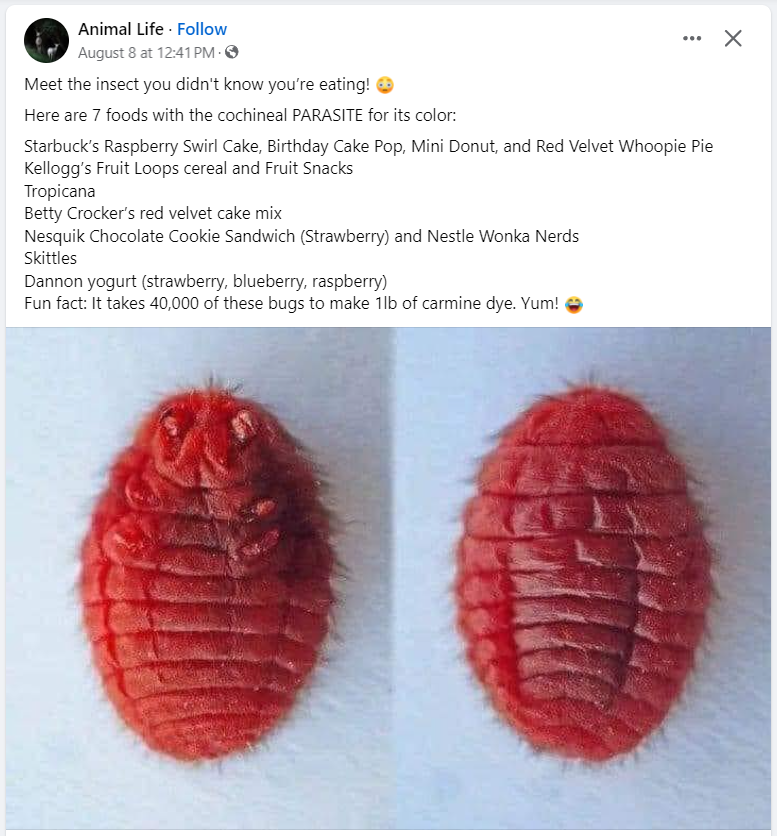

# Avoid

## Artificial Sweeteners

### Real vs Artificial

- sucralose, stevia, allulose, erythritol, adventame, neotame and acesulfame potassium, allulose
- found in bread, yogurt, oatmeal, muffins, canned soups, salad dressings, condiments and snack bars.

Scientists used to think that non-nutritive sweeteners were largely inert, activating sweet receptors on our tongues and passing through our bodies without causing metabolic changes. But questions remain about the health effects of consuming large amounts of these ingredients. saccharin and sucralose, worsened the participants’ blood sugar control.

[Personalized microbiome-driven effects of non-nutritive sweeteners on human glucose tolerance](https://pubmed.ncbi.nlm.nih.gov/35987213/) - The study found that these sweeteners caused changes in both the function and composition of the participants’ gut microbiomes

[The not-so-sweet effects of sucralose on blood sugar control](https://www.sciencedirect.com/science/article/pii/S0002916522029665?via%3Dihub=&itid=lk_inline_enhanced-template) - drinking beverages made with sucralose can promote insulin resistance

[Effects of Non-nutritive Sweeteners on Sweet Taste Processing and Neuroendocrine Regulation of Eating Behavior](https://pubmed.ncbi.nlm.nih.gov/32588329/) - you might develop stronger sugar cravings and end up eating more sugar and sweetened foods.

[Artificial sweeteners and risk of cardiovascular diseases: results from the prospective NutriNet-Santé cohort](https://www.bmj.com/content/378/bmj-2022-071204?itid=lk_inline_enhanced-template) - a high intake of artificial sweeteners increased the risk of cardiovascular problems such as strokes and coronary heart disease.

### Sugar Alternative

- Acesulfame potassium (Sweet One, Sunett).
- Advantame.
- Aspartame (NutraSweet, Equal).
- Neotame (Newtame).
- Saccharin (Sweet'N Low).
- Sucralose (Splenda).
- Luo han guo (Monk Fruit in the Raw).
- Purified stevia leaf extracts (Truvia, PureVia, others).

### High Fructose Corn Syrup

## BREAD

Based on the article "Ranking The Healthiest Breads, From Best To Worst" from HuffPost and additional information regarding bread and inflammation, we can classify breads into two groups: **Super-Healthy Breads** and **Not Healthy Breads**.

### Super-Healthy Breads

1. **Whole Grain Bread**
   - **Nutritional Benefits:** Contains all parts of the grain, providing fiber, vitamins, and minerals.
   - **Inflammation Impact:** Whole grains are associated with reduced inflammation and lower risk of chronic diseases (Harvard Health).

2. **Whole Wheat Bread**
   - **Nutritional Benefits:** Similar to whole grain, it retains nutrients from the wheat kernel.
   - **Inflammation Impact:** When labeled as 100% whole wheat, it can help manage inflammation (American Heart Association).

3. **Sprouted Grain Bread (Ezekiel)**
   - **Nutritional Benefits:** Higher protein and fiber due to sprouting process; lower sodium.
   - **Inflammation Impact:** Whole grains and legumes in sprouted bread can help reduce inflammation (Journal of Nutrition).

4. **Sourdough Bread**
   - **Nutritional Benefits:** Fermented, aiding in better nutrient absorption; lower glycemic index.
   - **Inflammation Impact:** Fermentation may lower inflammatory responses compared to regular bread (Nutrients Journal).

5. **Rye Bread**
   - **Nutritional Benefits:** Good for gut health and high in fiber.
   - **Inflammation Impact:** Rye can help reduce inflammatory markers in the body (European Journal of Clinical Nutrition).

6. **Pumpernickel Bread**
   - **Nutritional Benefits:** Contains whole rye berries, rich in fiber.
   - **Inflammation Impact:** Can lower harmful gut bacteria and reduce inflammation (American Journal of Clinical Nutrition).

### Not Healthy Breads

1. **White Sandwich Bread**
   - **Nutritional Drawbacks:** Low in fiber and nutrients; primarily made from refined flour.
   - **Inflammation Impact:** Refined carbs can spike blood sugar and promote inflammation (Cleveland Clinic).

2. **Bagels**
   - **Nutritional Drawbacks:** Very dense; equivalent to consuming multiple slices of bread.
   - **Inflammation Impact:** High in refined carbs, leading to potential inflammation (Harvard Health).

3. **Brioche**
   - **Nutritional Drawbacks:** High in calories and refined flour.
   - **Inflammation Impact:** Contributes to spikes in blood sugar and inflammation (Nutrition Reviews).

4. **Flour Tortillas**
   - **Nutritional Drawbacks:** Often made with refined flour and may contain preservatives.
   - **Inflammation Impact:** Similar to white bread, their low nutritional value can lead to inflammation (Journal of the Academy of Nutrition and Dietetics).

5. **Potato Bread**
   - **Nutritional Drawbacks:** Limited nutritional value, similar to white bread.
   - **Inflammation Impact:** Contains refined flour which can lead to inflammation (Mayo Clinic).

6. **White Pita**
   - **Nutritional Drawbacks:** Similar to white sandwich bread in terms of nutrient loss.
   - **Inflammation Impact:** Low in fiber, leading to potential blood sugar spikes and inflammation (American Heart Association).

## BREAD ADDITIVES

### Azodicarbonamide

- **Azodicarbonamide:** This chemical is used as a dough conditioner. While it is not directly carcinogenic, it breaks down into substances that may be harmful.

Azodicarbonamide (ACA), a chemical that forms bubbles in foams and plastics like vinyl, is used to bleach and leaven dough – but when baked, it, too, has been linked to cancer in lab animals.

### Acrylamide

 This chemical forms naturally during high-temperature cooking processes, including baking bread. While research is ongoing, some studies suggest a possible link to cancer.

### Potassium bromate

Potassium bromate is a chemical compound that has been linked to several health concerns, particularly its potential to cause cancer. Here's a breakdown of the science behind these concerns:

**Carcinogenic Potential:**

- **Animal Studies:** Numerous studies on animals have shown that potassium bromate can cause various types of cancer, including kidney, thyroid, and stomach cancer.
- **Mechanism of Action:** It's believed that potassium bromate damages DNA and interferes with cellular processes, leading to the development of cancerous cells.

**Other Health Risks:**

- **Neurotoxicity:** Some studies suggest that potassium bromate may affect the nervous system, leading to symptoms like headaches, irritability, and impaired cognitive function.
- **Reproductive Toxicity:** There's concern that potassium bromate may have adverse effects on reproductive health, although more research is needed.

**Regulatory Status:**

- **Banned in Many Countries:** Many countries, including the European Union, Canada, and China, have banned the use of potassium bromate as a food additive due to its potential health risks.
- **Regulated in the US:** In the United States, the Food and Drug Administration (FDA) allows the use of potassium bromate in flour, but it must be listed on the product label.

**Consumer Considerations:**

- **Read Labels:** Check the ingredient list of baked goods to see if they contain potassium bromate.
- **Choose Alternatives:** Opt for products made with potassium bromate-free flour.
- **Support Regulations:** Advocate for stricter regulations on food additives and encourage the banning of potassium bromate.

It's important to note that while the scientific evidence suggests a link between potassium bromate and health risks, more research is needed to fully understand the extent of these risks in humans. However, given the potential dangers, it's advisable to limit exposure to this chemical by making informed choices about the food you consume.

- **Prolamins and agglutinins**: These harmful and [inflammatory proteins are found in grains](https://michaelkummer.com/why-avoid-grains/) such as wheat, rye, barley, oats and corn.
- **Digestive enzyme inhibitors**: Certain grains, such as wheat, [can significantly lower the amounts of digestive enzymes](https://www.ncbi.nlm.nih.gov/pubmed/22878393). Yet another reason to avoid grains in your diet.

#### Bromate

Carb free, gluten free, white, wheat, multi-grain, whole grain. There's a lot of stress around bread. But what we don't hear a lot about is bromated vs. unbromated flour. There is an additive in flour here in the States, that quickens leavening thereby increasing production. It also happens to be carcinogenic.

[https://www.kingarthurbaking.com/pro/reference/bromate](https://www.kingarthurbaking.com/pro/reference/bromate)

### Conclusion

Choosing breads that are whole grain or sprouted can provide significant health benefits and help manage inflammation. In contrast, breads made from refined flours should be consumed sparingly, as they can contribute to inflammation and other health issues. Always look for whole grain options to ensure you are making a healthier choice.

## Wal-mart great value brand

[fish in great value brand products](https://www.instagram.com/reel/C2qs-bHrDYQ/)

## Skin, pores, free radicals

- soaps
- cleaning agents
- gloves

## Honey

- honey is sometimes adulterated with plain water and other sugars including hfcs (high fructose corn syrup)

## Endocrine Disruptors

Xenoestregens (BPA/BPS), Phtalates, Plastic, Parabens, PVC

Endocrine

### Endocrine Disruptor Foods

Endocrine disruptors are chemicals that can interfere with the body's endocrine system, affecting the production, secretion, transport, metabolism, binding action, or elimination of natural hormones. These chemicals can be found in various foods and can cause a range of health issues. Here is a list of foods that are known to contain endocrine disruptors:

- **Processed and packaged foods**: These foods often contain preservatives, artificial colors, and flavors that can disrupt the endocrine system. Additionally, the packaging of processed foods can contain chemicals such as bisphenol A (BPA), which can also act as hormone disruptors.
- **Non-organic dairy products**: These products often contain growth hormones and pesticides, which can be endocrine disruptors.
- **Conventionally grown fruits and vegetables**: These are often high sources of pesticides, herbicides, and fungicides, which can act as endocrine disruptors.
- **Conventionally raised meat**: Meat from animals raised with antibiotics and animal feed containing hormones can have higher levels of hormone disruptors than their organic or grass-fed counterparts.
- **Farmed salmon**: This type of salmon can contain high levels of contaminants, including endocrine disruptors.
- **Soy products**: Soy products such as tofu and soy milk contain a bioactive substance known as phytoestrogen, which can mimic estrogen in the body.
- **Eggs from polluted sites**: Eggs from areas where pesticides and industrial chemicals are present can contain endocrine-disrupting residues such as hexachlorocyclohexane, aldrin, and malathion.
- **Plastics and food storage materials**: Bisphenol A (BPA) and phthalates, commonly found in plastics and food storage materials, can leach into food and act as endocrine disruptors.
- **Non-stick food wrappers and microwave popcorn bags**: These items can contain perfluorochemicals and PFAS, which can disrupt thyroid function, harm liver and kidney function, and increase the risk of cancer.
- **Canned foods**: The lining of canned foods often contains BPA, which can leach into the food and act as an endocrine disruptor.

## Frozen Foods

Frozen foods can be convenient, but they often come with potential health risks. Here are some of the main dangers associated with frozen foods, particularly regarding sodium content and chemical additives like PFAs (per- and polyfluoroalkyl substances):

### 1. High Sodium Content

- **Preservation**: Many frozen foods, especially processed ones like frozen dinners, pizzas, and snacks, are high in sodium. Sodium is often used as a preservative and flavor enhancer.
- **Health Risks**: High sodium intake can lead to increased blood pressure, cardiovascular disease, and other health issues. The American Heart Association recommends limiting sodium intake to less than 2,300 mg per day, ideally around 1,500 mg for most adults.

## 2. Added Sugars and Unhealthy Fats

- **Flavor Enhancement**: To improve taste, many frozen foods contain added sugars and unhealthy fats, including trans fats, which are linked to heart disease.
- **Caloric Density**: These added ingredients can make frozen foods calorie-dense without providing essential nutrients.

## Coloring

[carmine color, natural red 4, cochineal extract](https://www.facebook.com/reel/1206039707134669)

## metabolic disease

### 3. Preservatives and Additives

- **Chemical Additives**: Frozen foods often contain preservatives like BHA, BHT, and sodium nitrite, which can have adverse health effects when consumed in large amounts.
- **Long-term Effects**: Some studies suggest a correlation between high intake of certain preservatives and health issues, including hormonal disruption and increased cancer risk.

### 4. PFAs (Per- and Polyfluoroalkyl Substances)

- **Chemical Coatings**: PFAs are often used in food packaging (like microwave popcorn bags) and can leach into food. They are resistant to heat, water, and oil, making them useful for packaging but also problematic for health.
- **Health Risks**: PFAs have been linked to various health issues, including immune system effects, hormone disruption, and increased risk of certain cancers. They are persistent in the environment and the human body, leading to long-term exposure concerns.

### 5. Loss of Nutritional Value

- **Freezing Process**: While freezing preserves food for longer periods, the process can lead to a loss of some vitamins and nutrients, particularly in fruits and vegetables. For example, vitamin C and certain B vitamins can degrade during freezing.
- **Cooking Methods**: How frozen foods are prepared (e.g., microwaving) can also affect their nutritional quality. Overcooking can lead to further nutrient loss.

### 6. Risk of Contamination

- **Microbial Growth**: Although freezing inhibits bacterial growth, it doesn't kill all bacteria. Improper thawing or reheating can allow bacteria to multiply, leading to foodborne illnesses.
- **Cross-contamination**: Frozen foods can be at risk for cross-contamination during processing, handling, or preparation.

### Conclusion

While frozen foods can offer convenience and a longer shelf life, it's essential to read labels carefully and be mindful of sodium content, preservatives, and potential contaminants like PFAs. Opting for whole, minimally processed frozen foods (like plain frozen vegetables or fruits) can help mitigate some of these risks. Preparing fresh meals whenever possible is generally the healthiest option.

## Dairy

## Soda

### Coca-Cola

[Fluorescent nanoparticles present in Coca-Cola and Pepsi-Cola: physiochemical properties, cytotoxicity, biodistribution and digestion studies - PubMed](https://pubmed.ncbi.nlm.nih.gov/29261040/)

### Diet Soda

- Phenylalanine is one of the breakdown products of aspartame, an artificial sweetener commonly used in diet sodas.
- 4-methylimidazole (4-MI), which is a byproduct of the caramel coloring process used to give sodas their brown color.

## Wrong Dietary Fat Sources

### Obesity

## Glyphosate

Glyphosate’s use in the U.S. has skyrocketed since 1996, the year Monsanto introduced genetically engineered seeds that could survive being sprayed with higher quantities of herbicides.

- Today, almost 90% of corn, cotton and soybean crops are modified to be tolerant to glyphosate and other chemical treatments used by farmers, U.S. Department of Agriculture data shows.
- Glyphosate residues have also been detected in air and rain samples, according to a study from the University of Minnesota.

## Food Dyes

## Toxic farming practices

Various studies have reported pesticide levels in both human blood and urine, which are further found to be associated with multiple diseases, including cancer, diabetes, hormonal disorders, asthma, metabolic diseases, and neurotoxicity. Furthermore, prolonged exposure to pesticides was also found to have teratogenic effects resulting in a reduction in birth weight, abnormal growth, diseases, and mortality

- Fragrance of food is gone in industrialized america

Toxic farming practices can significantly impact both the environment and human health, particularly in the context of fresh produce in the U.S. Here are some common practices:

- Opting for organic produce
- supporting local farms that practice sustainable methods

### Mono-crop agriculture

the practice of growing a single crop species over a large area, has several significant biological harms:

- **Reduced Biodiversity:**
  - **Loss of Habitat:** Large monoculture fields eliminate natural habitats for a wide range of organisms, including insects, birds, small mammals, and even larger animals.
  - **Limited Food Sources:** The lack of diverse plant life reduces food availability for many species, disrupting the entire food chain.
  - **Increased Vulnerability to Pests and Diseases:** When a single crop dominates, it creates ideal conditions for pests and diseases to thrive and spread rapidly. This often leads to increased reliance on harmful pesticides.

- **Soil Degradation:**
  - **Nutrient Depletion:** Continuously growing the same crop depletes specific soil nutrients, making the land less fertile over time.
  - **Erosion:** Monoculture often involves practices like tilling, which can increase soil erosion, leading to loss of topsoil and reduced water retention.
  - **Reduced Soil Microbiome:** The lack of diverse plant roots and organic matter in monoculture systems can negatively impact the beneficial soil microorganisms that are crucial for healthy soil.

- **Water Pollution:**
  - **Nutrient Runoff:** Excessive use of fertilizers in monoculture can lead to nutrient runoff into waterways, causing algal blooms and oxygen depletion, harming aquatic life.
  - **Pesticide Contamination:** Pesticides used in monoculture can contaminate water sources, posing risks to both human and wildlife health.

- **Increased Reliance on Pesticides:**
  - **Pest and Disease Outbreaks:** As mentioned, monoculture increases the risk of pest and disease outbreaks.
  - **Pesticide Resistance:** The overuse of pesticides can lead to the evolution of pesticide-resistant pests, requiring even stronger and more harmful chemicals.

- **Reduced Pollinator Health:**
  - **Lack of Diverse Pollen Sources:** Monoculture landscapes often lack the diverse floral resources that pollinators like bees and butterflies need for survival and reproduction.

### Sulfur Dioxide

### 1. **Pesticide Use**

- **Synthetic Pesticides:** Many conventional farms use synthetic pesticides that can be harmful to human health and the ecosystem. These chemicals can remain on produce, leading to potential exposure.
- **Neonicotinoids:** These are particularly concerning because they can harm pollinators like bees and have been linked to neurological issues in humans.

### 2. **Chemical Fertilizers**

- **Nitrogen and Phosphorus Overuse:** Excessive use of chemical fertilizers can lead to nutrient runoff, causing water pollution and harming aquatic ecosystems.
- **Soil Degradation:** Continuous use can degrade soil health, reducing its ability to retain moisture and nutrients.

### 3. **Monoculture Practices**

- **Lack of Crop Diversity:** Growing a single crop over large areas can lead to soil depletion, increased vulnerability to pests, and reliance on chemical inputs to manage these issues.
- **Ecosystem Disruption:** Monocultures can disrupt local ecosystems, reducing biodiversity and harming beneficial insects.

### 4. **Irrigation Practices**

- **Over-Irrigation:** Excessive irrigation can lead to salinization of the soil and depletion of local water resources.
- **Contaminated Water Sources:** Using water from polluted sources for irrigation can introduce harmful pathogens and chemicals into food crops.

### 5. **Soil Management Issues**

- **Soil Erosion:** Poor practices can lead to erosion, reducing soil fertility and increasing sediment in waterways.
- **Lack of Organic Matter:** Failing to incorporate organic matter depletes soil quality and reduces its ability to support healthy crops.

### 6. **Use of Antibiotics**

- **Livestock Antibiotics:** In some cases, antibiotics are used in plant farming as well, which can lead to antibiotic resistance and impact food safety.

### 7. **Synthetic Growth Hormones**

- **Hormone Treatments:** Some farms may use synthetic growth hormones to accelerate growth, which raises concerns about long-term health effects on consumers.

### 8. **Poor Labor Practices**

- **Exploitation of Workers:** Toxic farming practices often extend to labor conditions, where workers may be exposed to harmful chemicals without adequate protection.
- **Health Risks:** Workers in these environments face serious health risks, which can indirectly affect the safety of the produce.

## Laundry

Guppyfriend washing bag: These specialized bags capture microplastics during washing, preventing them from entering the wastewater system. You can find these online or at eco-friendly stores.

- When washed, polyester fabrics can shed microplastics, tiny plastic fibers that can enter water systems and potentially harm wildlife.

### Aflatoxins

**What Are Aflatoxins?**
Aflatoxins are toxic compounds produced by certain molds (Aspergillus species) that can grow on crops. They are particularly concerning because they are potent carcinogens.

**Health Risks:**

- Aflatoxins can cause liver damage, immune system suppression, and are linked to liver cancer. They can also affect growth and development in children.

**Foods to Avoid:**

- **Nuts**: Particularly peanuts and tree nuts (like pistachios) can be contaminated if not properly stored.
- **Grains**: Corn, rice, and wheat are susceptible to aflatoxin contamination, especially if stored improperly in warm, humid conditions.
- **Dried Fruits**: Certain dried fruits may harbor mold and aflatoxins.
- **Spices**: Some spices, particularly those sourced from regions with high humidity, can be contaminated.

### Prevention Strategies

1. **Choose Safe Sources**: Purchase food from reputable suppliers. Look for products tested for heavy metals and aflatoxins.
2. **Proper Storage**: Store grains, nuts, and seeds in cool, dry places to prevent mold growth and contamination.
3. **Diversify Your Diet**: Eating a wide variety of foods can help minimize the risk of exposure to any one contaminant.
4. **Wash and Cook Foods**: Washing vegetables and cooking food can reduce some levels of contaminants, though it may not eliminate them entirely.

### Conclusion

Being mindful of heavy metals and aflatoxins in your diet is crucial for long-term health. By avoiding certain high-risk foods and ensuring safe food practices, you can significantly reduce your exposure to these harmful compounds. Always stay informed about food safety guidelines and choose foods that are less likely to be contaminated.

## Acrylamide

Acrylamide is linked to an increased risk of cancer in some studies, although other scientists question the connection ([39Trusted Source](https://pubmed.ncbi.nlm.nih.gov/25403648/)).

Some people choose to limit their [acrylamide intake](https://www.healthline.com/nutrition/acrylamide-in-coffee) as much as possible ([40Trusted Source](https://www.fda.gov/food/chemical-contaminants-food/acrylamide-and-diet-food-storage-and-food-preparation)).

Some olive varieties -- especially ripe black olives -- may contain high amounts of acrylamide as a result of processing ([41Trusted Source](https://www.ncbi.nlm.nih.gov/pmc/articles/PMC7555664/), [42Trusted Source](https://pubmed.ncbi.nlm.nih.gov/25989363/), [43Trusted Source](http://www.fda.gov/food/foodborneillnesscontaminants/chemicalcontaminants/ucm053549.htm), [44Trusted Source](https://www.ncbi.nlm.nih.gov/pubmed/25110929)). Olive producers are investigating ways to reduce the amount of acrylamide that forms during processing.

mycotoxins, which are toxic substances produced by certain molds that can grow on grains like barley.
