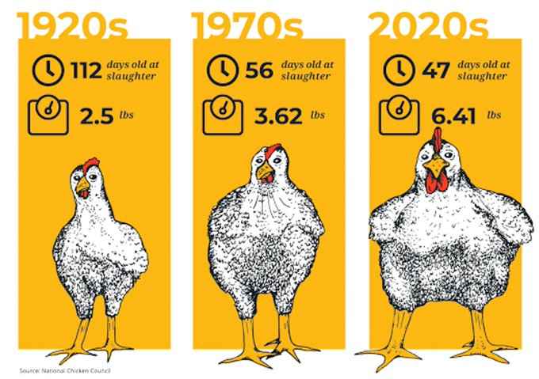
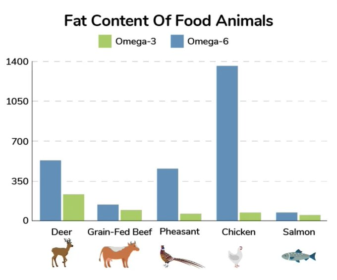

# Meat

## Processed meat

- "The World Health Organization has classified processed meats as a group 1 carcinogen, meaning it's known to cause cancer. Processed meats contain chemicals that are not present in fresh meat,"
- Coronary Artery Disease
- processed meat that has nitrates.
- nitrite can eventually form carcinogenic nitrosamines in the acidic environment."
- **coronary heart disorder**

## Weird Meat nutrition labels

- Raw or undercooked foods of animal origin
- “Foods of animal origin” instead of meat

## Harmful Histamines in Meat

### Understanding Histamines

**Histamines** are organic compounds involved in various physiological functions, primarily related to the immune response and regulation of bodily functions. They play a critical role in:

- **Allergic Reactions**: Histamines are released by the body during allergic responses, leading to symptoms like itching, swelling, and redness.
- **Regulation of Stomach Acid**: They help stimulate gastric acid secretion, aiding in digestion.
- **Neurotransmission**: Histamines act as neurotransmitters in the brain, influencing wakefulness and appetite.

### Histamines in Meat

When it comes to meat, histamines can be a concern, especially if the meat is not stored or handled properly. Here are some key points:

- **Histamine Formation**: Certain bacteria can produce histamines in protein-rich foods, including meat, especially if they are improperly stored or aged. This process can lead to higher histamine levels.
- **Scombroid Poisoning**: This is a foodborne illness caused by consuming fish with high levels of histamine due to improper storage. While it's more commonly associated with fish, similar processes can occur in some meats.
- **Symptoms of Histamine Intolerance**: Some individuals may experience symptoms like headaches, rashes, or gastrointestinal issues after consuming high-histamine foods, including improperly handled meats.

### Industrialized Groceries and Histamines

In industrialized grocery products, histamine levels can vary:

- **Processed Meats**: Items like sausages, deli meats, and other processed products may contain higher histamine levels due to the curing and fermentation processes.
- **Preservatives and Additives**: Some preservatives might affect the histamine content, but the primary concern is often related to microbial activity.
- **Storage Conditions**: Industrialized products not kept at the correct temperatures can lead to increased histamine production.

### Conclusion

While histamines are essential for various bodily functions, high levels of histamines in meat and other food products can lead to health issues, especially for those with histamine intolerance. Proper storage and handling of meat, as well as being mindful of processed foods, are important to minimize risks associated with harmful histamines.

## N-nitroso compounds in meat

N-nitroso compounds (NOCs) are a class of potentially harmful substances that can form during the processing and consumption of cured meats. These compounds are known to be carcinogenic and can cause various health issues. Here's a breakdown of the science behind their harm and tips on how to avoid buying cured meats with high levels of NOCs:

### Science Behind Harm from N-Nitroso Compounds

NOCs are formed when nitrites, commonly used as preservatives in cured meats, react with secondary amines present in the meat. This reaction is particularly accelerated during high-temperature cooking processes. The harmful effects of NOCs are primarily due to their ability to form DNA adducts, which can lead to mutations and potentially cancer. Specifically, N-nitroso compounds can alkylate guanine at the O6-position, forming promutagenic DNA lesions like O6-methylguanine and O6-carboxymethylguanine. If these lesions are not repaired, they can result in gene mutations and increase the risk of colorectal cancer.

### How to Avoid Buying Cured Meats with N-Nitroso Compounds

1. **Look for Alternative Additives**: Some meat products use natural additives like parsley extract powder, celery juice concentrate, or Swiss chard powder to reduce residual nitrite levels and inhibit the growth of harmful bacteria. These alternatives can help minimize the formation of NOCs.

2. **Check for High Pressure Processing (HPP)**: Products that have undergone HPP treatments at various pressures (e.g., 400 MPa, 600 MPa) can have extended shelf lives and reduced bacterial growth, including Listeria monocytogenes and Salmonella. This can help in reducing the need for high levels of nitrites and other preservatives.

3. **Choose Unprocessed Meats**: Opt for fresh, unprocessed meats that do not contain added nitrites or nitrates. These meats are less likely to form N-nitroso compounds.

4. **Cooking Methods**: Avoid high-temperature cooking methods like frying or grilling, as these can increase the formation of N-nitroso compounds. Instead, opt for lower-temperature cooking methods like boiling or steaming.

5. **Read Labels**: Be vigilant about reading food labels. Look for products that do not contain nitrites or nitrates, or those that use natural alternatives.

6. **Limit Intake**: Even if you cannot completely avoid cured meats, limiting your intake can reduce your exposure to N-nitroso compounds.

7. **Eat a Balanced Diet**: A diet rich in fruits and vegetables can help mitigate the harmful effects of N-nitroso compounds. These foods are high in antioxidants and can help neutralize the harmful effects of NOCs.

By following these guidelines, you can reduce your exposure to N-nitroso compounds and minimize the associated health risks.

## Omega 6 Fatty Acids

