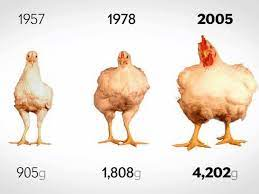

# Meat

## Processed meat

- "The World Health Organization has classified processed meats as a group 1 carcinogen, meaning it's known to cause cancer. Processed meats contain chemicals that are not present in fresh meat,"
- Coronary Artery Disease
- processed meat that has nitrates.
- nitrite can eventually form carcinogenic nitrosamines in the acidic environment."
- **coronary heart disorder**

## Weird Meat nutrition labels

- Raw or undercooked foods of animal origin
- “Foods of animal origin” instead of meat

## Harmful Histamines in Meat

### Understanding Histamines

**Histamines** are organic compounds involved in various physiological functions, primarily related to the immune response and regulation of bodily functions. They play a critical role in:

- **Allergic Reactions**: Histamines are released by the body during allergic responses, leading to symptoms like itching, swelling, and redness.
- **Regulation of Stomach Acid**: They help stimulate gastric acid secretion, aiding in digestion.
- **Neurotransmission**: Histamines act as neurotransmitters in the brain, influencing wakefulness and appetite.

### Histamines in Meat

When it comes to meat, histamines can be a concern, especially if the meat is not stored or handled properly. Here are some key points:

- **Histamine Formation**: Certain bacteria can produce histamines in protein-rich foods, including meat, especially if they are improperly stored or aged. This process can lead to higher histamine levels.
- **Scombroid Poisoning**: This is a foodborne illness caused by consuming fish with high levels of histamine due to improper storage. While it's more commonly associated with fish, similar processes can occur in some meats.
- **Symptoms of Histamine Intolerance**: Some individuals may experience symptoms like headaches, rashes, or gastrointestinal issues after consuming high-histamine foods, including improperly handled meats.

### Industrialized Groceries and Histamines

In industrialized grocery products, histamine levels can vary:

- **Processed Meats**: Items like sausages, deli meats, and other processed products may contain higher histamine levels due to the curing and fermentation processes.
- **Preservatives and Additives**: Some preservatives might affect the histamine content, but the primary concern is often related to microbial activity.
- **Storage Conditions**: Industrialized products not kept at the correct temperatures can lead to increased histamine production.

### Conclusion

While histamines are essential for various bodily functions, high levels of histamines in meat and other food products can lead to health issues, especially for those with histamine intolerance. Proper storage and handling of meat, as well as being mindful of processed foods, are important to minimize risks associated with harmful histamines.
