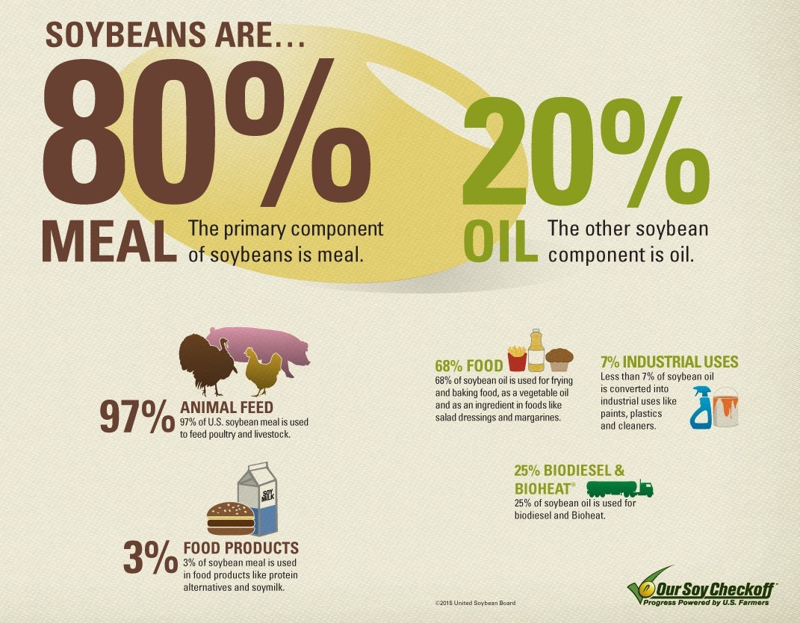

# Vegetable and Seed Oils

- BEEF MICROSPRAY
- A common herbicide used in wheat farming. Residues can remain in processed wheat products.
- Some research links **glyphosate** exposure to inflammatory conditions and other health issues.
- Malodextrin: Modified Food Starch
- Fungicides: Sulfur Dioxide
- Endocrine Disruptors
- GMO soy

## CANOLA OIL

There's not a canola plant, but you can still find this all-purpose cooking oil in many a pantry. It comes from the rapeseed plant, but that's a loaded name to try to sell. Canadian scientists made the rapeseed oil better suited for cooking, and now you can purchase "Canada Oil, Low Acid."

banned in the United States in 1956 by the FDA due to its high levels of erucic acid, which can cause cardiac problems. However, in the 1970s, farmers developed strains of rapeseed with lower levels of erucic acid, making it safe for human consumption.”

## Cottonseed

Cottonseed oil, which is derived from the seeds of the cotton plant, contains a toxic compound called gossypol. Gossypol is a natural pesticide that protects the plant from insects and other pests. However, it can be toxic to humans and animals if consumed in large amounts.

### Toxic Effects of Gossypol

Gossypol has been linked to several negative effects, including:

Infertility and liver damage: High concentrations of gossypol have been shown to cause infertility and liver damage in animals and humans.
Respiratory distress: Gossypol can cause respiratory distress, including coughing, wheezing, and shortness of breath.
Impaired body weight gain: Gossypol can impair body weight gain and overall health in animals and humans.
Anorexia and weakness: Gossypol can cause a loss of appetite and weakness in animals and humans.
Death: High concentrations of gossypol can be fatal in some cases.”
