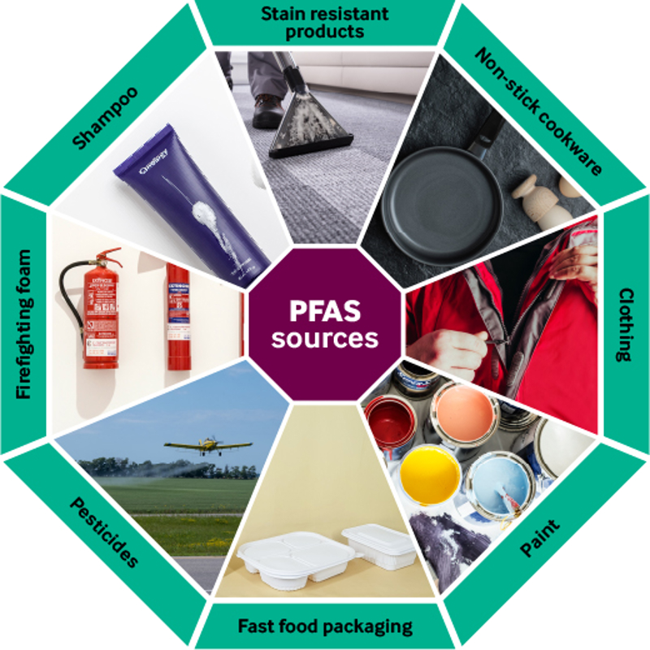

# PFAs

## Per- and polyfluoroalkyl substances (PFAS), also known as "forever chemicals," are a real concern in clothing. Here's what you need to know:

**Why are PFAS used in clothing?**

* PFAS make clothing **water-resistant** and **stain-resistant**. This is desirable for rain jackets, hiking pants, activewear, and even some everyday clothes.

**How widespread are PFAS in clothing?**

* Studies have shown PFAS to be present in a significant portion of clothing, including:
  * Rain jackets and outerwear [1, 2]
  * Yoga pants and athletic wear [2]
  * Even some children's clothing [3]

**Why are PFAS a concern?**

* PFAS are called "forever chemicals" because they break down very slowly in the environment and our bodies.
* They have been linked to various health problems, including some cancers, immune system issues, and reproductive problems [1].

**Should I be worried about PFAS in my clothes?**

* The level of risk is still being studied, but some exposure is likely from wearing PFAS-treated clothing.
* Children might be more vulnerable due to their developing bodies [3].

**How can I minimize PFAS exposure from clothing?**

* Look for clothes labelled **PFAS-free** or made with alternative water-repellent technologies.
* Tightly woven fabrics can be naturally water-resistant.
* Wash clothes less frequently according to care instructions to potentially reduce PFAS release.

**Are there regulations on PFAS in clothing?**

* Currently, there are no major regulations on PFAS use in clothing in the US.
* Some states are considering legislation, and there are ongoing discussions about broader restrictions [1].

**Further Exploration:**

* You can find more information about PFAS in clothing from these resources:
  * Environmental Working Group: [Environmental Working Group PFAS in clothing ON ewg.org]
  * NRDC: [NRDC PFAS chemicals ON nrdc.org]
