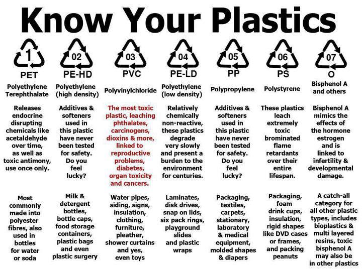

# Microplastics and Nanoplastics

## cooking utensils

Black Plastic Spatula Chemicals

Black plastic cooking spatulas can contain harmful microplastics and chemicals due to their manufacturing process and materials. The term "black plastic" refers to plastic that has been colored black using a pigment called carbon black, which is produced by charring organic matter in the absence of air. Carbon black enhances the heat resistance, strength, and rigidity of plastics, and it also blocks ultraviolet light, which can degrade plastics. However, black plastic spatulas can also contain flame retardants, which are chemicals added to plastics to prevent fires. These flame retardants can include brominated compounds like decabromodiphenyl ether (decaBDE), which has been linked to health issues such as cancer, reproductive, developmental, and immunologic toxicity effects.

When black plastic spatulas are exposed to heat, these chemicals can leach into food, potentially causing health risks. Microplastics, which are tiny pieces of plastic ranging in size from 5 millimeters to 0.001 millimeters, can also transfer to food when using black plastic utensils. These microplastics can lead to changes in gut and oral microbiota and harm to the kidney. The presence of these microplastics and chemicals is particularly concerning because they can accumulate in the body over time, even at low levels of exposure.

To avoid these risks, it is recommended to use alternative materials for cooking utensils, such as wood, stainless steel, or silicone, which are less likely to leach harmful chemicals into food. 

## Receipt Paper

Receipt paper, particularly thermal paper used in cash registers, contains chemicals like bisphenol A (BPA) and bisphenol S (BPS) that can be harmful to human health. These chemicals are endocrine disruptors and can interfere with the body's hormone system, potentially leading to reproductive and developmental abnormalities, diabetes, thyroid conditions, and increased susceptibility to cancer Studies have shown that BPA and BPS can be absorbed through the skin when people handle receipts, and workers who frequently handle receipts, such as cashiers, may have higher exposure levels Efforts to reduce exposure include opting for digital receipts and washing hands after handling thermal paper receipts

## plastic contaminants in body

[There are Microplastics in Your Testicles - Here's What You Can Do About it](https://youtu.be/ATGW8kvEUDo?si=cKuxdYJxuKsjqTRI)

## Car Tires

- number 1 source of microplastic exposure is being near roads and inhaling microplastics from burning rubber

- Microplastics: Popular brands of bottled water contain up to 100 times more nanoplastics — even tinier flecks of the material than microplastics — than previously thought, a monumental study found earlier this year. We now know that these plastic bits have made their way into many parts of our bodies, where they may trigger inflammation, metabolic changes, reproductive issues and Parkinson’s disease-related brain changes. And it’s not just drinking bottled water that exposes us to microplastics. “Nine out of 10 plastic bottles end up in the environment where they disintegrate into microplastics and nanoplastics that cause global pollution and adverse health effects on living organisms including humans,” Rolf Halden, director of Arizona State University’s Biodesign Center for Environmental Health Engineering, tells Yahoo Life.
- Phthalates: These chemicals are used to make plastics more flexible and durable. They can be found in everything from cosmetic products to food, flooring and bottled water. Phthalates are known as “endocrine disruptors” because they interfere with the endocrine system, which regulates hormones. The chemicals have been linked to reproductive health issues, low IQ in children and metabolic changes.
- PFAS: Best known as forever chemicals, per- and polyfluoroalkyl substances are synthetics used to treat products including carpets and nonstick pans to make them heat-resistant. It can take hundreds or thousands of years for PFAS to break down in the environment and up to a decade for them to leave the human body. And while they’re already in our bodies, high levels of PFAS may contribute to higher cholesterol levels, liver enzyme changes, preeclampsia during pregnancy, low birth weights and greater testicular and kidney cancer risks. They may also contribute to obesity and metabolic issues.
- BPA: Bisphenol A, or BPA, is a chemical used to make food packaging stronger and less vulnerable to corrosion or breaking down. But like phthalates, it disrupts hormones and has been linked to higher risks of infertility, PCOS, diabetes, cardiovascular disease and breast and prostate cancer. However, the Food and Drug Administration considers BPA levels in food packaging safe, and stated after a four-year review that safety standards don’t need to be changed.

## plastic grinders

Plastic grinders tend to break and leave shavings of themselves in the buds you grind.

This means you might smoke tiny plastic shavings with your herb, whether they burn in the process or just inhale the tiny microplastics. So either way, you are getting harmful chemicals in your bloodstream, which is highly not recommended.
