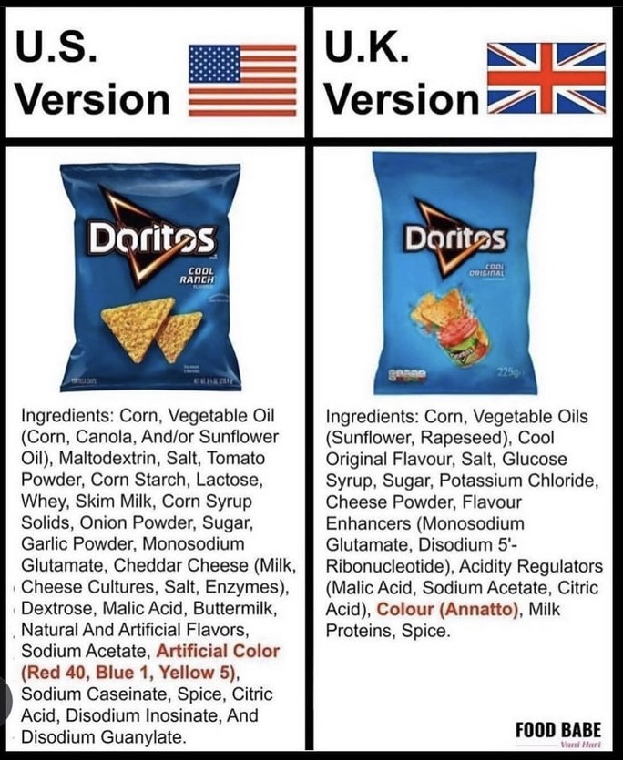

# PROCESSED FOODS

## Trisodium phosphate (TSP)

Trisodium phosphate (TSP) is a food additive commonly found in processed foods. While the FDA considers it safe for consumption in small amounts, there are growing concerns about the potential health risks of consuming too much TSP.

Here's what we know so far:

- **Possible strain on the kidneys:** For people with healthy kidneys, small amounts of TSP likely don't pose a problem. However, for those with existing kidney issues, consistently consuming high levels of phosphate can make it harder for the kidneys to function properly. This can lead to unhealthy levels of phosphorus in the blood.
- **Reduced bone density:** Studies suggest that a diet high in TSP may contribute to bone loss. This is because high phosphate intake can increase the production of fibroblast growth factor 23 (FGF23), a hormone that interferes with the body's ability to use calcium for bone mineralization.
- **Other potential health risks:** There is some evidence that high phosphate intake may also be linked to an increased risk of heart disease and mortality. More research is needed to confirm this connection.

**It's important to note that most of the research on the health effects of TSP is still ongoing.** If you're concerned about your intake of sodium phosphate, it's wise to:

- **Limit processed foods:** Processed foods are the primary source of dietary TSP. By limiting your intake of processed foods, you can naturally reduce your consumption of TSP.
- **Check food labels:** Read the ingredients list on food labels. If you see "sodium phosphate" or "TSP" listed, it means the food contains this additive.
- **Choose natural sources of phosphorus:** Many whole foods are naturally rich in phosphorus, including dairy products, meat, fish, nuts, seeds, and beans.

## Ultraprocessed foods

Ultraprocessed foods are manufactured industrial products that contain little to no whole food ingredients. They are often highly palatable, convenient, and inexpensive, but also linked to various health problems, including obesity, diabetes, and cancer.

### Key Characteristics of Ultraprocessed Foods

1. High in added sugars, salt, and unhealthy fats
2. Low in essential nutrients, fiber, and whole food components
3. Contain artificial additives, preservatives, and coloring agents
4. Often highly processed and transformed from their natural state

### Foods to Avoid

Based on scientific evidence, the following ultraprocessed foods have been linked to increased risks of obesity, diabetes, and cancer:

### 1. **Packaged snacks**:

- Chips, crackers, and pretzels
- Cookies, cakes, and pastries
- Candy and sugary treats

### 2. **Processed meats**:

- Hot dogs, sausages, and bacon
- Canned meats, such as Spam and corned beef

### 3. **Frozen meals and TV dinners**:

- Pizza, chicken nuggets, and other processed entrees

### 4. **Beverages**:

- Sugary soft drinks, sports drinks, and energy drinks
- Flavored waters and sweetened teas

### 5. **Ready-to-eat cereals**:

- Many commercial cereals contain added sugars and artificial ingredients

### 6. **Processed baked goods**:

- Muffins, croissants, and other sweet breads

### 7. **Fried foods**:

- French fries, fried chicken, and doughnuts

### Foods to Limit or Avoid

1. Soft drinks (e.g., Coca-Cola, Pepsi)
2. Processed breakfast cereals (e.g., Frosted Flakes, Froot Loops)
3. Frozen pizza (e.g., Totino's, Stouffer's)
4. Canned soups (e.g., Campbell's, Progresso)
5. Processed meat products (e.g., Oscar Mayer hot dogs, Ball Park franks)
6. Sugary yogurts (e.g., Dannon, Yoplait)
7. Flavored instant noodles (e.g., Ramen, Cup Noodles)

### Conclusion

Ultraprocessed foods are a significant contributor to chronic diseases, including obesity, diabetes, and cancer. By limiting or avoiding these foods and focusing on whole, nutrient-dense foods, you can reduce your risk of developing these conditions and promote overall health and well-being.
