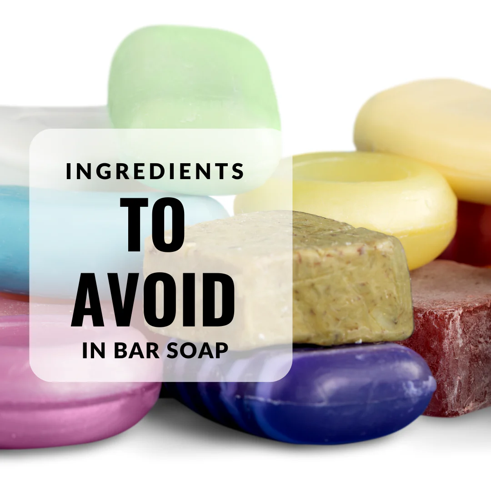
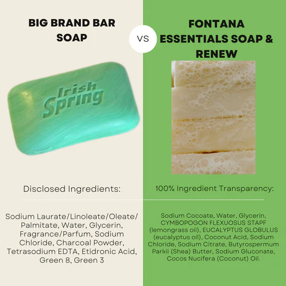
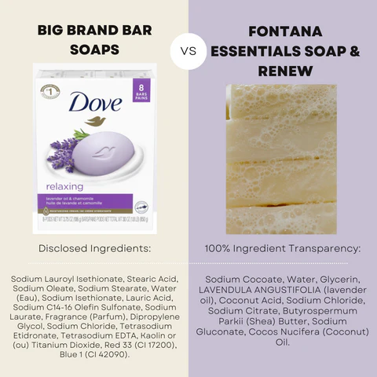

# Chemicals in Soap

[fontana candle co](https://fontanacandlecompany.com/blogs/bee-well-blog/ingredients-to-avoid-in-bar-soap)

Based on the provided search results, here's a summary of the harmful chemical ingredients found in soap bars and liquids:

1. **Contamination of bar soaps**: A study published in PubMed (Contamination of bar soaps under "in-use" conditions) found that 100% of 84 samples from public lavatories yielded positive cultures, indicating microbial contamination. The study suggested that bar soaps may be a potential reservoir for the spread of cross-infection in public institutions.
2. **Preservatives and antimicrobial agents**: Research highlighted the presence of harmful preservatives and antimicrobial agents in soaps, including:

* Quaternium-15, which releases formaldehyde, a known carcinogen.
* Diazolidinyl urea, imidazolidinyl urea, and formaldehyde-releasing agents, which can cause skin irritation, allergic reactions, and potentially trigger asthma.
* Triclosan, a synthetic antimicrobial agent linked to hormone disruption, antibiotic resistance, and potential human health risks.

3. **Fragrances and phthalates**: Studies detected the presence of phthalates, a group of chemicals used in fragrances, which have been shown to:

* Cause damage to the liver, kidneys, lungs, and reproductive system.
* Disrupt hormone balance, particularly in males.

4. **Dioxane**: Research found that 1,4-dioxane, a byproduct of ethoxylation, is commonly present in soaps and can:

* Penetrate the skin and cause organ toxicity.
* Be linked to cancer and other health issues.

5. **SLS and SLES**: Sodium Lauryl Sulfate (SLS) and Sodium Laureth Sulfate (SLES) are common foaming agents in soaps, which can:

* Cause skin irritation, allergic reactions, and dryness.
* Stripping the skin of its natural oils.

6. **Other harmful ingredients**: Additional research highlighted the presence of other harmful chemicals in soaps, including:

* Parabens, which mimic estrogen and can cause hormone disruption.
* PEGs (Polyethylene Glycol), petroleum-based compounds used as penetration enhancers, thickeners, solvents, and moisture-carriers.
* Borax, which can cause skin irritation and allergic reactions.

To minimize exposure to these harmful chemicals, consider opting for natural, fragrance-free, and hypoallergenic soaps that use gentle, plant-based ingredients. Always read labels and look for certifications like EWG Verified or Leaping Bunny to ensure the products meet your standards for safety and sustainability.

Some soap products may contain 1,4-dioxane, a chemical byproduct of the manufacturing process for certain ingredients.

Here's what you need to know:

* **What is 1,4-dioxane?**
  * It's a chemical classified as a probable human carcinogen by the U.S. Environmental Protection Agency (EPA).
  * It can be found as a contaminant in some personal care products, including soaps, shampoos, and cosmetics.

* **How does it get into soap?**
  * 1,4-dioxane is not intentionally added to soap.
  * It can be a byproduct of the manufacturing process for certain ingredients, such as those containing ethoxylated compounds (like sodium laureth sulfate or ammonium laureth sulfate).

* **Scientific research:**
  * **Carcinogenicity:** The EPA has classified 1,4-dioxane as a probable human carcinogen based on animal studies that showed an increased risk of cancer.
  * **Exposure:**
    * 1,4-dioxane can be absorbed through the skin, inhaled, or ingested.
    * Exposure from personal care products is generally considered low-level.
  * **Regulation:**
    * The Food and Drug Administration (FDA) does not have specific regulations for 1,4-dioxane in cosmetics.
    * Some states have implemented regulations or restrictions on 1,4-dioxane in personal care products.

* **What can you do?**
  * **Check product labels:** Look for ingredients like sodium laureth sulfate (SLES) or ammonium laureth sulfate (ALES), which may contain 1,4-dioxane.
  * **Choose products with alternative ingredients:** Look for soaps and other personal care products made with sulfate-free surfactants, such as sodium cocoyl isethionate or sodium lauroyl isethionate.
  * **Consider organic or natural products:** These products are often less likely to contain 1,4-dioxane.

**Disclaimer:** This information is for general knowledge and informational purposes only and does not constitute medical advice.

**For further information:**

* You can consult the EPA's website for more information on 1,4-dioxane.
* You can also contact the manufacturer of a specific product for information about its ingredients and manufacturing process.

I hope this information is helpful! Let me know if you have any other questions.
