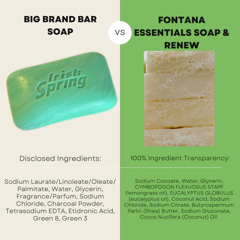
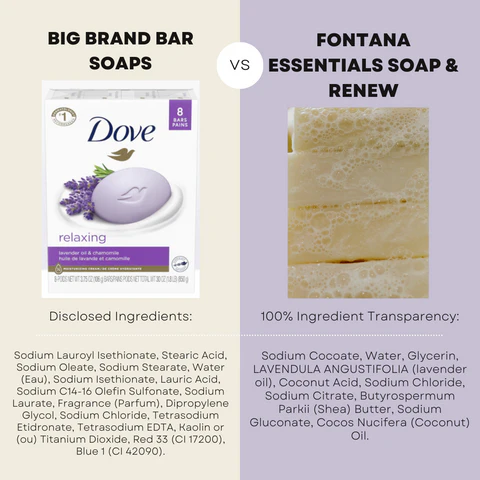

# Chemicals in Soap

[fontana candle co](https://fontanacandlecompany.com/blogs/bee-well-blog/ingredients-to-avoid-in-bar-soap)

## harmful chemical ingredients found in soap bars and liquids:

### Contamination of bar soaps

A study published in PubMed (Contamination of bar soaps under "in-use" conditions) found that 100% of 84 samples from public lavatories yielded positive cultures, indicating microbial contamination. The study suggested that bar soaps may be a potential reservoir for the spread of cross-infection in public institutions.

### Preservatives and antimicrobial agents

Research highlighted the presence of harmful preservatives and antimicrobial agents in soaps, including:

* Quaternium-15, which releases formaldehyde, a known carcinogen.
* Diazolidinyl urea, imidazolidinyl urea, and formaldehyde-releasing agents, which can cause skin irritation, allergic reactions, and potentially trigger asthma.
* Triclosan, a synthetic antimicrobial agent linked to hormone disruption, antibiotic resistance, and potential human health risks.

### Fragrances and phthalates

Studies detected the presence of phthalates, a group of chemicals used in fragrances, which have been shown to:

* Cause damage to the liver, kidneys, lungs, and reproductive system.
* Disrupt hormone balance, particularly in males.

### Dioxane

Research found that 1,4-dioxane, a byproduct of ethoxylation, is commonly present in soaps and can:

* Penetrate the skin and cause organ toxicity.
* Be linked to cancer and other health issues.

### SLS and SLES

Sodium Lauryl Sulfate (SLS) and Sodium Laureth Sulfate (SLES) are common foaming agents in soaps, which can:

* Cause skin irritation, allergic reactions, and dryness.
* Stripping the skin of its natural oils.

### Other harmful ingredients

Additional research highlighted the presence of other harmful chemicals in soaps, including:

* Parabens, which mimic estrogen and can cause hormone disruption.
* PEGs (Polyethylene Glycol), petroleum-based compounds used as penetration enhancers, thickeners, solvents, and moisture-carriers.
* Borax, which can cause skin irritation and allergic reactions.

To minimize exposure to these harmful chemicals, consider opting for natural, fragrance-free, and hypoallergenic soaps that use gentle, plant-based ingredients. Always read labels and look for certifications like EWG Verified or Leaping Bunny to ensure the products meet your standards for safety and sustainability.

### Some soap products may contain 1,4-dioxane

* **What is 1,4-dioxane?**

* a chemical byproduct of the manufacturing process for certain ingredients
* It's a chemical classified as a probable human carcinogen by the U.S. Environmental Protection Agency (EPA).
* It can be found as a contaminant in some personal care products, including soaps, shampoos, and cosmetics.

* **How does it get into soap?**
  * 1,4-dioxane is not intentionally added to soap.
  * It can be a byproduct of the manufacturing process for certain ingredients, such as those containing ethoxylated compounds (like sodium laureth sulfate or ammonium laureth sulfate).

* **Scientific research:**
  * **Carcinogenicity:** The EPA has classified 1,4-dioxane as a probable human carcinogen based on animal studies that showed an increased risk of cancer.
  * **Exposure:**
    * 1,4-dioxane can be absorbed through the skin, inhaled, or ingested.
    * Exposure from personal care products is generally considered low-level.
  * **Regulation:**
    * The Food and Drug Administration (FDA) does not have specific regulations for 1,4-dioxane in cosmetics.
    * Some states have implemented regulations or restrictions on 1,4-dioxane in personal care products.

* **What can you do?**
  * **Check product labels:** Look for ingredients like sodium laureth sulfate (SLES) or ammonium laureth sulfate (ALES), which may contain 1,4-dioxane.
  * **Choose products with alternative ingredients:** Look for soaps and other personal care products made with sulfate-free surfactants, such as sodium cocoyl isethionate or sodium lauroyl isethionate.
  * **Consider organic or natural products:** These products are often less likely to contain 1,4-dioxane.

**Disclaimer:** This information is for general knowledge and informational purposes only and does not constitute medical advice.

**For further information:**

* You can consult the EPA's website for more information on 1,4-dioxane.
* You can also contact the manufacturer of a specific product for information about its ingredients and manufacturing process.

## Ingredients to Avoid in Shampoos

* **Sulfates (SLS, SLES)**: Sulfates, such as sodium lauryl sulfate (SLS) and sodium laureth sulfate (SLES), are surfactants that create lather. They can strip the natural oils from the hair and scalp, leading to dryness, irritation, and potential damage. SLES can also form carcinogenic byproducts like 1,4-dioxane during manufacturing, which has been shown to contribute to cancer development in lab animals.

* **Parabens**: Parabens, such as methylparaben, ethylparaben, and butylparaben, are preservatives that mimic estrogen and can disrupt hormone balance. They are linked to reproductive health issues, skin irritation, and have been associated with increased breast cancer risk. Parabens can also cause ecological harm.

* **Triclosan**: Triclosan is an antibacterial agent used in shampoos and other personal care products. It has been classified as a potential endocrine disruptor, which can affect reproductive health, cause immune system issues, and is linked to cancer. Triclosan has been banned from antibacterial soaps due to these concerns.

* **Formaldehyde Releasers (Quaternium-15)**: Ingredients like quaternium-15 release formaldehyde, a known carcinogen. Formaldehyde can cause allergic reactions, skin irritation, and has been linked to cancer. It can also affect or cause asthma.

* **Synthetic Fragrances and Colors**: The term "fragrance" or "parfum" often includes a blend of chemicals that can cause allergies, asthma, and even cancer. Synthetic colors, derived from coal tar or petroleum, can lead to hair loss, irritation, and are carcinogenic.

* **PEG (Polyethylene Glycol)**: PEG is a thickening agent that can strip moisture from the hair and scalp, causing breakage. It has been classified as a developmental toxicant and is linked to cancer.

* **Phthalates**: These are used as gelling agents and to keep products soft and fragrant. Phthalates can be absorbed into the body and have been linked to reproductive health issues, including reduced fertility and increased risk of birth defects.

* **Ethanolamines (MEA, TEA, DEA)**: These compounds are used as emulsifiers in hair care products. They can accumulate in tissues and have been associated with liver tumors and altered sperm structure, leading to infertility and affecting fetal brain development.

* **Synthetic Musks**: These perfumed compounds are absorbed through the skin and can affect hormonal and reproductive functions. They are particularly concerning for pregnant or breastfeeding women due to potential harm to the fetus or child.

* **Benzophenone**: This compound is used in sunscreens and hair care products. It can seep through the skin and collect in the body, potentially causing harm.

* **Toluene**: Toluene is a petrochemical solvent used in hair dyes. It can cause skin irritation and is harmful if inhaled.

* **Selenium Sulfide**: Selenium sulfide is a carcinogen that has been shown to cause tumor development in lab tests. It is commonly found in anti-dandruff shampoos.

### Shampoos that typically avoid the ingredients are often labeled as "natural," "organic," or "free-from."

* **Brands:**
  * **Acure:** Known for their organic and natural ingredients.
  * **SheaMoisture:** Uses ethically sourced shea butter and other natural ingredients.
  * **Puracy:** Focuses on plant-derived and biodegradable ingredients.
  * **Josh Rosebrook:** Known for their high-quality, luxurious, and minimally processed products.
  * **Rahua:** Uses Amazonian superfoods like ungurahua oil.
  * **Nature's Gate:** Offers a wide range of natural and organic hair care products.

* **Keywords:**
  * **"No Sulfates" (or "Sulfate-Free")**
  * **"No Parabens"**
  * **"No Phthalates"**
  * **"No Triclosan"**
  * **"No Formaldehyde"**
  * **"No Synthetic Fragrances"**
  * **"No PEG"**
  * **"No Ethanolamines"**
  * **"No Synthetic Musks"**
  * **"No Benzophenone"**
  * **"No Toluene"**
  * **"No Selenium Sulfide"**
  * **"Organic"**
  * **"Natural"**
  * **"Plant-Based"**

**Important Notes:**

* **Always read the ingredient list:** Even if a product claims to be "natural," carefully check the ingredients to ensure it aligns with your specific needs and concerns.
* **Look for certifications:** Some brands may have certifications from organizations like the USDA Organic or the Leaping Bunny (cruelty-free).
* **Consider your hair type:** Choose a shampoo that is specifically formulated for your hair type (e.g., dry, oily, color-treated).

**Disclaimer:** This information is for general knowledge and guidance only. It's essential to consult with a dermatologist or a qualified healthcare professional for personalized advice on hair care products that suit your individual needs and sensitivities.

## Castile Soap Benefits Explained

Castile soap is a good choice for several reasons, rooted in its composition and properties. It is made from vegetable oils such as olive, coconut, and palm, and does not contain animal fats or synthetic ingredients. This plant-based composition makes it a natural and biodegradable option, which is beneficial for the environment.

One of the key scientific reasons why castile soap is effective is its amphiphilic nature. The molecules in castile soap have one end that bonds to water and another that repels it. When mixed with water, these molecules attach to dirt, grime, and grease, effectively removing them from surfaces. This property is what allows castile soap to be a versatile cleaner for both personal care and household use.

Castile soap is also hypoallergenic and mild, making it suitable for individuals with sensitive skin. It can be used as a gentle cleanser for the body and hair, and its moisturizing properties can help soothe irritated skin. The anti-inflammatory effects of olive oil, a common ingredient in castile soap, contribute to its soothing nature.

Additionally, castile soap is not corrosive, allowing it to be safely used on various surfaces without causing damage. This makes it a reliable choice for cleaning a wide range of items, from dishes to laundry, and even for pets.

However, it is important to use castile soap correctly, typically by diluting it properly before application. Overuse or incorrect dilution can lead to issues such as a white film residue on surfaces, especially in hard water conditions.