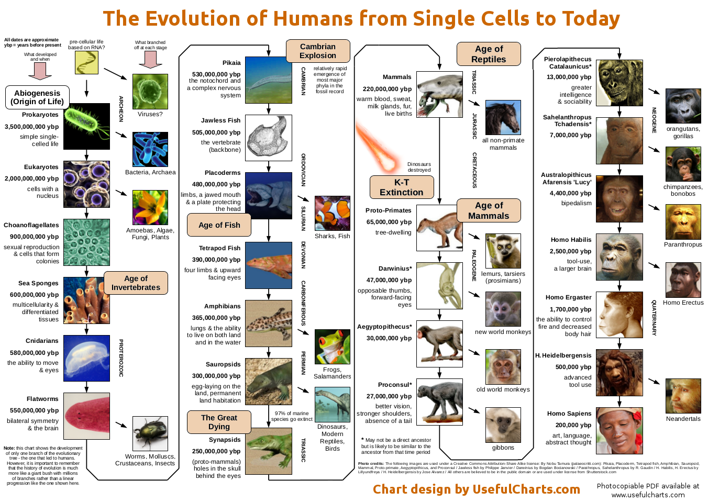

# Genetics

## Epigenetics

Epigenetics is the study of changes in gene activity that do not involve alterations to the DNA sequence. These changes can influence how genes are expressed and can be passed on to daughter cells during cell division. Key mechanisms include DNA methylation, histone modifications, and non-coding RNA. These modifications can affect gene expression without changing the underlying DNA sequence, influencing traits and potentially being inherited across generations.

## Telomerase Upregulation when Fasting

Fasting has been shown to have significant effects on stem cell rejuvenation and telomere length, which are crucial aspects of cellular health and longevity. Telomerase, the enzyme responsible for maintaining telomere length, plays a vital role in this process. Here's how fasting influences telomerase and its regulation through epigenetic mechanisms:

* **Telomerase Activation**: Fasting can activate telomerase, which helps in extending and maintaining the length of telomeres. Longer telomeres are associated with increased stem cell pluripotency, enhancing the regenerative capacity of cells.
  
* **Epigenetic Regulation**: Fasting can alter DNA methylation patterns, which are key epigenetic modifications. These changes can affect the expression of genes like TERT, the catalytic subunit of telomerase. For instance, hypermethylation of the TERT promoter can lead to reduced telomerase activity, while demethylation can upregulate it.

* **Histone Modifications**: Fasting can also influence histone modifications, such as acetylation and methylation, which can alter chromatin structure and gene expression. These modifications can impact the accessibility of the TERT promoter and thus regulate telomerase activity.

* **miRNA Regulation**: Fasting can modulate the expression of microRNAs (miRNAs) that target TERT. For example, miR-512-5p has been shown to downregulate TERT expression and telomerase activity in head and neck squamous cell carcinoma cells. Changes in miRNA expression during fasting can therefore influence telomerase activity.

* **Circadian Clock**: Intermittent fasting can reset the circadian clock, which is known to regulate various cellular processes, including telomerase activity. Disruption of circadian rhythms can lead to cancer and metabolic syndrome, while resetting the clock can protect against these conditions.

* **DNA Repair**: Fasting can upregulate proteins involved in DNA repair, which is essential for maintaining telomere integrity. Enhanced DNA repair mechanisms can help preserve telomere length and function.

* **Proteomic Changes**: Intermittent fasting can induce an anticancer serum proteomic signature, upregulating key regulatory proteins involved in glucose and lipid metabolism, circadian clock, DNA repair, immune system, and cognitive function. These changes can indirectly support telomerase activity and telomere maintenance.

* **Stem Cell Rejuvenation**: Fasting can rejuvenate the stem cell pool by increasing the percentage of stem cells with long telomeres, allowing for a quicker response to injuries and prolonged proliferation when nutrients are available again.

* **Clinical Implications**: The effects of fasting on telomerase and telomere length have important clinical implications. Intermittent fasting can be a preventive and adjunct therapy in cancer, metabolic syndrome, and several cognitive and neuropsychiatric diseases, without the need for calorie restriction or significant weight loss.

* **Future Research**: Further studies are needed to fully understand the mechanisms by which fasting influences telomerase and telomere length. This includes exploring the interplay between genetic, epigenetic, and environmental factors in regulating telomerase activity during fasting.

## Genome Sizes

### Salamanders genome

its cells are up to 300 times larger than those of a lizard, bird or mammal. You can see, with a simple magnifying glass, individual blood cells zipping through the capillaries in its transparent gills.

Each of its cells is bloated with 38 times more DNA than a human cell.

Neuse River waterdog

## The uncertainty in the number of human genes

the range of 20,000 to 25,000 human genes reflects both our current best estimate based on available data and an acknowledgment of the inherent uncertainties in counting something as dynamic and multifaceted as the human genome.

1. **Gene Definition**: What exactly counts as a gene? The definition has evolved. Initially, genes were thought of as segments of DNA that code for proteins. But with discoveries like non-coding RNAs that have regulatory roles, the line blurs. Some genes might be partial or overlap, complicating the count.

2. **Alternative Splicing**: One gene can produce multiple proteins through alternative splicing, where different exons of the same gene are combined in various ways. This means one gene sequence can be considered multiple genes based on how you count its products.

3. **Pseudogenes**: These are segments of DNA that resemble genes but are non-functional, often remnants of genes that were once active but have since been inactivated by mutations. Whether to count these as genes is a contentious point.

4. **Gene Overlaps**: Sometimes, different genes can overlap on the same strand of DNA, sharing some sequences. Deciding whether to count these as one or multiple genes adds to the ambiguity.

5. **Sequencing andAssembly Errors**: The human genome's sequence is massive and complex. Despite advancements, there can be errors or gaps in genome assembly, leading to uncertainties in gene annotation, especially in repetitive or structurally complex regions.

6. **Population Variability**: Humans aren't genetically identical. There's natural variation in gene numbers across individuals due to genetic polymorphisms, insertions, deletions, or duplications. This variability means the "average" number of genes can fluctuate.

7. **Research Evolution**: As technology and techniques for gene identification evolve, so does our understanding. New genes might be discovered, or previously identified sequences might be reclassified as not genes after all.

8. **Regulatory Elements**: Some sequences might not directly code for proteins but play crucial roles in gene regulation. Whether these should be counted as genes in certain contexts is debated.

## Epigenetics

Epigenetics is the study of heritable changes in gene function that occur without a change in the underlying DNA sequence. In the context of neuroscience and genetics, epigenetics plays a crucial role in shaping the development, function, and plasticity of the brain, as well as its response to environmental factors and experiences.

**Epigenetic Mechanisms:**

1. **DNA Methylation:** The addition of a methyl group (-CH3) to cytosine residues in CpG dinucleotides, resulting in gene silencing.
2. **Histone Modification:** The covalent modification of histone proteins, which DNA wraps around to form chromatin, affecting gene accessibility and expression. Common modifications include acetylation, methylation, phosphorylation, and ubiquitination.
3. **Chromatin Remodeling:** The reorganization of chromatin structure, allowing or blocking access to transcription factors and other regulatory proteins.

**Neuroscientific Context:**

1. **Developmental Epigenetics:** Epigenetic mechanisms regulate gene expression during brain development, influencing the formation of neural circuits, synapse formation, and neuronal migration.
2. **Experience-Dependent Epigenetic Changes:** Environmental stimuli, such as learning and stress, induce epigenetic changes in specific genes, leading to changes in gene expression and neural plasticity.
3. **Epigenetic Regulation of Neurotransmission:** Epigenetic mechanisms control the expression of neurotransmitter receptors, transporters, and enzymes, influencing synaptic transmission and plasticity.
4. **Epigenetic Contributions to Neurological and Psychiatric Disorders:** Aberrant epigenetic marks have been implicated in various neurological and psychiatric disorders, including Rett syndrome, autism, depression, and anxiety disorders.

**Genetic Factors:**

1. **Epigenetic Gene Variants:** Variations in genes involved in epigenetic regulation, such as histone-modifying enzymes and DNA methyltransferases, can influence epigenetic marks and gene expression.
2. **Genetic Susceptibility:** Genetic predisposition can influence the response to environmental stimuli and the induction of epigenetic changes, contributing to individual differences in brain function and behavior.
3. **Epigenetic Interactions with Genetic Variants:** Epigenetic marks can interact with genetic variants to modulate gene expression and phenotypic outcomes.

**Key Findings:**

1. **Epigenetic Regulation of BDNF:** Epigenetic mechanisms control the expression of brain-derived neurotrophic factor (BDNF), a key molecule in neuronal survival and plasticity.
2. **Histone Acetylation and Memory:** Histone acetylation is involved in the consolidation of long-term memory, and its dysregulation has been linked to memory impairments.
3. **DNA Methylation and Neurodevelopment:** DNA methylation plays a crucial role in regulating gene expression during neurodevelopment, influencing the formation of neural circuits and synapse formation.
4. **Epigenetic Markers of Neurological and Psychiatric Disorders:** Epigenetic markers, such as DNA methylation and histone modification, have been identified as potential biomarkers for neurological and psychiatric disorders.

**Therapeutic Implications:**

1. **Epigenetic Therapies:** Targeting epigenetic mechanisms, such as histone deacetylases or DNA methyltransferases, may offer new avenues for treating neurological and psychiatric disorders.
2. **Environmental Enrichment:** Providing enriched environments that promote epigenetic changes may have therapeutic benefits for brain function and behavior.

In summary, epigenetics plays a critical role in shaping the brain's development, function, and plasticity, and its dysregulation contributes to various neurological and psychiatric disorders. Understanding the interplay between epigenetics, genetics, and environmental factors is essential for developing novel therapeutic strategies and improving our comprehension of brain function and behavior.

## Gene Responsive Element

A gene responsive element (RE) is a short sequence of DNA within a gene promoter or enhancer region that can bind specific transcription factors and regulate gene transcription. These elements are crucial for the coordinated response of genes to various stimuli, such as hormones, environmental signals, or stress conditions.

### Types of Response Elements

1. **Hormone Response Elements (HREs)**: These are specific DNA sequences within the promoter of a gene that can bind to hormone receptor complexes, thereby regulating transcription. For example, steroid hormones often bind to their specific receptors, which then interact with HREs to modulate gene expression.

2. **Antioxidant Responsive Elements (AREs)**: AREs are cis-acting DNA sequences that are essential for the basal and inducible expression of antioxidant and detoxification genes. They are activated by oxidative stress inducers and bind to transcription factors like Nrf2, which form heterodimers with small Maf proteins to regulate targeted antioxidant genes.

3. **Estrogen Responsive Elements (EREs)**: EREs are cis-acting enhancer elements located within regulatory regions of target genes. They are bound by estrogen receptors (ERα and ERβ) when estrogen binds, leading to the regulation of estrogen-sensitive genes. EREs can also interact with other transcription factors, such as specificity protein-1 (SP-1) and activator protein 1 (AP-1), to regulate gene expression.

### Function and Regulation

- **Binding and Activation**: Response elements function by binding specific transcription factors that can activate or repress gene transcription. For instance, the cAMP-response element binding protein (CREB) is activated by phosphorylation in response to cAMP, which then binds to CREs (cAMP-response elements) to stimulate gene expression.

- **Cooperative Interactions**: Response elements often work in concert with other cis elements to provide additional control over gene transcription. For example, the combination of two or more cis elements can create a "response complex" that provides a greater flexibility in the regulation of gene transcription.

- **Selective Occupancy**: The occupancy of response elements can vary between different cell types, leading to tissue-specific gene regulation. For instance, the binding patterns of CREB can be similar across different human tissues, but the induction of target genes may differ due to the recruitment of coactivators like CREB-binding protein (CBP).

### Conclusion

Response elements play a critical role in gene regulation by serving as binding sites for transcription factors. They enable cells to respond to various stimuli by coordinating the expression of specific genes. Understanding the mechanisms of response element function is essential for comprehending how genes are regulated in response to different signals and conditions.

## Mutagenic DNA Contamination

Mutagenic DNA contamination refers to the presence of substances that can cause mutations in DNA, leading to genetic changes in an organism. These mutagens can be physical or chemical agents that alter the genetic material, usually DNA, and increase the frequency of mutations above the natural background level.

Mutagens can be categorized into physical and chemical mutagens. Physical mutagens include radiation such as X-rays, gamma rays, and ultraviolet (UV) light. Chemical mutagens include substances like polycyclic aromatic hydrocarbons (PAHs), bisphenol A (BPA), and heavy metals such as chromium, lead, mercury, arsenic, and cadmium.

Mutagenic DNA contamination can occur naturally or be introduced through environmental exposure. For example, titanium dioxide nanoparticles (TiO2-NPs) and cadmium can co-expose and cause genetic and genomic DNA damage, as shown in a study on Dicentrarchus labrax embryonic cells. These contaminants can lead to DNA damage, carcinogenesis, and chromosomal abnormalities.

The process of DNA becoming modified by mutagens is called mutagenesis. Mutagenesis can occur spontaneously in nature or as a result of mutagens. In the laboratory, mutagenesis can be induced using molecular genetic techniques such as polymerase chain reaction (PCR) to study mutations in detail.

Mutagens can affect DNA replication and repair mechanisms, leading to errors in replication and mutations. Some mutagens may directly damage DNA, while others may indirectly cause damage through metabolic processes. For instance, PAHs are not carcinogenic by themselves but can produce reactive metabolites that interact with DNA, leading to mutations.

In summary, mutagenic DNA contamination involves the presence of mutagens that can alter DNA, leading to genetic changes. These mutagens can be physical or chemical and can cause DNA damage, mutations, and potentially cancer and heritable diseases.