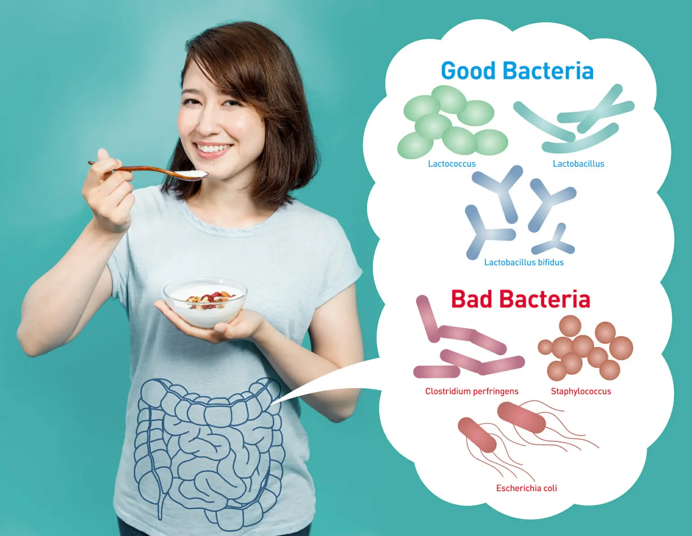
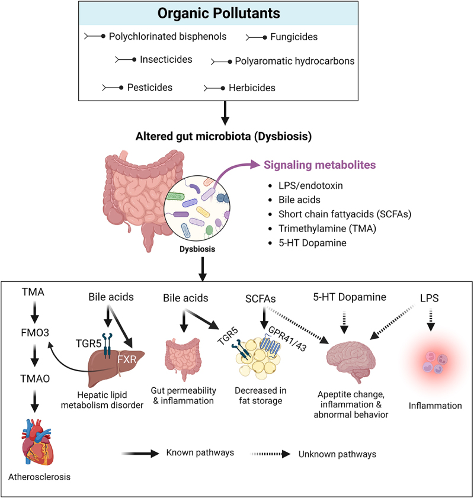
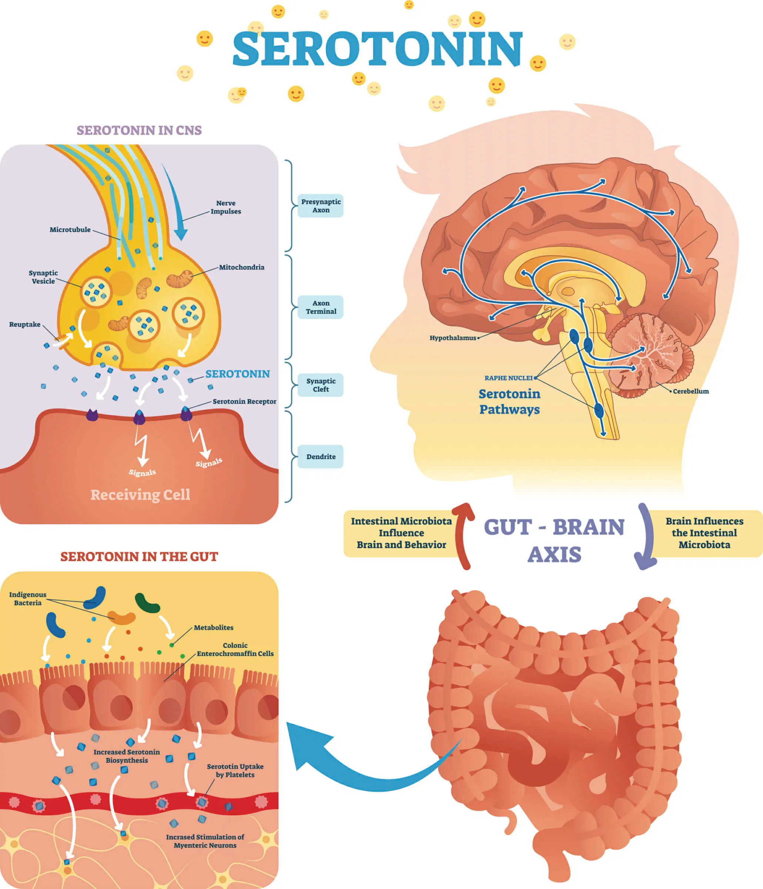

# Gut microbiome

- It's home to about 3.3 million genes, as compared to the approximately 20,000 to 25,000 human genes.
- It's composed of bacteria, archaeabacteria (which are similar to bacteria), viruses, and yeast-like single-cell eukaryotes. These microorganisms are colonized in the Gastrointestinal (GI) tract
- You can find 400 to 1,500 different species in a healthy digestive tract. [over 2000 species, including protozoa, fungi, bacteria and viruses](https://pubmed.ncbi.nlm.nih.gov/30158926/)
- There are around 35,000 microbial species across all of mankind.
- 99% of your gut microbes are from 30 to 40 species.
- Diversity is the number one defining feature of a healthy microbiome.
- the "gut brain" contains around 200 million neurons. That's incredible, considering that [the brain functions properly with "only" 86 billion neurons](https://onlinelibrary.wiley.com/doi/full/10.1002/cne.21974).

[pubmed](https://pmc.ncbi.nlm.nih.gov/articles/PMC10026936/)

## Digestion

- Without our gut microbiota we wouldn’t be able to digest and metabolize fiber, starches and sugars (carbohydrates), protein or fat.
- Our bodies only have 17 so-called carbohydrate-active enzymes (CAZymes). The remaining 10,000+ come from the bacteria in our gut, such as Bacteroides, and they’re important for digesting carbs. The main byproducts of that carb metabolism are short-chain fatty acids — including acetate, propionate and butyrate — that play vital roles in reducing inflammation, blood-sugar control, fat metabolism and more.
- [Contributions of intestinal bacteria to nutrition and metabolism](https://pubmed.ncbi.nlm.nih.gov/21787967/)

The gut microbiome refers to the diverse community of microorganisms that inhabit the gastrointestinal tract, particularly the stomach and intestines. These microorganisms, including bacteria, viruses, fungi, and other microbes, form a symbiotic relationship with the human host. The gut microbiome is considered to be a complex ecosystem that plays a crucial role in digestion, immunity, metabolism, and overall health.

In the stomach, the environment is highly acidic due to the presence of gastric acid, which helps in the digestion of food and acts as a defense mechanism against harmful pathogens. Consequently, the number and diversity of microorganisms in the stomach, particularly in the acidic environment, tend to be lower compared to other parts of the gastrointestinal tract.

While the stomach is generally inhospitable for many microorganisms, certain microorganisms can still colonize and survive in the stomach. Helicobacter pylori is a well-known example of a stomach-adapted bacterium that can colonize the gastric mucosa and has been associated with various gastrointestinal disorders, such as gastritis and peptic ulcers.

However, the majority of the symbiotic microorganisms in the gut reside in the lower parts of the gastrointestinal tract, such as the small intestine and large intestine. These regions provide a more suitable environment for microbial colonization due to factors like milder acidity, slower transit time, and availability of nutrients from undigested food.

The symbiotic microorganisms in the gut perform a range of beneficial functions. They help in the breakdown and fermentation of dietary fibers and complex carbohydrates that are otherwise indigestible by the human digestive enzymes. This process produces short-chain fatty acids, such as acetate, propionate, and butyrate, which serve as an energy source for the gut epithelial cells and influence various physiological processes.

The gut microbiome also plays a crucial role in the development and regulation of the immune system. It helps educate the immune system, ensuring appropriate responses to pathogens while maintaining tolerance to harmless substances. Additionally, the gut microbiome helps protect against colonization by harmful bacteria by competing for resources and producing antimicrobial compounds.

Imbalances or disruptions in the gut microbiome, known as dysbiosis, have been associated with various health conditions, including gastrointestinal disorders (e.g., inflammatory bowel disease), metabolic disorders (e.g., obesity, diabetes), autoimmune diseases, and even mental health disorders.

Understanding the gut microbiome and its interactions with the human host is an active area of research. Techniques such as DNA sequencing and metagenomics have revolutionized our ability to study the composition and functions of the gut microbiome, providing insights into its role in health and disease.

the gut is nearly as powerful a force as the brain, affecting your physical and mental health right now-and into your future.

For example, Bifidobacterium species in the human gut produce a neurotransmitter called gamma-aminobutyric acid (GABA), which is an inhibitory neurotransmitter that may have an analgesic effect and [may even reduce abdominal pain from a neuronal perspective](https://www.ncbi.nlm.nih.gov/pmc/articles/PMC5195897/).

Another example is Lactobacillus rhamnosus, which is a common probiotic strain to control post-antibiotic diarrhea. These bacteria [cause a change in the expression of GABA receptors in the brain](http://www.pnas.org/content/early/2011/08/26/1102999108.short) and reduce psychiatric symptoms such as anxiety and depression.

On the other hand, pathogen species such as Streptococcus, Enterococcus, Escherichia, and Candida produce a neurotransmitter called serotonin, which scientists have linked to anxiety, depression, impulsive behavior and other mental health problems.

mindless eating the 200 daily food decisions we overlook summary, relate it to research from gut microbiome influencing brain with hormones, or neuro-transmitters

- The gut microbiome’s production of ghrelin and serotonin may amplify the effects of environmental cues, leading to increased food intake and reduced awareness of food choices.
- The brain’s reward system, influenced by the gut microbiome, may prioritize immediate gratification over long-term nutritional needs, further contributing to mindless eating.

Implications and Future Research
Understanding the interplay between the gut microbiome, hormones, and neurotransmitters can provide insights into the mechanisms underlying mindless eating. Future research should investigate:

- The specific gut microbiome compositions associated with mindless eating and their effects on brain function.
- The role of hormonal and neurotransmitter imbalances in influencing food choices and appetite regulation.
- Strategies for modifying the gut microbiome and environmental cues to promote healthier, more mindful eating habits.

Mindless Food Choice

## Mindless Food Choices Influence

Research suggests that people underestimate the number of food-related decisions they make daily, with an average of over 221 decisions overlooked (Wansink & Sobal, 2007). These decisions are often influenced by environmental cues, such as plate size, serving bowls, and packaging (Wansink, 2016). This phenomenon is referred to as “mindless eating,” where individuals are unaware of how their environment shapes their food choices.
Gut Microbiome and Hormonal Influences
Recent studies have highlighted the intricate relationship between the gut microbiome and the brain. The gut microbiome produces neurotransmitters and hormones that communicate with the brain, influencing food intake and appetite regulation (Cryan & Dinan, 2013). For example:

- The gut hormone ghrelin stimulates appetite and food seeking, while the hormone leptin suppresses appetite (Klok et al., 2007).
- The neurotransmitter serotonin, produced by gut bacteria, plays a role in regulating satiety and food intake (Taché et al., 2001).
Neurotransmitters and Hormones in Mindless Eating
In the context of mindless eating, the gut microbiome’s influence on neurotransmitters and hormones may contribute to the unawareness of food-related decisions. For instance:
- The gut microbiome’s production of ghrelin and serotonin may amplify the effects of environmental cues, leading to increased food intake and reduced awareness of food choices.
- The brain’s reward system, influenced by the gut microbiome, may prioritize immediate gratification over long-term nutritional needs, further contributing to mindless eating.
Implications and Future Research
Understanding the interplay between the gut microbiome, hormones, and neurotransmitters can provide insights into the mechanisms underlying mindless eating. Future research should investigate:
- The specific gut microbiome compositions associated with mindless eating and their effects on brain function.
- The role of hormonal and neurotransmitter imbalances in influencing food choices and appetite regulation.
- Strategies for modifying the gut microbiome and environmental cues to promote healthier, more mindful eating habits.
By acknowledging the complex interplay between the gut microbiome, hormones, and neurotransmitters, we can develop more effective interventions to address mindless eating and promote sustainable dietary habits.

## Brain food

The article from *The Guardian* discusses how nutrition impacts brain health throughout different life stages. Key points include:

1. **Pregnancy**: Iodine is crucial for fetal brain development. Women should ensure adequate iodine intake from dairy, fish, and seaweed, as deficiency can lead to developmental issues.

2. **Childhood**: Omega-3 fatty acids, especially DHA from oily fish, are vital for brain growth. However, many children exceed recommended sugar intake, which can have negative effects on cognitive health.

3. **Adulthood**: The prevalence of ultra-processed foods (UPFs) in diets is linked to poorer brain health, with studies showing a correlation between high UPF consumption and lower vitamin and mineral intake, as well as cognitive decline.

4. **Later Life**: Diets rich in fish, vegetables, and fermented foods like sauerkraut are associated with lower dementia rates. The article emphasizes the importance of maintaining a nutritious diet at all life stages to support brain health.

Overall, it advocates for a varied and balanced diet to foster long-term cognitive well-being.

## Gut microbiota

### Alcohol's Impact on Gut Microbiome Composition

- Excessive alcohol consumption can alter the gut microbiome, leading to dysbiosis (imbalance) and potentially pathogenic microbes dominating over beneficial ones (Wang et al., 2024; Zengler et al., 2024).
- Chronic binge drinking can induce susceptibility to colonic inflammation, which is microbiome-dependent (Wang et al., 2024).
- Regular alcohol consumption can change the composition of the gut microbiome, favoring potentially pathogenic microbes and killing off beneficial ones (Hsu et al., 2023).
- Sustained alcohol use disorder (AUD) may cause irreversible damage to the gut microbiome (Hsu et al., 2023).
- Acetate, a byproduct of alcohol metabolism, can alter the gut microbiome, but not directly or significantly linked to liver disease (Zengler et al., 2024).
- Moderate alcohol consumption may have a positive effect on the microbiome, particularly with polyphenols found in red wine (Bishehsari et al., 2017).

### Key Takeaways

- Excessive alcohol consumption can harm the gut microbiome, leading to dysbiosis and potentially pathogenic microbes.
- Chronic binge drinking can induce colonic inflammation, which is microbiome-dependent.
- Regular alcohol consumption can change the gut microbiome composition, favoring potentially pathogenic microbes.
- Sustained AUD may cause irreversible damage to the gut microbiome.
- Acetate, a byproduct of alcohol metabolism, does not directly contribute to liver disease.
- Moderate alcohol consumption may have a positive effect on the microbiome, particularly with polyphenols found in red wine.

### Recommendations

- Consume alcohol responsibly and in moderation (if at all).
- Prioritize gut health through a balanced diet, adequate hydration, and stress management.
- Avoid using alcohol as a means to quench thirst or as a regular habit.
- Consider incorporating polyphenol-rich foods and drinks, such as red wine, into your diet in moderation

### Gut Microbiome and Ketosis

Studies have shown that ketogenic diets can alter the gut microbiome, leading to changes in the composition and function of the microbial community. This may have implications for human health and performance, although more research is needed to fully understand these effects.

### Key Genera of Symbiotic Gut Microbiota

- **Bacteroides**: A dominant genus in the human gut, known for their role in metabolizing complex carbohydrates.
- **Bifidobacterium**: These bacteria are often associated with infant gut health and play a role in immune development.
- **Faecalibacterium**: A common genus that produces short-chain fatty acids, which have beneficial effects on gut health and overall metabolism.
- **Lactobacillus**: These bacteria are often found in fermented foods and can help maintain a healthy vaginal microbiome.

Diet and Gut Microbiota Composition
The composition of the gut microbiota is highly influenced by diet. Different dietary patterns can significantly alter the types and abundance of microorganisms residing in the gastrointestinal tract.

### Vegan Diet

- **Increased Fiber**: Vegan diets are typically high in fiber, which can promote the growth of beneficial bacteria that can digest fiber, such as Bifidobacterium and Akkermansia.
- **Reduced Antibiotic Resistance Genes**: Studies have shown that vegan diets may be associated with lower levels of antibiotic resistance genes in the gut microbiota.
- **Potential for Dysbiosis**: While vegan diets can be beneficial, strict vegan diets lacking essential nutrients may lead to imbalances in the gut microbiota, known as dysbiosis.

### Fast Food Diet

- **Increased Opportunistic Pathogens**: Diets high in processed foods and unhealthy fats can promote the growth of opportunistic pathogens, such as Clostridium difficile.
- **Reduced Diversity**: Fast food diets may lead to a less diverse gut microbiota, which can compromise overall gut health.
- **Inflammation**: The high intake of unhealthy fats and sugars in fast food diets can contribute to chronic inflammation, which can further disrupt the gut microbiota.

### Strict Diets (e.g., Keto, Paleo)

- **Shifts in Microbial Composition**: Strict diets can lead to significant shifts in the composition of the gut microbiota. For example, the ketogenic diet may favor the growth of bacteria that can metabolize ketones.
- **Potential for Nutrient Deficiencies**: Restrictive diets may lead to nutrient deficiencies, which can impact the gut microbiota.
- **Individual Variation**: The effects of strict diets on the gut microbiota can vary significantly between individuals.
Key Factors Influencing Microbiota Composition:
- **Fiber Content**: A diet high in fiber can support the growth of beneficial bacteria.
- **Nutrient Profile**: A balanced diet with a variety of nutrients can promote a healthy gut microbiota.
- **Antibiotic Use**: Excessive antibiotic use can disrupt the gut microbiota.
- **Probiotics and Prebiotics**: Consuming probiotics (live beneficial bacteria) and prebiotics (food for beneficial bacteria) can help maintain a healthy gut.
In conclusion, diet plays a crucial role in shaping the gut microbiota. A balanced, diverse diet, rich in fruits, vegetables,and whole grains, can support a healthy gut microbiome. However, individual responses to dietary changes can vary, and it's essential to consult with a healthcare professional for personalized advice

## New study indicates tomatoes help with gut health

## neuroactive compounds

## Regulation of Gut Barrier Integrity

If the tight junctions of the interior lining of your gut are permeable, then the contents of your gut, including toxins, can flow unregulated into your bloodstream, causing inflammation and chronic diseases. That condition is called leaky gut or permeability of the gut.