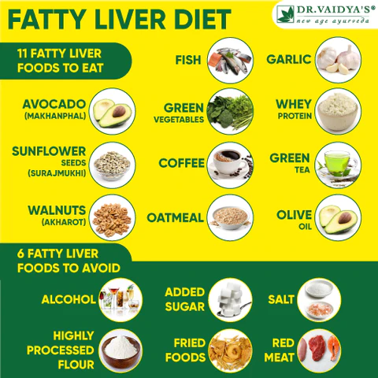
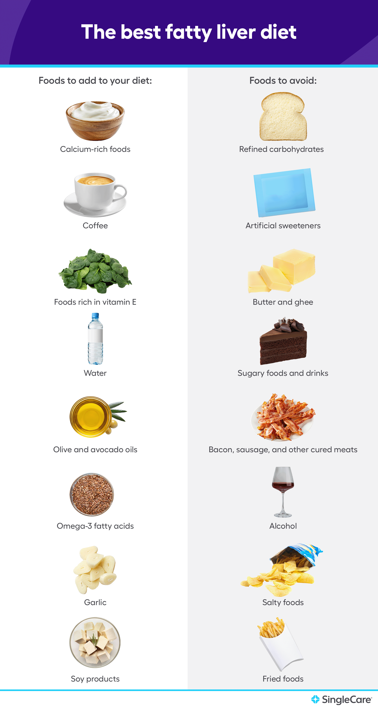

# Liver

- **Oily fish**: Oily fish, such as salmon, mackerel, and sardines, are rich in omega-3 fatty acids, which can help reduce inflammation and improve liver function.
- **Leafy greens**: Leafy greens, such as spinach, kale, and collard greens, are rich in antioxidants and other nutrients that can help protect the liver from damage and promote the growth of new liver cells.

1. Garlic:

Root vegetable, consist of sulfur compounds that are essential for liver supporting and activating enzymes that are responsible for flushing out toxins and waste from the body.

1. Citrus fruits:

Lemons, orange , grapefruit , amla which has high vitamin C and antioxidants, citrus fruits like grapefruits, oranges, limes and lemons support the natural cleansing abilities of the liver.

1. Turmeric root:

Turmeric root is your liver’s best friend! It is anti-inflammatory and rich in antioxidants.
This incredible spice contains a boatload of antioxidants that help to repair the liver cells, protect against the cellular damage and assist in detoxification.

1. Leafy Green Vegetables:

Most powerful allies in cleansing the liver is leafy greens which can be eaten either raw, cooked or as a juice or as a smoothie. Extremely high in chlorophyll, these greens soak up environmental toxins from the blood stream and help detoxify the liver.

1. Apples:

High in pectin, polyphenols present in Apple keep serum and lipid levels of liver under control. They also contain malicacid that help remove toxins and carcinogens. Apples have anti-inflammatory properties that protect you against fatty liver and helps cleanse your liver.

1. Green Tea:

Green tea is known for its antioxidants which boosts the digestion.

1. Beetroots & Carrots:

Betalains and cyanins protect the liver from injury and its juice or smoothie helps in liver detoxifying.

1. Walnuts:

Helps the toxin elements with having of omega 3, fatty acids to cleanse and make healthy liver.

1. Lentils:

Their detox properties are not the best thing about this particular legume.
They normalize the blood sugars, protect against the cancer and also cleanses your liver to make you healthy.

**10. Avocados:**
Gluthaione whose function is to protect cells against oxidation and also detoxify the heavy metals is present in the avacado.

**11. Tomato:**
It promotes the activation of digestive enzyme and liver enzyme to keep liver activity good and also helps in cleansing of the liver.

**12. Plants and infusions:**
Dandelion root herbs help the liver to break down the fat, to produce amino acids by ridding it of the toxins.
Rosemary boiled in water and drunk allows it to stimulate the production of bile which helps in digestion and limits liver problems.

**13. Curcuma and other spices:**
Curcuma, a root from India has many curative properties. It detoxifies the liver by stimulating the production of bile and releases the liver ducts.

**14. Quinoa:**
It detoxifies your liver naturally, adding alternative grains like millets, buckwheat and quinoa in your diet can be helpful instead of fatty food.

## Fatty Liver Disease

### Metabolic Dysfunction Liver Disease

**Metabolic dysfunction-associated steatotic liver disease (MASLD)** is a condition characterized by the accumulation of fat in the liver, which can lead to inflammation and liver damage. This condition is influenced by various factors including central obesity, insulin resistance, lipid metabolism, and genetic predispositions. The development of MASLD involves complex interactions between systemic metabolic dysfunction and liver health, often resulting from altered dietary habits, obesity, and other metabolic disorders. Treatment approaches typically focus on lifestyle modifications, such as diet and exercise, to improve metabolic health and reduce liver fat. Additionally, managing comorbid conditions like cardiovascular disease and diabetes is crucial for overall patient outcomes.

Kale, Blueberry, Kefir Shake
