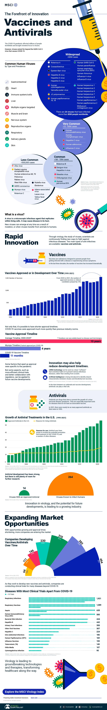
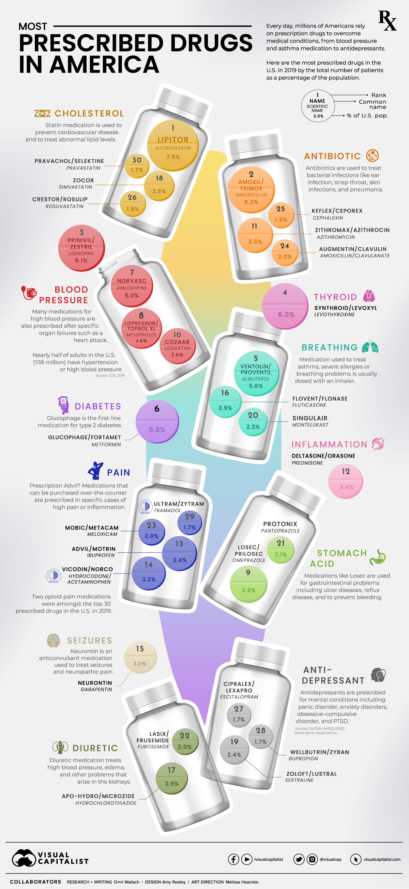
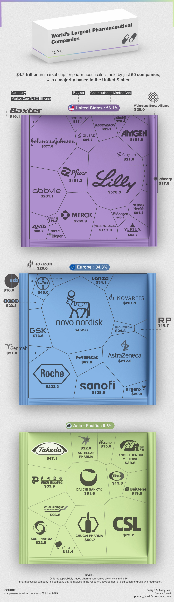
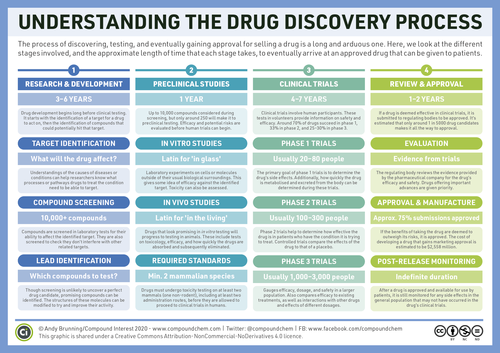
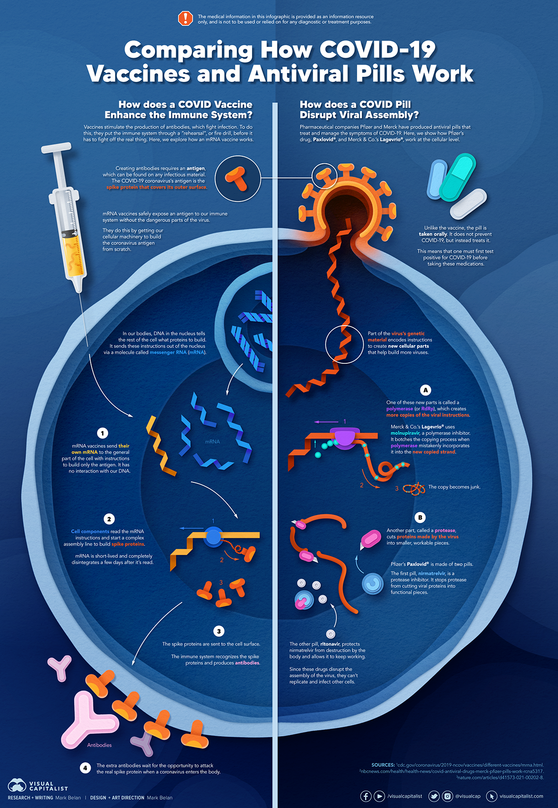
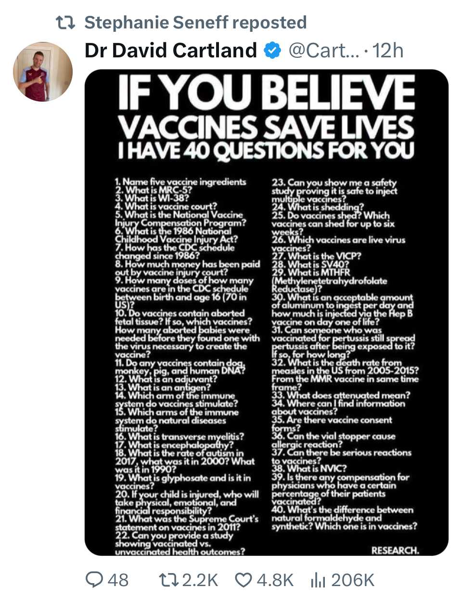
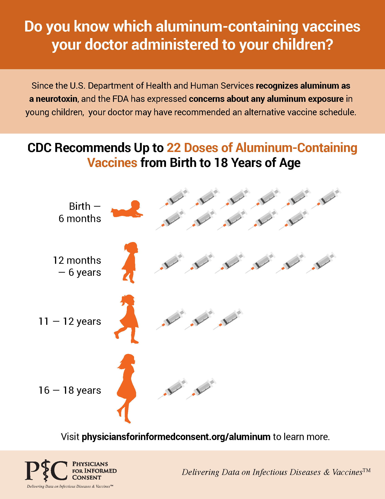

# Vax

## Drug Discovery Process

## types of vaccines

### Live, attenuated vaccines

fight viruses and bacteria. These vaccines contain a version of the living virus or bacteria that has been weakened so that it does not cause serious disease in people with healthy immune systems. Because live, attenuated vaccines are the closest thing to a natural infection, they are good teachers for the immune system. Examples of live, attenuated vaccines include measles, mumps, and rubella vaccine (MMR) and varicella (chickenpox) vaccine. Even though they are very effective, not everyone can receive these vaccines. Children with weakened immune systems—for example, those who are undergoing chemotherapy—cannot get live vaccines.

### Non-live vaccines

also fight viruses and bacteria. These vaccines are made by inactivating, or killing, the germ during the process of making the vaccine. The inactivated polio vaccine is an example of this type of vaccine. Often, multiple doses are necessary to build up and/or maintain immunity.

### Toxoid vaccines

prevent diseases caused by bacteria that produce toxins (poisons) in the body. In the process of making these vaccines, the toxins are weakened so they cannot cause illness. Weakened toxins are called toxoids. When the immune system receives a vaccine containing a toxoid, it learns how to fight off the natural toxin. The DTaP vaccine contains diphtheria and tetanus toxoids.

### Subunit vaccines

 include only parts of the virus or bacteria, or subunits, instead of the entire germ. Because these vaccines contain only the essential antigens and not all the other molecules that make up the germ, side effects are less common. The pertussis (whooping cough) component of the DTaP vaccine is an example of a subunit vaccine.

### Conjugate vaccines

fight a type of bacteria that has antigens. These bacteria have antigens with an outer coating of sugar-like substances called polysaccharides. This type of coating disguises the antigen, making it hard for a young child’s immature immune system to recognize it and respond to it. Conjugate vaccines are effective for these types of bacteria because they connect (or conjugate) the polysaccharides to antigens that the immune system responds to very well. This linkage helps the immature immune system react to the coating and develop an immune response. An example of this type of vaccine would be the Haemophilus influenzae type B (Hib) vaccine and the mRNA COVID-19 vaccine.

## Why does sarvico-virus / coronavirus keep mutating?

- Genetic shift
- Genetic drift

## Antigen presentation

immune system provides cues in the forms of chemical signals (cytokines) or degraded products of infectious organisms (antigens) to activate the adaptive immune system, using a process known as “antigen presentation”. Without these cues, the adaptive immune system cannot be activated.

## Terms

The term inoculation is often used as a synonym for vaccination or immunization.

**Adaptive Immunity**

## SV40 in mRNA COVID Vaccine

Recent studies and discussions have highlighted concerns about the presence of SV40 (Simian Virus 40) in mRNA COVID vaccines, such as those produced by Pfizer and BioNTech.

- **SV40 Presence**: A peer-reviewed study published in the journal *Science, Public Health Policy and the Law* found SV40 DNA contaminants in mRNA vaccines. The study also noted that DNA in Pfizer’s COVID-19 vaccines exceeds regulatory limits by three to four times.

- **DNA Contamination**: Researchers identified residual DNA in mRNA vaccines at levels far exceeding the maximal acceptable concentration of 10 ng per clinical dose. This DNA contamination includes SV40 promoter/enhancer sequences, which can potentially transport plasmid DNA into the cell nucleus.

- **Health Concerns**: Some experts, like Karl Jablonowski, suggest that DNA contamination may contribute to autoimmune diseases due to the interferon response triggered by foreign DNA in the bloodstream. Additionally, cardiologist Dr. Peter McCullough has stated that mRNA vaccines have a dangerous mechanism of action, potentially leading to overproduction of spike proteins and cellular damage.

- **Persistence and Shedding**: The study found that spike proteins produced by the vaccines persist in the body for at least seven days, contrary to earlier claims. These proteins can be shed and packaged into exosomes, which can travel throughout the body.

- **Regulatory Response**: The Therapeutic Goods Administration (TGA) in Australia has been criticized for withholding information about DNA contamination risks from the public. Emails released under Freedom of Information show that TGA staff were aware of potential risks but focused on allaying public fears rather than investigating further.

## Vax Injury

- The story of Alexis Lorenze

## Aluminum Adjuvants

- aluminum doesn't have any biological use. it's toxic to life
- Thimerasal
- neuro and cytotoxic
- dead proteins from a virus is not enough to stimulate immune system response. The macrophages and endritic cells will consume it and dispose it. Cellular death stimulates immune response.
