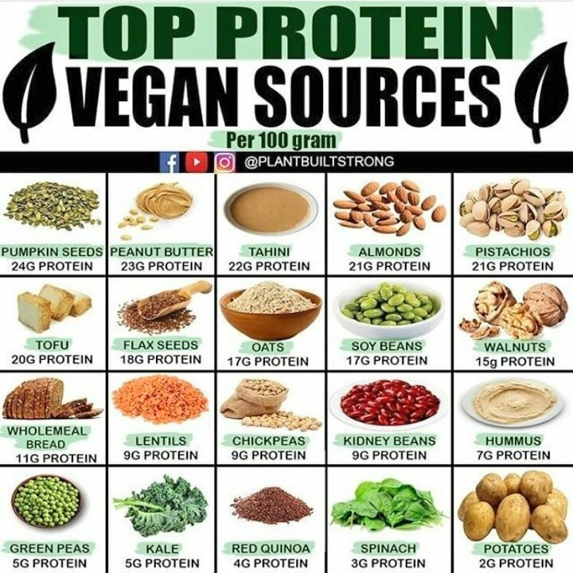

# Macros

80% of foods come from micro-nutrient dense food such as plants, lean meats

what you eat

when you eat

15g of fiber per 1000 cal

7 cal per gram of alcohol
9 cal in 1 g of fat
4 cal in 1 g of carb
4 cal in 1 g of protein

“eat 500 less cal, you will lose 1lb of fat / wk”

eating 100 cal cookie vs 100cal egg sends a different hormonal response

recommended daily amount of carbs for the average adult is 130 grams

insulin spike on cookie

eating low carbohydrate diet, fat/protein keeps you full for longer

carborific
caloric

Avoid

* Sucrose
* Fructose
* Sugar
* Maltose
* Corn syrup
* White flour
* Wheat flour
many natural, unrefined sweeteners contain high levels of simple carbs. Honey, molasses, maple syrup and brown sugar all contain high levels of simple carbs. Beet sugar and cane sugar also contain high levels of simple carbohydrates.

avoid refined white-flour foods

* White bread
* White pasta
* Cakes, pastries and many baked goods
* Packaged cereals

prefer organic or grass-fed meats

simple carbs are bad carbs
complex carbs are good carbs
monosaccaride
disaccaride
polysaccaride (complex)

LIVER IS STORAGE SITE FOR GLYCOGEN

Metabolic disease
cardiovascular disease from carborific diets

half truths?:
dairy >> mucus >> sickness

Calorie surplus
Calorie deficit

## FATS

Visceral fat - damaging your internal organs, belly, heart disease, stroke, diabetes

## CHOLESTEROL CLEANSE

* Whole-grain cereals such as oatmeal and oat bran
* Fruits such as apples, bananas, oranges, pears, and prunes
* Legumes such as kidney beans, lentils, chick peas, black-eyed peas, and lima beans

## Carb Cycling

<https://www.medicalnewstoday.com/articles/324599#7-strategies>

## Mediterranean diet

* cut most red meat and lower your dairy intake. Eat lots of veggies, fruits, nuts, seeds, and fish; cut sugar drinks and refined grains

## Protein

