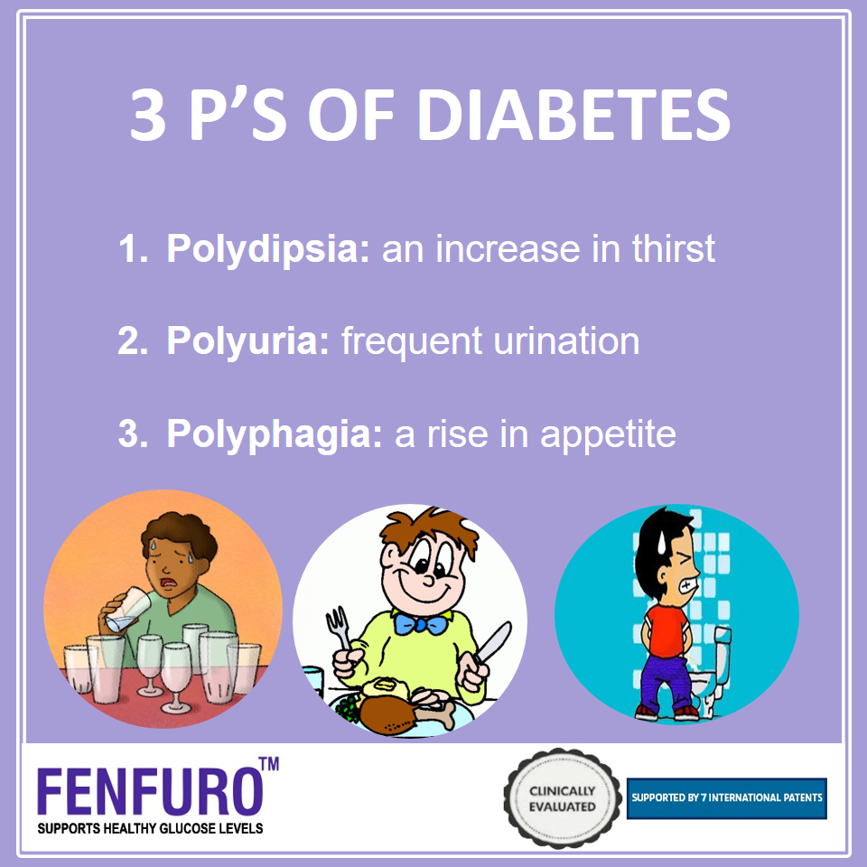

# Disease

## Diabetes Prevention

-Neuropathy (nerve damage)

### Foot and Leg Problems

- infections, ulcers (sores) that don’t heal
- corns and calluses
- dry, cracked skin
- nail disorders (fungal infections)
- hammertoes and bunions
- brittle bones
- foot deformities (charcot foot)
- blocked artery in calf
- amputation