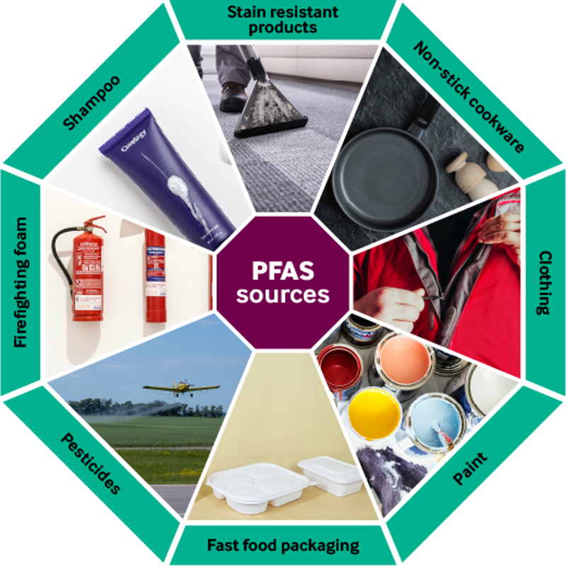
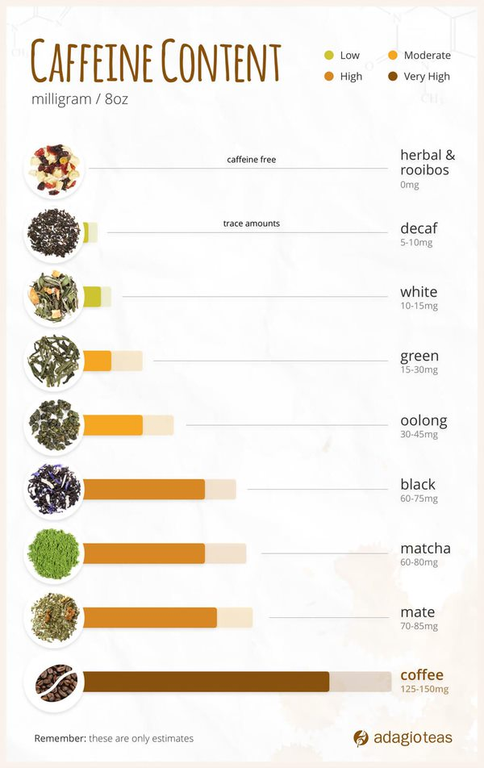

# Avoid

## Endocrine Disruptors

## GMOs

## EMF

## Weird Meat nutrition labels

- Raw or undercooked foods of animal origin
- “Foods of animal origin” instead of meat

## Harmful Histamines in Meat

### Understanding Histamines

**Histamines** are organic compounds involved in various physiological functions, primarily related to the immune response and regulation of bodily functions. They play a critical role in:

- **Allergic Reactions**: Histamines are released by the body during allergic responses, leading to symptoms like itching, swelling, and redness.
- **Regulation of Stomach Acid**: They help stimulate gastric acid secretion, aiding in digestion.
- **Neurotransmission**: Histamines act as neurotransmitters in the brain, influencing wakefulness and appetite.

### Histamines in Meat

When it comes to meat, histamines can be a concern, especially if the meat is not stored or handled properly. Here are some key points:

- **Histamine Formation**: Certain bacteria can produce histamines in protein-rich foods, including meat, especially if they are improperly stored or aged. This process can lead to higher histamine levels.
- **Scombroid Poisoning**: This is a foodborne illness caused by consuming fish with high levels of histamine due to improper storage. While it's more commonly associated with fish, similar processes can occur in some meats.
- **Symptoms of Histamine Intolerance**: Some individuals may experience symptoms like headaches, rashes, or gastrointestinal issues after consuming high-histamine foods, including improperly handled meats.

### Industrialized Groceries and Histamines

In industrialized grocery products, histamine levels can vary:

- **Processed Meats**: Items like sausages, deli meats, and other processed products may contain higher histamine levels due to the curing and fermentation processes.
- **Preservatives and Additives**: Some preservatives might affect the histamine content, but the primary concern is often related to microbial activity.
- **Storage Conditions**: Industrialized products not kept at the correct temperatures can lead to increased histamine production.

### Conclusion

While histamines are essential for various bodily functions, high levels of histamines in meat and other food products can lead to health issues, especially for those with histamine intolerance. Proper storage and handling of meat, as well as being mindful of processed foods, are important to minimize risks associated with harmful histamines.

## Dairy

## Sugar

### slows muscle/injury recovery

There is evidence suggesting that high sugar intake can slow down injury healing and muscle soreness recovery. Here's how:

- **Increased inflammation:** Consuming too much sugar, particularly refined sugar and added sugars, can contribute to inflammation in the body [1]. Inflammation is a natural part of the healing process, but excessive inflammation can hinder tissue repair.
- **Reduced blood flow:** High blood sugar levels can stiffen arteries and reduce blood flow [2]. This limits the delivery of essential nutrients and oxygen to the injured area, which are crucial for healing.
- **Impaired immune function:** Sugar can potentially weaken the immune system's ability to fight off infection and promote healing [3].

**Here's what the research suggests:**

- Studies haven't directly looked at the effect of sugar on muscle soreness recovery, but the link between sugar and inflammation suggests it might play a role.
- Research on diabetic wounds (where high blood sugar is a constant factor) shows delayed healing [4].

**Overall, limiting added sugar intake can likely benefit injury healing and muscle recovery by:**

- Reducing inflammation
- Improving blood flow
- Supporting a healthy immune system

For optimal healing, focus on a balanced diet rich in:

- **Lean protein:** Provides building blocks for tissue repair.
- **Fruits and vegetables:** Deliver essential vitamins, minerals, and antioxidants.
- **Whole grains:** Offer sustained energy and fiber.

**Remember:** While sugar may slow healing, it's not the sole factor. Consult a healthcare professional for personalized guidance on injury recovery and a healthy diet.

### Sugar Alternative

## High Fructose Corn Syrup

## Wrong Dietary Fat Sources

### Vegetable and Seed Oils

- BEEF MICROSPRAY
- A common herbicide used in wheat farming. Residues can remain in processed wheat products.
- Some research links **glyphosate** exposure to inflammatory conditions and other health issues.
- Malodextrin: Modified Food Starch
- Fungicides: Sulfur Dioxide
- Endocrine Disruptors
- GMO soy

### Obesity

## Glyphosate

Glyphosate’s use in the U.S. has skyrocketed since 1996, the year Monsanto introduced genetically engineered seeds that could survive being sprayed with higher quantities of herbicides.

- Today, almost 90% of corn, cotton and soybean crops are modified to be tolerant to glyphosate and other chemical treatments used by farmers, U.S. Department of Agriculture data shows.
- Glyphosate residues have also been detected in air and rain samples, according to a study from the University of Minnesota.

## Food Dyes

## Artificial Sweeteners

## Toxic farming practices

- Fragrance of food is gone in industrialized america

Toxic farming practices can significantly impact both the environment and human health, particularly in the context of fresh produce in the U.S. Here are some common practices:

- Opting for organic produce
- supporting local farms that practice sustainable methods

### Sulfur Dioxide

### 1. **Pesticide Use**

- **Synthetic Pesticides:** Many conventional farms use synthetic pesticides that can be harmful to human health and the ecosystem. These chemicals can remain on produce, leading to potential exposure.
- **Neonicotinoids:** These are particularly concerning because they can harm pollinators like bees and have been linked to neurological issues in humans.

### 2. **Chemical Fertilizers**

- **Nitrogen and Phosphorus Overuse:** Excessive use of chemical fertilizers can lead to nutrient runoff, causing water pollution and harming aquatic ecosystems.
- **Soil Degradation:** Continuous use can degrade soil health, reducing its ability to retain moisture and nutrients.

### 3. **Monoculture Practices**

- **Lack of Crop Diversity:** Growing a single crop over large areas can lead to soil depletion, increased vulnerability to pests, and reliance on chemical inputs to manage these issues.
- **Ecosystem Disruption:** Monocultures can disrupt local ecosystems, reducing biodiversity and harming beneficial insects.

### 4. **Irrigation Practices**

- **Over-Irrigation:** Excessive irrigation can lead to salinization of the soil and depletion of local water resources.
- **Contaminated Water Sources:** Using water from polluted sources for irrigation can introduce harmful pathogens and chemicals into food crops.

### 5. **Soil Management Issues**

- **Soil Erosion:** Poor practices can lead to erosion, reducing soil fertility and increasing sediment in waterways.
- **Lack of Organic Matter:** Failing to incorporate organic matter depletes soil quality and reduces its ability to support healthy crops.

### 6. **Use of Antibiotics**

- **Livestock Antibiotics:** In some cases, antibiotics are used in plant farming as well, which can lead to antibiotic resistance and impact food safety.

### 7. **Synthetic Growth Hormones**

- **Hormone Treatments:** Some farms may use synthetic growth hormones to accelerate growth, which raises concerns about long-term health effects on consumers.

### 8. **Poor Labor Practices**

- **Exploitation of Workers:** Toxic farming practices often extend to labor conditions, where workers may be exposed to harmful chemicals without adequate protection.
- **Health Risks:** Workers in these environments face serious health risks, which can indirectly affect the safety of the produce.

## PFAs

## Nicotine / Tobacco

### nicotine withdrawal symptoms

- mental fog
- vascular constriction
- collagen, elastin
- craving

## Microplastics and Nanoplastics

- Microplastics: Popular brands of bottled water contain up to 100 times more nanoplastics — even tinier flecks of the material than microplastics — than previously thought, a monumental study found earlier this year. We now know that these plastic bits have made their way into many parts of our bodies, where they may trigger inflammation, metabolic changes, reproductive issues and Parkinson’s disease-related brain changes. And it’s not just drinking bottled water that exposes us to microplastics. “Nine out of 10 plastic bottles end up in the environment where they disintegrate into microplastics and nanoplastics that cause global pollution and adverse health effects on living organisms including humans,” Rolf Halden, director of Arizona State University’s Biodesign Center for Environmental Health Engineering, tells Yahoo Life.
- Phthalates: These chemicals are used to make plastics more flexible and durable. They can be found in everything from cosmetic products to food, flooring and bottled water. Phthalates are known as “endocrine disruptors” because they interfere with the endocrine system, which regulates hormones. The chemicals have been linked to reproductive health issues, low IQ in children and metabolic changes.
- PFAS: Best known as forever chemicals, per- and polyfluoroalkyl substances are synthetics used to treat products including carpets and nonstick pans to make them heat-resistant. It can take hundreds or thousands of years for PFAS to break down in the environment and up to a decade for them to leave the human body. And while they’re already in our bodies, high levels of PFAS may contribute to higher cholesterol levels, liver enzyme changes, preeclampsia during pregnancy, low birth weights and greater testicular and kidney cancer risks. They may also contribute to obesity and metabolic issues.
- BPA: Bisphenol A, or BPA, is a chemical used to make food packaging stronger and less vulnerable to corrosion or breaking down. But like phthalates, it disrupts hormones and has been linked to higher risks of infertility, PCOS, diabetes, cardiovascular disease and breast and prostate cancer. However, the Food and Drug Administration considers BPA levels in food packaging safe, and stated after a four-year review that safety standards don’t need to be changed.

## Laundry

Guppyfriend washing bag: These specialized bags capture microplastics during washing, preventing them from entering the wastewater system. You can find these online or at eco-friendly stores.

- When washed, polyester fabrics can shed microplastics, tiny plastic fibers that can enter water systems and potentially harm wildlife.

## Caffiene

