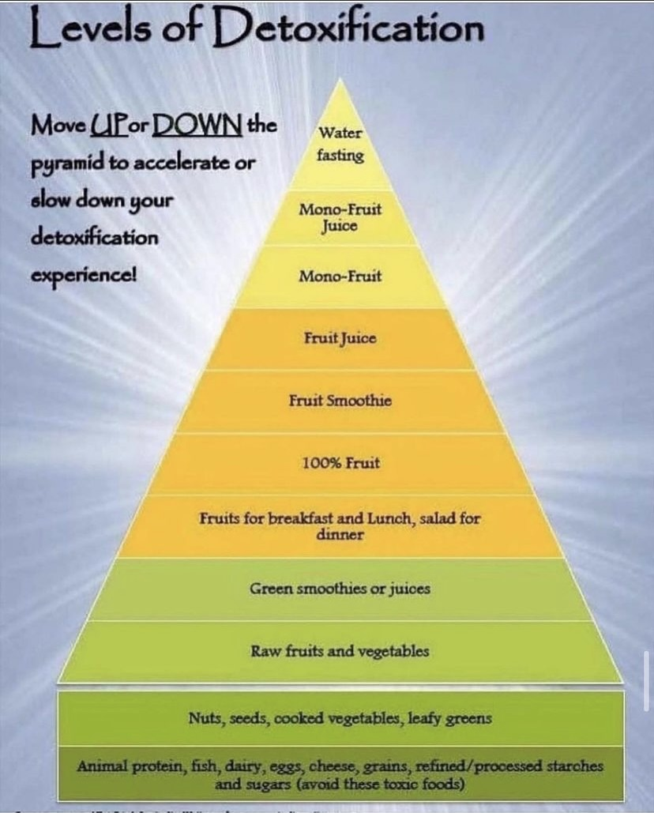

# Detoxification

## bioactive compounds that may be beneficial

**Fatty Liver**

* **Polyphenols:** Found in fruits, vegetables, tea, and coffee, polyphenols have antioxidant and anti-inflammatory properties that can help reduce liver inflammation and fat accumulation.
* **Resveratrol:** Found in grapes and red wine, resveratrol has shown promise in protecting the liver from damage and reducing fat accumulation.
* **Curcumin:** The active compound in turmeric, curcumin has powerful anti-inflammatory and antioxidant effects that can help improve liver function.

**Insulin Regulation**

* **Berberine:** A compound found in several plants, including Berberis vulgaris, berberine has been shown to improve insulin sensitivity and lower blood sugar levels.
* **Alpha-lipoic acid (ALA):** A powerful antioxidant, ALA can help improve insulin sensitivity and reduce oxidative stress.
* **Chromium:** An essential mineral, chromium plays a role in insulin function and can help regulate blood sugar levels.

**Lung Detoxification**

* **N-acetyl cysteine (NAC):** An amino acid that can help protect the lungs from damage caused by pollutants and toxins.
* **Vitamin C:** A powerful antioxidant that can help protect the lungs from oxidative stress.
* **Quercetin:** A flavonoid found in many fruits and vegetables, quercetin has anti-inflammatory and antioxidant properties that can help protect the lungs.

## Olive Oil

Olive oil contains a variety of bioactive compounds, including antioxidants, flavonoids, and polyphenols, which contribute to its health benefits. Here are some of the key compounds and their health benefits:

* **Hydroxytyrosol**: This compound is a powerful antioxidant that can help reduce the risk of cancer and improve blood lipid levels. It prevents LDL cholesterol from oxidizing into a more harmful form and may help restore levels of glutathione, the body's "master antioxidant."
* **Tyrosol**: Similar to hydroxytyrosol, tyrosol is an antioxidant that can help prevent lipid oxidation and reduce inflammation, contributing to heart health.
* **Oleocanthal**: This compound has anti-inflammatory properties and can inhibit the activity of enzymes that cause inflammation, similar to ibuprofen.
* **Oleuropein**: An antioxidant that can help reduce blood pressure and has antimicrobial properties, potentially inhibiting the growth of harmful bacteria.
* **Luteolin**: A flavonoid with anti-inflammatory and antioxidant properties, luteolin can help reduce the expression of pro-inflammatory mediators and inhibit the activity of enzymes that contribute to inflammation.
* **Vanillic Acid**: A phenolic acid with antioxidant properties, it can help protect cells from oxidative damage.
* **Gallic Acid**: Another phenolic acid, gallic acid is a potent antioxidant that can help protect against oxidative stress and reduce the risk of chronic diseases.
* **Caffeic Acid**: This compound has antioxidant and anti-inflammatory properties and can help reduce the risk of cancer by inducing apoptosis in cancer cells.
* **Pinoresinol**: A lignan with antioxidant properties, it can help protect against oxidative stress and reduce the risk of chronic diseases.
* **Flavones (e.g., Apigenin, Luteolin)**: These compounds have antioxidant and anti-inflammatory properties, which can help reduce the risk of chronic diseases and improve overall health.

These compounds work together to provide a range of health benefits, including reducing inflammation, protecting against oxidative stress, and lowering the risk of chronic diseases such as cancer, cardiovascular disease, and neurodegenerative disorders.

## Cinnamon

Cinnamon contains several bioactive compounds that contribute to its health benefits, including antioxidants, flavonoids, and polyphenols. Here are some of the key compounds and their health benefits:

* **Cinnamaldehyde**: This is the main compound responsible for cinnamon's distinct smell and flavor. It has potent antioxidant and anti-inflammatory properties. Studies suggest that cinnamaldehyde can help reduce inflammation, protect against DNA damage, and inhibit tumor growth.

* **Cinnamic Acid**: This compound is another important polyphenol in cinnamon. It contributes to cinnamon's antioxidant and anti-inflammatory effects, helping to protect the body from oxidative stress and inflammation-related diseases.

* **Flavonoids**: Cinnamon is rich in flavonoids, which are a type of polyphenol. These compounds have strong antioxidant properties and can help reduce the risk of chronic diseases by neutralizing free radicals. Flavonoids in cinnamon include quercetin, kaempferol, and myricetin.

* **Polyphenols**: Cinnamon is packed with various polyphenols, which are powerful antioxidants. These compounds help neutralize harmful free radicals in the body and prevent oxidative stress. They can also improve blood sugar control, reduce inflammation, and protect against heart disease and cancer.

* **Eugenol**: This is another bioactive compound found in cinnamon, known for its anti-inflammatory and analgesic properties. It can help reduce pain and inflammation in the body.

* **Cinnamtannin B1**: This compound is known for its strong antioxidant properties and can help protect the body from oxidative stress and damage.

These compounds collectively contribute to cinnamon's wide range of health benefits, including its ability to improve blood sugar control, reduce inflammation, and protect against chronic diseases.

## Health Benefits of Honey Compounds

Honey contains a variety of bioactive compounds including antioxidants, flavonoids, and polyphenols, each with distinct health benefits:

* **Chrysin**: This compound has a molecular formula of $C_{15}H_{10}O_{4}$. It is known for its potential to improve cognitive deficits and brain damage, and it also exhibits anticancer properties.
* **Cinnamic Acid**: With a molecular formula of $C_{9}H_{8}O_{2}$, cinnamic acid is recognized for its ability to improve cognitive deficits and brain damage, and it also has an antimicrobial effect.
* **p-Coumaric Acid**: This compound, with the molecular formula $C_{9}H_{8}O_{3}$, is noted for its anticancer activity and its potential to improve cognitive deficits and brain damage.
* **Caffeic Acid**: This polyphenol is known for its ability to inhibit oxidative stress in iron-overloaded rats by reducing lipid peroxidation and increasing vitamin E levels in the plasma.
* **Quercetin**: It reduces oxidative stress by scavenging free radicals, chelating metal ions, and inhibiting xanthine oxidase and lipid peroxidation.
* **Kaempferol**: This flavonoid reduces oxidative stress caused by glutamate in the mouse hippocampal cell line HT-22 by blocking ROS generation.
* **Apigenin**: It promotes interleukin 1b and tumor necrosis factor, which can have anti-inflammatory effects.
* **Ferulic Acid**: Known for its neuroprotective effects, it can decrease the levels of phospho-Akt, phospho-pyruvate dehydrogenase kinase-1, and phospho-Bad and increase caspase-3 levels in a mouse model of Parkinson’s disease.
* **Pinocembrin**: This flavonoid is known for its antioxidant and antibacterial properties.
* **Gallic Acid**: It induces apoptosis and is involved in the antioxidant pathways of honey.

These compounds contribute to honey's antioxidant, anti-inflammatory, and antibacterial properties, among other health benefits.

## Garlic's Polyphenols

Garlic contains several bioactive compounds, including flavonoids and polyphenols, which offer various health benefits. Here are some key antioxidants found in garlic and their associated health benefits:

* **Quercetin**: A flavonoid with strong antioxidant properties. It helps protect against oxidative stress and may reduce the risk of Alzheimer's disease and cognitive decline. Quercetin also has anti-diabetic properties, protecting against alterations in diabetic patients during oxidative stress.

* **Allicin**: A compound that is released when garlic is crushed or chopped. It has potent antioxidant and anti-inflammatory effects, which can help protect against cell damage and aging.

* **Ferulic Acid**: A polyphenol that acts as a potent anti-diabetic agent. It can lower blood glucose levels and increase plasma insulin, thereby improving insulin sensitivity and glucose tolerance.

* **Resveratrol**: While not specific to garlic, resveratrol is a polyphenol found in some plant foods, including garlic. It is known for its antioxidant and anti-inflammatory properties, which can help reduce the risk of chronic diseases such as heart disease and cancer.

These compounds in garlic contribute to its health benefits, including cardiovascular protection, anti-inflammatory effects, and potential anti-cancer properties.