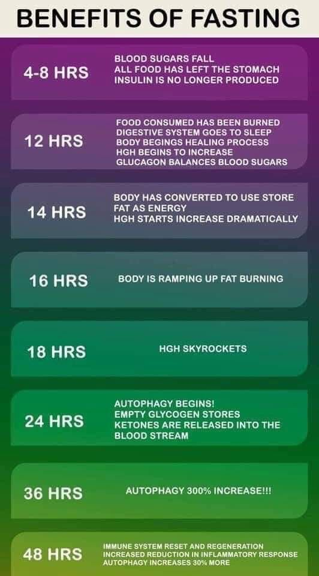
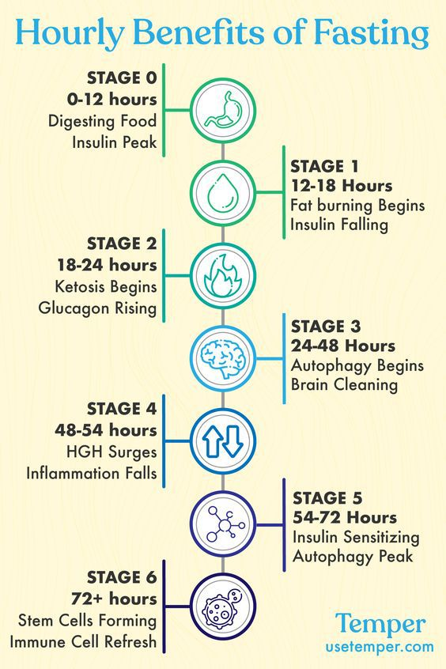
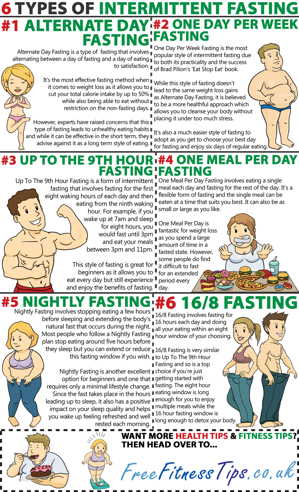
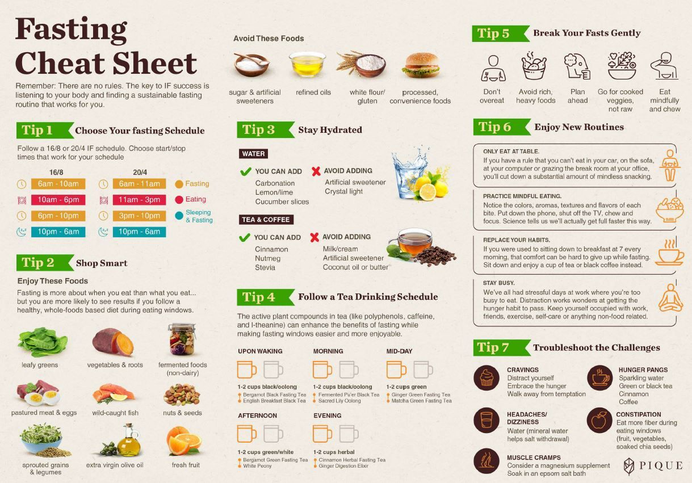
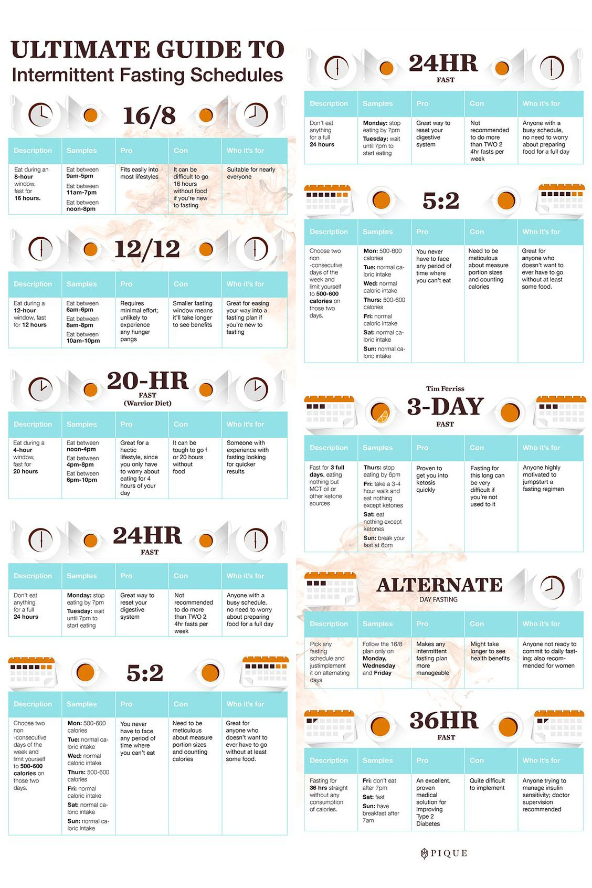

# Fasting

2 kinds of fasting

Don’t eat for 16hrs
Eat for 8hrs

Long term water only fasting
Controlled setting

## Distilled water fast

For water fasting, both distilled and purified water can be used, but they have some differences. **Distilled water** is water that has undergone a distillation process to remove impurities and contaminants. **Purified water**, on the other hand, is water that has been treated to remove chemicals, minerals, and microbes, but may not necessarily undergo distillation.

For water fasting, distilled water is often recommended due to its extremely low total dissolved solids (TDS) content, typically less than 10 parts per million (ppm). This is because distilled water has been stripped of all minerals and electrolytes, which can be beneficial during a fast as it allows the body to focus on detoxification and cellular cleansing.

In contrast, purified water may still contain some minerals and electrolytes, albeit in small amounts, which could potentially interfere with the body's natural detoxification processes during a fast.

However, it's essential to note that some experts recommend drinking water with electrolytes and minerals during a fast, as the body may lose these essential nutrients during the fasting period. In this case, purified water with added electrolytes or minerals might be a better option.

Ultimately, the choice between distilled and purified water for water fasting depends on individual preferences and goals. If you prioritize a complete removal of impurities and minerals, distilled water might be the better choice. If you prefer water with some minerals and electrolytes, purified water could be a better option.

**Key Takeaways:**

* Distilled water is often recommended for water fasting due to its extremely low TDS content.
* Purified water may still contain some minerals and electrolytes, which could potentially interfere with the body's natural detoxification processes during a fast.
* Some experts recommend drinking water with electrolytes and minerals during a fast, making purified water with added electrolytes or minerals a viable option.

## AVOID SOS

Salt, oil, sugar

## gradually increase your fasting duration

Based on the provided search results, here's a step-by-step guide to gradually increase your fasting duration:

1. Start with Intermittent Fasting: Begin with 12-14 hour fasting windows, where you eat within an 8-10 hour window. This will help your body adapt to periods of fasting.
2. Increase Fasting Window by 1-2 Hours Every 2-4 Weeks: Gradually extend your fasting window by 1-2 hours every 2-4 weeks. For example, if you're currently fasting for 14 hours, increase it to 16 hours, then 18 hours, and so on.
3. Monitor Your Body's Response: Pay attention to your body's signals, such as hunger, fatigue, or dizziness. If you experience any severe symptoms, consider reducing your fasting duration or consulting a healthcare professional.
4. Refeed Gradually: When breaking your fast, reintroduce food gradually. Start with small, easily digestible meals, and gradually increase the portion size and complexity of food over the next few hours or days.
5. Listen to Your Body: If you're feeling unwell or experiencing adverse effects, it may be necessary to shorten your fasting duration or adjust your refeeding strategy.
6. Consider Extended Fasting: Once you've successfully extended your intermittent fasting window to 24-30 hours, you can consider transitioning to extended fasting (EF) for 48 hours or longer. However, it's essential to:
  Work up to longer fasts gradually, starting with shorter durations.
  Ensure proper hydration and electrolyte balance.
  Monitor your body's response and adjust as needed.

Additional Tips

 Stay hydrated by drinking zero-calorie fluids like water, black coffee, and tea during your fasting periods.
 Avoid heavy carbohydrates and processed foods during your refeeding phase.
 Consult with a healthcare professional if you have any underlying medical conditions or concerns.

* Be patient and flexible, as adapting to longer fasting durations may take time.

Remember, gradual progression is key to successful and safe extended fasting. Listen to your body and adjust your approach as needed.

## Intermittent Fasting

### (OMAD) One Meal A Day
