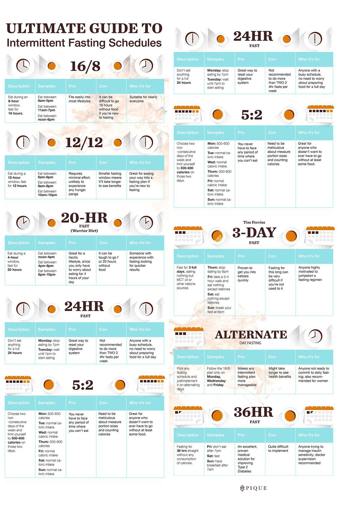

# Plant

25 organic pesticides are approved for organic use versus the staggering 900 that are currently allowed to be used on conventional crops ([15](https://ota.com/advocacy/organic-standards/national-list-allowed-and-prohibited-substances)).

organic pesticides are tightly regulated for safety but can be harmful to health in high doses. organic pesticides, such as copper, rotenone and spinosad, can be used in organic farming. Unfortunately, long-term studies examining the risks of consuming conventional fruits and vegetables versus organic fruits and vegetables in the general population are lacking.

## Vegetarian Protein

[https://www.huffpost.com/entry/vegetarian-protein-complete-meat\_n\_5a90357ae4b01e9e56bb3224](https://www.huffpost.com/entry/vegetarian-protein-complete-meat_n_5a90357ae4b01e9e56bb3224 "‌")

- Seitan: The plant protein with the highest amount of protein per serving is seitan. Boasting 31 grams of protein per 3 oz portion, it also contains 6x more amino acids than other grains.
- Quinoa: While quinoa only contains 8 grams of protein per 1 cup serving, it contains much higher amounts of most amino acids than other seeds.
- Spirulina: also known as blue-green algae, spirulina contains 4-8 grams of protein in only 2 tablespoons, making the perfect addition to smoothies. It is also a great source of iron.
- Hemp Seeds: Another food with high amounts of protein in a small package are hemp seeds. They contain 6 grams of protein in 2 tablespoons and are also very high in most amino acids.
- Tofu and Tempeh: tofu and tempeh are made from soybeans and can provide 10-15 grams protein in a half-cup serving. Both contain adequate amounts of all amino acids, therefore are considered a complete protein.
- Lentils: for a half-cup serving, lentils provide 9 grams of protein and provide adequate amounts of each amino acid except tryptophan.  
- Pumpkin Seeds: contain 9 grams of protein for a quarter-cup serving. Pumpkin seeds appear to be the only seed with adequate levels of tryptophan.

## Fruits

### Cucumbers

Cucumbers are classified as a **vegetable** in the culinary world. However, botanically, they are considered **fruits** because they grow from the flower of a plant and contain seeds.

While cucumbers don't contain specific "weight loss" nutrients, their unique combination of properties makes them a great addition to a weight loss diet:

**High Water Content:**

* **Hydration:** Cucumbers are 96% water, which helps keep you hydrated and can contribute to feelings of fullness.
* **Low-Calorie Density:** Their high water content means they're low in calories, making them a satisfying and low-calorie snack.

**Fiber:**

* **Digestive Health:** Fiber promotes healthy digestion and can help regulate bowel movements.
* **Appetite Control:** Fiber can help you feel fuller for longer, reducing overall calorie intake.

**Vitamins and Minerals:**

* **Essential Nutrients:** Cucumbers provide essential vitamins like vitamin K and minerals like potassium, which support overall health.

**Overall, cucumbers are a low-calorie, hydrating, and nutrient-dense food that can support weight loss as part of a balanced diet.**

It's important to note that no single food is a magic solution for weight loss. A healthy and sustainable weight loss plan involves a combination of factors, including a balanced diet, regular exercise, and adequate sleep. Cucumbers can be a valuable part of this plan, but they should be combined with other healthy foods and lifestyle practices.

### Citrus Fruits

- Oranges, grapefruits, and lemons are good sources of vitamin C, an antioxidant that helps protect the cornea, the outer layer of the eye.

## Cruciferous vegetables

Cruciferous vegetables, such as broccoli, cauliflower, and Brussels sprouts, contain compounds that can help detoxify the liver and reduce the risk of liver cancer.

### Seasonal

- apricots and asparagus in the **spring**,
- blackberries and blueberries in the **summer**,
- parsnips and pears in the **fall and winter.**
- apples, bananas, carrots and celery **all year long**

- <https://www.joyfulbelly.com/>

### Types

Type | definition
---|---
nightshade family | eggplants, potatoes, and peppers.

## polyphenols / antioxidants

resveratrol, a polyphenol or natural antioxidant commonly found in berries, peanuts, and red wine.

## Aryuvedic

there are numerous health benefits of both onion and garlic,  In Ayurveda, onion and garlic are more like medicine than food items.

root vegetables
alliaceous vegetables - onion plant group
