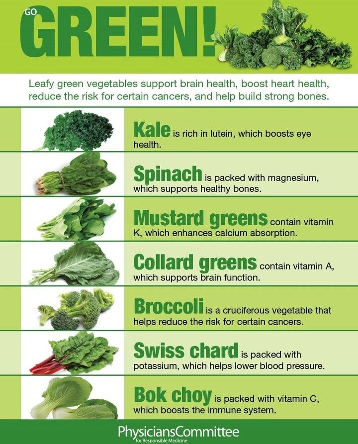

# Plant

## Fruits

### Citrus Fruits

- Oranges, grapefruits, and lemons are good sources of vitamin C, an antioxidant that helps protect the cornea, the outer layer of the eye.

## Cruciferous vegetables

Cruciferous vegetables, such as broccoli, cauliflower, and Brussels sprouts, contain compounds that can help detoxify the liver and reduce the risk of liver cancer.

### Seasonal

- apricots and asparagus in the **spring**,
- blackberries and blueberries in the **summer**,
- parsnips and pears in the **fall and winter.**
- apples, bananas, carrots and celery **all year long**

- <https://www.joyfulbelly.com/>

### Types

Type | definition
---|---
nightshade family | eggplants, potatoes, and peppers.

## polyphenols / antioxidants

resveratrol, a polyphenol or natural antioxidant commonly found in berries, peanuts, and red wine.

## Aryuvedic

there are numerous health benefits of both onion and garlic,  In Ayurveda, onion and garlic are more like medicine than food items.

root vegetables
alliaceous vegetables - onion plant group
