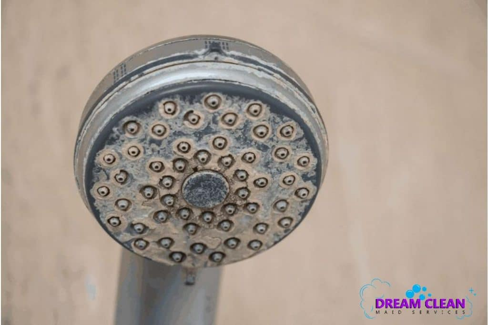

# Water

- Up to 60 percent of your body consists of water. And muscles can be as much as 79 percent water!
- body can absorb 10oz every 20min
- it's ok to urinate more frequently > detoxing

## Hard Water

## Flouridated Water

## Purified vs Distilled

## Simple Recipes

- Lemon & Cucumber
- Blueberries, cucumber, & basil
- Mint, kiwi, & grapefruit

### Clearer Skin

- cucumber
- lemon
- mint
- water

### Metabolism Booster

- apples
- cinnamon stick
- water

### Stomach Bloat

- cucumber
- lemon
- mint
- ginger
- water

### Weight Loss

- cucumber
- grapefruit
- water
