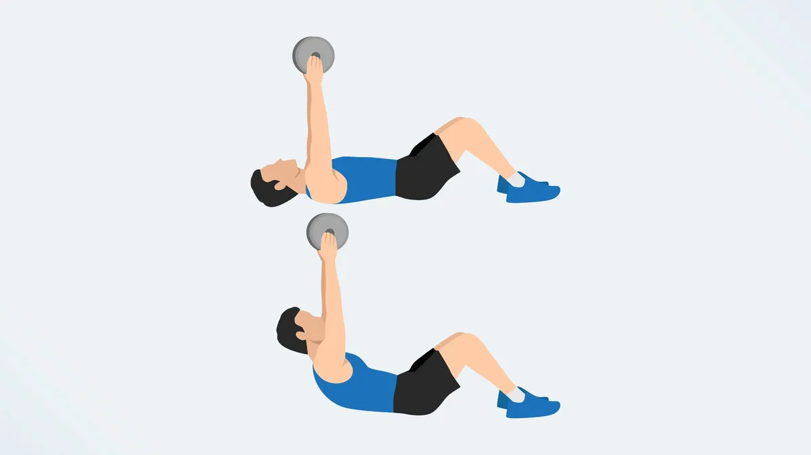

# Dumbbell

## Squats

## Abs

### Wood Chop

- standing twists
- russian twists

### Side Bend

- Obliques

### Crunch

## Butterfly sit-ups

Butterfly sit-ups remove your hips from the equation, fully loading your ab muscles during the exercise. Sit-ups target the rectus abdominis, transverse abdominis, and internal and external obliques, making the move a total ab attack. Having a wall in front of you helps support your feet and forces you to reach forward at the top, achieving a fuller range of motion.

## seated windshield wipers
