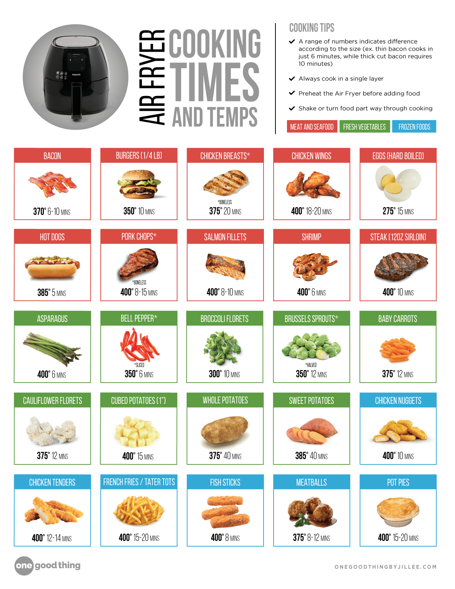

# Kitchen

- Soda-lime glass is used in everything from jars to windows. It's the most common type of glass produced.
- Borosilicate glass is a type of glass that is able to heat and cool rapidly without breaking. It has many applications, but for home use you're probably most familiar with it as bakeware, such as the old Pyrex baking dish your mom used to use.

## non stick pans

made after 2013 are made without polytetrafluoroethylene (PTFE) and perfluorooctanoic acid (PFOA), also known as C8.

**PFAS** (Per- and Polyfluoroalkyl Substances) accumulates in your body and can stay around for a while. Which means your levels can keep rising even if you are not exposed to a lot of PFAS at one time. Simply because you keep adding PFAS with every exposure and your body is not flushing them out.

## air fryers

- Teflon

PFAS (Per- and Polyfluoroalkyl Substances) are chemicals used in non-stick coatings, waterproofing, and other applications. Some kitchen appliances, including air fryers, may contain PFAS. Here's a breakdown of general categories and specific air fryer brands:

### Best Buy Disclosure

**General Categories:**

1. **Non-stick cookware**: Many non-stick pans and cookware sets contain PFAS.
2. **Small kitchen appliances**: Some air fryers, toaster ovens, and slow cookers may have PFAS-coated surfaces.
3. **Cookware and bakeware**: Some stainless steel cookware and bakeware may contain PFAS.

**Air Fryer Brands with PFAS:**

Based on available information, some air fryer brands may contain PFAS:

1. **Cosori**: Although Cosori claims to be PFAS-free, some models may still contain these chemicals. It's essential to verify the specific model and manufacturer's statement.
2. **Black+Decker**: Some Black+Decker air fryer models may contain PFAS.

**Air Fryer Brands without PFAS:**

Based on available information, some air fryer brands are PFAS-free:

1. **KitchenAid**: KitchenAid's air fryer products are designed without PFAS.
2. **Our Place**: Our Place's Wonder Oven air fryer is certified PFAS-free.
3. **Other brands**: Some smaller, niche brands, like Sustainably Chic's top 9 non-toxic air fryers, prioritize PFAS-free materials.
4. Ninja

**What to Look for in Product Descriptions:**

When searching for air fryers on Amazon or Temu, pay attention to the following:

1. **Material descriptions**: Look for phrases like "PFAS-free," "non-toxic," or "eco-friendly" in the product description.
2. **Certifications**: Check for certifications like Greenguard Gold, CertiPUR-US, or Oeko-Tex, which indicate compliance with stricter chemical standards.
3. **Manufacturer statements**: Verify the manufacturer's claims about PFAS-free materials and coatings.
4. **Customer reviews**: Read customer reviews and look for comments about non-stick coatings, durability, and any potential health concerns.

**Tips for Safe Air Fryer Use:**

1. Always follow the manufacturer's cleaning and maintenance instructions to minimize exposure to potential chemicals.
2. Avoid using abrasive cleaners or scouring pads, which can damage non-stick coatings and release particles into the air.
3. Keep your air fryer clean and well-maintained to reduce the risk of chemical leaching.

Remember that even PFAS-free air fryers may still contain other chemicals or materials that could potentially cause health concerns. Always prioritize proper use and maintenance to minimize exposure.

## Coffee Filters' Leaching Effects

Based on the provided search results, here's a summary of the findings:

1. **Paper filters:** Some studies suggest that paper filters, particularly those from third-world countries or China, may contain chemicals like formaldehyde, which can leach into coffee. However, the extent of this leaching is unclear, and more research is needed to confirm the risks.
2. **Micro-plastics:** The use of paper filters can also contribute to micro-plastic pollution in the environment, as the filters can break down into smaller particles. However, this is more of an environmental concern than a direct health risk to consumers.
3. **Chemex natural coffee filters:** A study tested Chemex natural coffee filters for PFAS (per- and polyfluoroalkyl substances) and found no indications of PFAS contamination. However, it's essential to note that this study only tested one specific brand and type of filter.
4. **Plastic containers:** Research has shown that fluorinated high-density polyethylene (HDPE) plastic containers, used for household cleaners, pesticides, and personal care products, can leach PFAS into food and solvents. While not directly related to coffee filters, this finding highlights the potential for PFAS contamination in plastic products.
5. **Coffee maker plastics:** A study mentioned that plastics used in coffee makers can contain potentially dangerous chemicals, including BPA and PFAS. However, the study emphasized that the risk is low, as long as the coffee maker is not damaged or exposed to boiling water for extended periods.

In summary, while some studies suggest that plastics used in coffee filters or strainers may leach chemicals, including PFAS, the evidence is limited and inconclusive. More research is needed to fully understand the risks associated with specific types of coffee filters and strainers.

**Recommendations:**

1. Choose paper filters from reputable sources, such as those from Europe or the United States, which may have stricter regulations and testing for chemicals like formaldehyde.
2. Consider switching to metal or mesh filters, which can reduce the risk of chemical leaching and micro-plastic pollution.
3. Opt for reusable filters made from stainless steel or glass, which eliminate the need for disposable filters and reduce plastic waste.
4. When purchasing coffee makers, look for models with BPA-free and PFAS-free plastics, and ensure that the manufacturer has implemented safe manufacturing practices.

**Future research directions:**

1. Conduct comprehensive testing of various coffee filters and strainers for PFAS and other chemicals.
2. Investigate the potential for micro-plastic pollution from coffee filters and strainers.
3. Study the effects of different brewing methods and temperatures on chemical leaching from coffee filters and strainers.
4. Evaluate the environmental and health impacts of different coffee filter and strainer materials and manufacturing processes.
