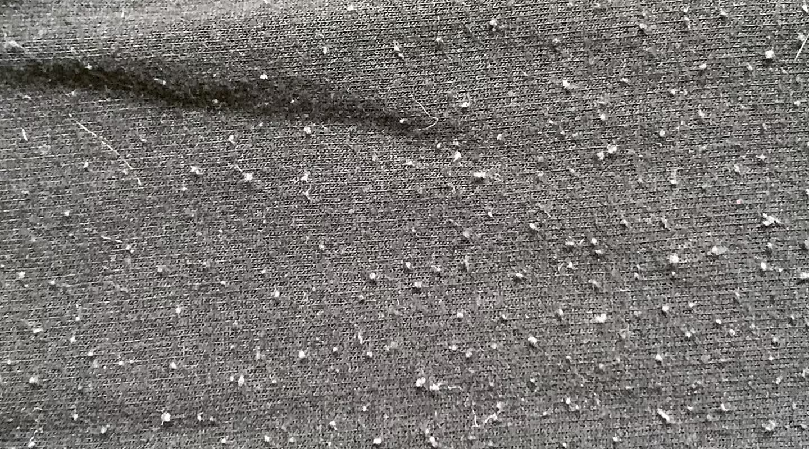

# average lifespan of clothing

## Men's Underwear

The frequency of replacing polyester boxer briefs can depend on several factors, including hygiene, usage, and personal comfort. Here are some considerations based on microbial science:

**Lifespan of Underwear**: A good rule of thumb is to replace them every 6 to 12 months, depending on wear and tear.

**Signs of Wear**: Look for signs such as fading, loss of elasticity, or persistent odors even after washing, which can indicate it's time for a replacement.

## Socks

According to the search results, the lifespan of socks can vary, but it's generally recommended to replace them every 3-6 months to maintain freshness and hygiene.

**When to Throw Out Socks with Microbes** Based on the information, it's essential to consider the following:

* **Visible signs of wear and tear**: If your socks show significant signs of wear, such as holes, fraying, or excessive pilling, it's time to replace them, regardless of their microbial contamination.
* **Odor and appearance**: If your socks develop an unpleasant odor or appear visibly dirty, it's likely that microbes have accumulated. In this case, it's recommended to wash them in hot water (at least 60°C/140°F) and dry them in the sun to reduce microbial survival.
* **Regular replacement schedule**: Even if your socks don't show visible signs of wear, it's still recommended to replace them every 3-6 months to maintain hygiene and prevent the buildup of microbes.

Remember that some microbes can survive for extended periods on socks, even after washing. To minimize the risk of microbial transmission, prioritize regular washing, drying, and replacement of your socks.

## Nylon, Spandex, and Polyester: A Microbial Showdown for Athletic Wear

When it comes to athletic wear, durability against microbial growth from sweat is a crucial factor. Nylon, spandex, and polyester are common choices due to their performance properties. Let's compare their resistance to microbial growth:

### Nylon: Moderate Resistance

* **Pros:** Durable, moisture-wicking, and quick-drying.
* **Cons:** Can be susceptible to microbial growth if not cared for properly.

### Spandex: Low Resistance

* **Pros:** Highly elastic and provides a comfortable fit.
* **Cons:** Prone to microbial growth due to its moisture-absorbing properties.

### Polyester: High Resistance

* **Pros:** Durable, moisture-wicking, quick-drying, and resistant to microbial growth.
* **Cons:** Can sometimes feel less breathable than other fabrics.

**Overall, polyester tends to be the most resistant to microbial growth among these three fabrics.** Its hydrophobic properties help repel moisture, making it less hospitable to bacteria and fungi.

**Tips for Maintaining Microbial Resistance:**

* **Wash regularly:** Frequent washing helps remove sweat and bacteria.
* **Use antimicrobial detergents:** These can provide additional protection.
* **Air dry:** Whenever possible, air drying can help reduce the growth of microorganisms.
* **Avoid leaving wet clothes:** Wet clothes create a breeding ground for bacteria.

By understanding the properties of these fabrics and following proper care guidelines, you can choose the best athletic wear to meet your needs and maintain a healthy, odor-free wardrobe.

## Longevity of Athletic Wear: Nylon, Spandex, and Polyester

The longevity of athletic wear depends on several factors, including the quality of the fabric, care practices, and frequency of use. Here's a general breakdown of the lifespan for nylon, spandex, and polyester:

### Nylon

* **Average lifespan:** 2-3 years.
* **Factors affecting lifespan:** Frequent washing, exposure to chlorine, and excessive stretching.

### Spandex

* **Average lifespan:** 1-2 years.
* **Factors affecting lifespan:** Frequent washing, exposure to chlorine, and excessive stretching. Spandex is particularly susceptible to degradation over time.

### Polyester

* **Average lifespan:** 3-5 years.
* **Factors affecting lifespan:** Frequent washing, exposure to harsh chemicals, and excessive heat. Polyester is generally more durable than nylon and spandex.

**General Tips for Extending the Lifespan of Athletic Wear:**

* **Follow care instructions:** Wash according to the care label.
* **Avoid harsh chemicals:** Use gentle detergents and avoid bleach.
* **Air dry:** Whenever possible, air drying can help preserve the fabric.
* **Store properly:** Fold or hang clothes to prevent wrinkles and creases.
* **Inspect for damage:** Regularly check for holes, tears, or worn-out areas.

Remember, these are general estimates, and the actual lifespan of your athletic wear can vary depending on individual factors. If your clothes start to show signs of wear and tear, such as fading, pilling, or losing elasticity, it may be time to replace them.

## Polyester workout clothing

Polyester workout clothing typically lasts between 1 to 3 years,

## shoes, sneakers, sandals, slides

Based on the provided search results, here's a breakdown of the average lifespan for different types of footwear:

### Shoes

8-12 months (according to podiatrists) or 2.5 years (for work shoes)

### Sneakers

9-10 months (based on heavy trail running use) or variable (depending on individual usage and quality)

### Sandals

Not specifically mentioned in the search results, but generally considered to have a shorter lifespan (6-12 months) due to exposure to water, UV rays, and wear on straps and soles.

### Slides

Similar to sandals, slides typically have a shorter lifespan (6-12 months) due to their lightweight construction and frequent use.

Factors Affecting Lifespan

 Usage: Heavy daily use, especially in harsh environments, can reduce the lifespan of footwear.
 Quality: Better-quality shoes and sandals may last longer than cheaper alternatives.
 Maintenance: Regular cleaning and inspection can help extend the lifespan of footwear.

Inspection Tips

 Check for uneven wear on soles and heels.
 Inspect for signs of degradation, such as cracks or creases, in midsoles and outsoles.
 Verify that shoes sit evenly on a flat surface, without tipping or rocking.

Keep in mind that these estimates are general and may vary depending on individual circumstances. It's essential to regularly inspect your footwear and replace them when necessary to maintain good foot health.

**Here are some signs that your shoes might have bacterial growth:**

* **Unpleasant odor:** A strong, foul smell, especially after wearing the shoes for a prolonged period, can be a sign of bacterial growth.
* **Discoloration:** Look for discoloration or staining, particularly in the interior of the shoes. This can be caused by bacteria or fungi.
* **Irritation or skin problems:** If you experience itching, redness, or other skin problems in the areas that come into contact with your shoes, it might be due to bacterial or fungal infections.

**If you suspect that your shoes have bacterial growth, it's important to take steps to clean and disinfect them.** Here are some tips:

* **Remove the insoles:** Wash the insoles with a mild detergent and allow them to dry completely.
* **Clean the interior:** Use a soft-bristled brush or a damp cloth to clean the inside of the shoes. Avoid using harsh chemicals that can damage the materials.
* **Use a disinfectant:** Spray a disinfectant solution inside the shoes and allow them to dry completely.
* **Air them out:** Leave your shoes in a well-ventilated area to dry thoroughly.

**If the problem persists or if you experience severe skin irritation, it might be a good idea to consult with a healthcare professional.** They can provide advice on how to treat the infection and recommend appropriate footwear.

## jeans

Based on the fabric blend of your men's jeans (2/3 cotton, 29% polyester, 3% rayon, 2% spandex), I'll provide an analysis of its potential lifespan in relation to microbial growth.

**Cotton (2/3):** Cotton is a natural fiber that provides a relatively hospitable environment for microorganisms. However, its high water-absorbing capacity and breathable nature can also facilitate the growth of beneficial microorganisms, such as lactic acid bacteria, which can help break down sweat and odors. The cotton content will contribute to the overall durability and lifespan of the jeans.

**Polyester (29%):** Polyester, being a synthetic fiber, is less susceptible to microbial degradation than cotton. However, it can still harbor microorganisms, particularly those that thrive in moist environments. Polyester's hydrophobic nature can reduce the growth of some microorganisms, but it may not completely eliminate the presence of microbes.

**Rayon (3%):** Rayon, a semi-synthetic fiber, can exhibit properties similar to both cotton and polyester. Its cellulose-based composition makes it more prone to microbial degradation than polyester, but less so than cotton. The 3% rayon content will have a moderate impact on the jeans' lifespan.

**Spandex (2%):** Spandex, a synthetic elastomer, is generally resistant to microbial growth due to its hydrophobic and non-porous nature.

**Overall Assessment:** Considering the fabric blend, the lifespan of your men's jeans in relation to microbial growth can be estimated as follows:

* Initial stages (0-6 months): The jeans will likely exhibit moderate to high microbial activity, particularly on the cotton-rich areas, due to the presence of sweat and body oils. This may lead to the growth of beneficial microorganisms, such as lactic acid bacteria, which can help break down odors and sweat.
* Medium-term (6-18 months): As the jeans are washed and worn regularly, the microbial population will likely stabilize, with a balance between beneficial and potentially odor-causing microorganisms. The polyester and rayon contents will help reduce the growth of some microorganisms, while the cotton and spandex will continue to provide a relatively hospitable environment.
* Long-term (18 months+): The jeans may experience a decline in microbial activity as the fabric ages and becomes less conducive to microbial growth. The polyester and rayon contents will continue to play a role in reducing microbial activity, while the cotton and spandex will contribute to the overall durability of the jeans.

**Lifespan Prediction:** Based on this analysis, I estimate the lifespan of your men's jeans in relation to microbial growth to be around 2-3 years, assuming regular washing and maintenance. However, this prediction is influenced by various factors, including:

* Washing frequency and detergent used
* Drying methods (e.g., machine drying, air drying, or a combination)
* Storage conditions (e.g., folded, hung, or packed)
* Body chemistry and sweat patterns
* Environmental factors (e.g., temperature, humidity)

Keep in mind that this prediction is based on the fabric blend and microbial growth dynamics. Actual lifespan may vary depending on the specific conditions and usage of the jeans.

## Fabric Pilling

* **Minor Pilling:** If the shorts are still functional and comfortable, you can remove the pills using a fabric shaver or a lint roller.
* **Severe Pilling:** If the fabric has lost its integrity, is uncomfortable, or affects performance, it might be time to replace them.

“Pills” are the name frequently given to small, firm balls of lint that form on the surface of fabrics like clothing, while “pilling” is the process that forms them. Thankfully, you can usually remove pills with a fabric comb or battery-operated pill/lint remover that cuts or scrapes them away.

You can also learn how to prevent pilling on clothes, or at least reduce it, including how you wash and dry your fabrics. Read on to learn more about fabric pilling and prevention methods.

To prevent pilling, opt for sturdy fabrics that are tightly woven and made from durable materials. Clothes pilling is most common with looser, shorter fibers. Knitted fabrics tend to pill more than woven ones, and clothes made from wool, cotton, polyester, acrylic and other synthetics tend to develop pills more readily than silk, rayon, denim or linen.

Washing clothing in hot water doesn’t directly cause fabric to pill, but it can make clothing more susceptible to pilling. Hot water can wear out the fibers of clothing more quickly than washing with cold water. This can lead to the fabric fibers becoming tangled, creating those pesky little fabric pills on your laundry.

pilling can form from the friction of fabric rubbing together during the tumble dry cycle. If you have a load of fabrics that are more likely to pill, you may want to lay them out flat to air dry rather than tossing them in the dryer.
