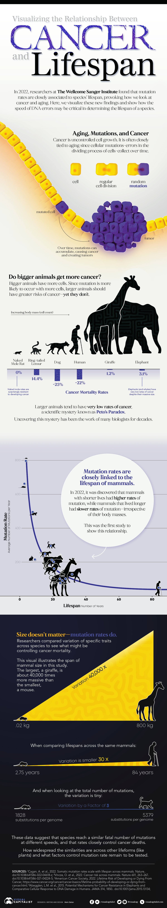

# Mental Fitness Concepts for Aging

## Longevity

- cardiorespiratory fitness > VO2 Max
- Strength

Based on the provided search results, here are some mental fitness concepts to counteract aging:

1. **Regular Exercise**: Engage in at least 30 minutes of moderate exercise daily, such as brisk walking, to boost oxygen supply to the brain and improve cognitive functions like memory, reasoning, and reaction times.
2. **Mental Engagement**: Participate in frequent social, mental, and physical activities to sustain mental engagement and cognitive reserve. This can include learning new skills, playing games, or volunteering.
3. **Cognitive Training**: Engage in brain-training exercises, such as cognitive apps, to improve processing speed, attention, and memory.
4. **Stress Management**: Practice stress-reducing techniques, such as meditation or yoga, to mitigate the negative effects of stress on cognitive function.
5. **Social Connection**: Maintain strong social connections and engage in activities that promote social interaction, as social isolation can negatively impact cognitive health.
6. **Positive Thinking**: Cultivate a positive outlook and attitude, as research suggests that optimism and gratitude can contribute to better cognitive function and overall well-being.
7. **Mindfulness**: Practice mindfulness meditation to improve attention, working memory, and cognitive flexibility.
8. **Neuroplasticity**: Engage in activities that promote neuroplasticity, such as learning new skills or taking up a new hobby, to build cognitive reserve and promote brain health.
9. **Sleep and Relaxation**: Prioritize adequate sleep and relaxation to reduce oxidative stress and inflammation, which can negatively impact cognitive function.
10. **Nutrition and Supplements**: Consume a balanced diet rich in omega-3 fatty acids, antioxidants, and B vitamins, and consider supplements like vitamin D and B12 to support cognitive health.

Additionally, the following concepts were mentioned in the search results:

- **Busyness**: Engage in activities that promote a sense of purpose and fulfillment, rather than simply being busy, to potentially improve cognitive function.
- **Occupational Engagement**: Remain engaged in meaningful work or activities, even in retirement, to promote cognitive preservation.
- **Cognitive Demands**: Challenge yourself with mentally demanding tasks, such as problem-solving or learning new skills, to build cognitive reserve.
