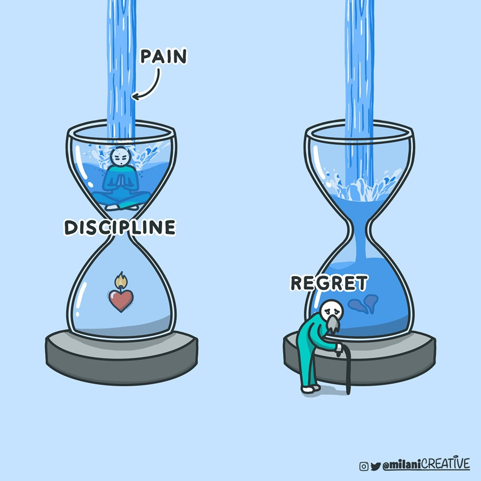

# Discipline

## making sacrifices

**The Breakdown, Gen Z Style:**

* **"Making sacrifices" = Leveling Up Your Priorities:** Think of it like a video game. You can't unlock the next level (maturity, success) if you're stuck grinding the same low-level quests (instant gratification, avoidance). Sacrifices are like spending your XP wisely. You might have to skip the late-night Discord sesh (sacrifice) to study for that midterm (priority).
* **Maturity = Adulting with Intention:** Maturity isn't about suddenly liking kale smoothies and paying taxes. It's about being able to delay that dopamine hit for a bigger, longer-lasting reward. It’s about having the emotional regulation to deal with not getting what you want right away. It's understanding that sometimes you have to "choose your battles" and let some things go.
* **Growth = Your Personal Glow-Up:** When you make a sacrifice and it pays off, that's growth. You've proven to yourself that you can handle discomfort and that you're capable of achieving your goals. It's like seeing your character's stats increase after a tough boss fight.
* **Self-Esteem from Success = The "W" Factor:** Every time you succeed after making a sacrifice, you get a little boost of self-esteem. It's like getting that "W" on your report card or finally nailing that presentation. You're building a "receipts" folder of your accomplishments. This isn't about being "main character energy" all the time, but about recognizing that you're capable.
* **Avoiding Sacrifices = Getting "Stuck in Your Feels":** If you constantly avoid making sacrifices, you might end up feeling stagnant. You might experience FOMO, or feel like you are always "coping" instead of thriving. It can lead to a cycle of low self-esteem because you never push yourself out of your comfort zone.
* **"It's Giving" Resilience:** When you bounce back from a failed sacrifice, or a sacrifice that didn't pay off immediately, "it's giving" resilience. You learn from the experience, adjust your strategy, and try again. It's about understanding that setbacks are part of the process.

**The Psychology Behind It:**

* **Delayed Gratification:** This is a core concept. People who can delay gratification tend to have better outcomes in life, including higher academic achievement, better relationships, and greater overall well-being.
* **Cognitive Behavioral Therapy (CBT) Principles:** CBT emphasizes the connection between thoughts, feelings, and behaviors. Making sacrifices can be seen as a behavioral strategy for changing negative thought patterns and improving emotional regulation.
* **Self-Efficacy:** This is the belief in your ability to succeed in specific situations. Making sacrifices and achieving your goals strengthens your self-efficacy, which in turn boosts your self-esteem.

**In simpler terms:**

Sacrifices aren't about self-deprivation. They're about investing in your future self. It's about recognizing that sometimes, you have to trade a little "now" for a lot of "later." And every time you do, you're building a stronger, more confident version of yourself.
