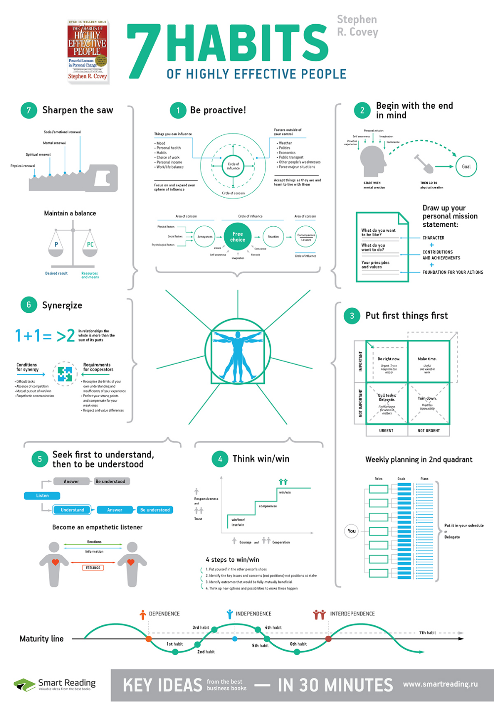
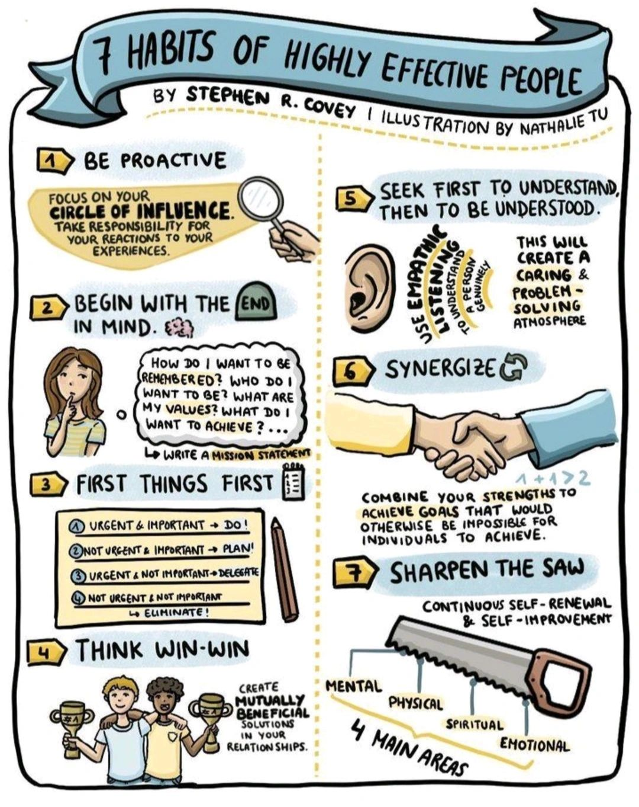
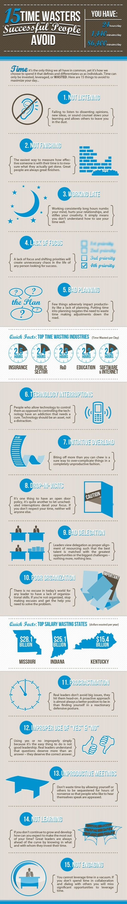

# Habits

## "we do not rise to the level of our goals, we fall to the level of our systems.”

Within our self-imposed systems, our execution is also capped at our love level.

Whether you love your job, have fallen out of love with it, or have never loved it all, the work to sustain it, find our way back, or find the job that we do love, is key to both success and happiness.

## Identify Bad Habit

**It takes three steps to identify and break a bad habit:**

1. **Cue:** When, where, with whom, or after which activity do you feel the urge for your habit?
2. **Reward:** What craving are you trying to satisfy?
3. **Routine:** Can you train yourself to do something else that satisfies the same need?
