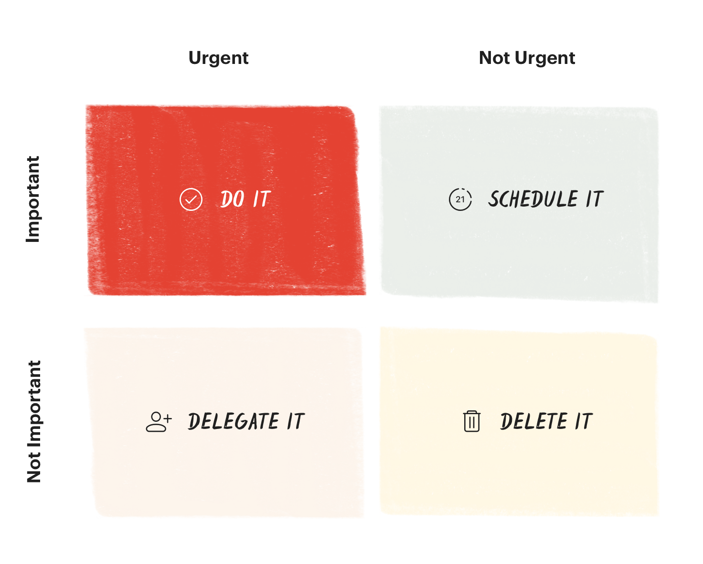

# Time Management

- Find your optimal "chunk"

## Time is a cost. Prepare just enough and do.

- Activity gets you busy. But productivity gets you free.
- "Perfection is not attainable, but if we chase perfection, we can catch excellence." – Vince Lombardi
- There are decades where nothing happens, and weeks where decades happen

## Eisenhower Matrix

Eisenhower Matrix

- Besides filtering out incoming tasks that are neither urgent nor important, discover and stop bad habits, like surfing the internet without a reason or gaming too long.
- The fourth and last quadrant in the Eisenhower Matrix is called Don’t Do because it is there to help you sort out things you should not do at all.
  - From smoking to overeating to all those other things we do even though we know they're bad for us or don’t serve our vision. These are the things that give you an excuse for not being able to deal with important tasks in the 1st and 2nd quadrant. Put them all down in the fourth quadrant.

## strategy for each personality

## Rule of thumb

## Schedule

## Time Blocking

working with full focus for 52 minutes followed by a 17-minute break

## 2 min rule

if a task arises that can be done in two minutes or less, it should be done immediately

## Time Boxing

Timeboxing is a time management method where you allocate a fixed period, or ‘box’, to complete a specific task or set of tasks before moving on. This technique contrasts with the Pomodoro Technique, which involves working in set intervals (typically 25 minutes) followed by a short break, regardless of the task type or its completion status. Timeboxing allows for more flexibility as the length of each time box can be adjusted based on the task’s complexity and priority, rather than adhering to a uniform interval.

## Ultradian Rhythms

Ultradian Rhythms are recurrent periods or cycles repeated throughout a 24-hour day, influencing various biological processes, including sleep, arousal, and physical performance. In the context of productivity, the most relevant ultradian rhythm is the 90-minute cycle that affects our levels of focus and energy. Research indicates that during each cycle, individuals experience a peak when they are most alert and a trough when they are less energetic. Harnessing these natural fluctuations can significantly enhance work efficiency and mental acuity.

## Ultra Time Mgmt

## 8 annual goals is good number

## Delegate

- Enlist Pros, build a team

PRIORITIZE tasks, delegate

## Productivity

