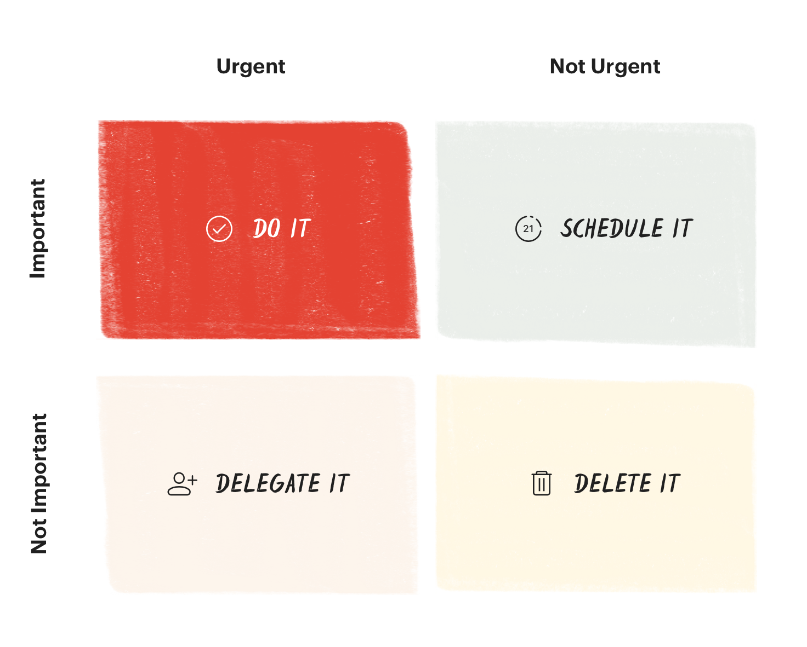

# Time Management

- Activity gets you busy. But productivity gets you free.
- "Perfection is not attainable, but if we chase perfection, we can catch excellence." – Vince Lombardi
- There are decades where nothing happens, and weeks where decades happen

## Eisenhower Matrix

Eisenhower Matrix

- Besides filtering out incoming tasks that are neither urgent nor important, discover and stop bad habits, like surfing the internet without a reason or gaming too long.
- The fourth and last quadrant in the Eisenhower Matrix is called Don’t Do because it is there to help you sort out things you should not do at all.
  - From smoking to overeating to all those other things we do even though we know they're bad for us or don’t serve our vision. These are the things that give you an excuse for not being able to deal with important tasks in the 1st and 2nd quadrant. Put them all down in the fourth quadrant.

## strategy for each personality

## Rule of thumb

## Schedule

## Ultra Time Mgmt

## 8 annual goals is good number

PRIORITIZE tasks, delegate

## Productivity

