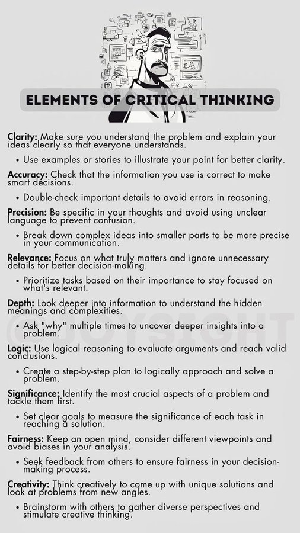

# Critical Thinking Skills

Increasing your mental toughness to resist propaganda and polarizing fake news involves several strategies. Here are some effective methods:

1. **Critical Thinking Skills**: Develop your ability to analyze information critically. This includes questioning the sources of news, verifying facts, and considering multiple perspectives. Critical thinking helps you evaluate information objectively and avoid being swayed by emotional or misleading content.

2. **Media Literacy Education**: Educate yourself on how media works, including understanding the techniques used by media outlets and social platforms to influence public opinion. This includes recognizing bias, understanding the difference between opinion and fact, and being aware of the role of advertising and sponsored content.

3. **Fact-Checking**: Before sharing or believing information, verify it through reliable sources. Use fact-checking websites and tools to cross-reference claims and ensure the information is accurate.

4. **Exposure to Diverse Perspectives**: Seek out a variety of viewpoints and sources to broaden your understanding of issues. This can help you develop a more nuanced perspective and resist the polarizing effects of echo chambers and filter bubbles.

5. **Emotional Awareness**: Recognize how emotions can influence your judgment. Be aware of how certain narratives or images might trigger emotional responses that could cloud your judgment.

6. **Digital Detox**: Periodically take breaks from social media and news to reduce exposure to polarizing content. This can help you maintain a clearer perspective and avoid the constant bombardment of information that can lead to mental fatigue and susceptibility to persuasion.

7. **Mindfulness and Self-Reflection**: Practice mindfulness to stay grounded and focused. Regularly reflect on your beliefs and the reasons behind them. This can help you identify and challenge any biases or assumptions that might make you more susceptible to propaganda.

8. **Engage in Constructive Dialogue**: Participate in respectful and constructive discussions with people who have different views. This can help you understand different perspectives and build resilience against polarizing rhetoric.

By implementing these strategies, you can enhance your mental toughness and become less susceptible to propaganda and polarizing fake news.

## excessive negative media consumption leading to emotional distress and unproductive behaviors

**CBT 101: Rewiring Your Brain (Think of it as a Mental App Update)**

CBT is all about understanding the connection between your **thoughts**, **feelings**, and **behaviors**. It's like realizing your phone's battery is draining because of a rogue app running in the background.

* **Thoughts (The Rogue App):**
  * Right now, this young adult's thoughts are likely dominated by negativity from the political media. They're probably experiencing:
    * **Catastrophizing:** "Everything is going to fall apart."
    * **All-or-nothing thinking:** "The world is either completely good or completely bad."
    * **Emotional reasoning:** "I feel angry, so the world must be terrible."
  * These thoughts are distorted and inaccurate, but they feel real.
* **Feelings (The Low Battery):**
  * The negative thoughts lead to feelings of:
    * Depression
    * Anger
    * Anxiety
    * Impulsivity
* **Behaviors (The Unproductive Actions):**
  * These feelings drive behaviors like:
    * Endless doomscrolling
    * Argumentative online behavior
    * Avoidance of productive activities
    * Difficulty regulating emotions.

**Breaking the Cycle: Hacking Your Mind**

Here's how we can use CBT to help this young adult:

1. **Thought Journaling (Debugging Your Thoughts):**
    * Start by identifying those negative thoughts. When you feel angry or depressed after being online, write down what you were thinking.
    * Challenge those thoughts. Ask yourself:
        * "Is there any evidence to support this thought?"
        * "Is there another way to look at this situation?"
        * "What would I tell a friend who was thinking this?"
2. **Behavioral Activation (Restarting Your System):**
    * This is key. We need to replace the negative online behavior with positive activities.
    * **Start small:** "Instead of scrolling for an hour, I'll read a chapter of a book I enjoy."
    * **Focus on activities that provide a sense of accomplishment or pleasure.**
3. **Exposure Therapy (Facing Your Fears, Gradually):**
    * This does not mean we want to increase the exposure to negative media. We are talking about exposure to real life.
    * If social anxiety is involved, we will start with small social interactions.
    * If avoidance of leaving the house is happening, we will start with small trips outside.
4. **Time Management (Protecting Your Battery Life):**
    * Set time limits for online activity.
    * Use apps or browser extensions to block distracting websites.
    * Schedule productive activities into the day.

**Inspiring Productive Hobbies: Finding Your "Thing"**

Here's how to frame it for a young adult who might be resistant:

* **"Level Up Your Skills":**
  * "Think of hobbies as skill trees. You can learn anything online: coding, music production, graphic design, writing. These are skills that can actually help you in the future, not just make you feel bad."
* **"Find Your Community":**
  * "Online communities around hobbies can be super positive. You can connect with people who share your interests, learn from them, and even collaborate."
* **"Build Your 'Receipts' Folder":**
  * "Every time you create something, learn something new, or accomplish a goal, it's like adding a receipt to your folder of accomplishments. That folder is your self-esteem."
* **"Your Parents Aren't Trying to Be Annoying":**
  * "When your parents say you're 'wasting your time,' they're seeing the potential you have. They know you're capable of more than just getting angry online. They want you to experience the satisfaction of achieving something real."
* **"Dopamine Management":**
  * "Social media is engineered to give you short bursts of dopamine. Hobbies give you longer, more sustainable dopamine hits. It's the difference between eating a candy bar and cooking a good meal."
* **"Find something that creates flow":**
  * Flow is the mental state of being completely immersed in an activity. When you find a hobby that creates flow, time will fly by, and you will feel amazing.

Social media algorithms prioritize content that maximizes user engagement, and content evoking fear and anger tends to perform well due to psychological mechanisms rooted in human cognition and emotion. Here's an explanation, grounded in psychological theory and research:

### negativity bias

1. **Emotional Arousal and Attention**: Fear and anger are high-arousal emotions that activate the brain's limbic system, particularly the amygdala, which is responsible for processing emotional stimuli. High-arousal emotions capture attention more effectively than low-arousal emotions (e.g., contentment or boredom) because they signal potential threats or conflicts requiring immediate response. According to the **Negativity Bias**, negative emotions like fear and anger are more salient than positive ones, as they historically aided survival by prompting quick reactions to danger (Baumeister et al., 2001). Social media algorithms exploit this by amplifying content that triggers these emotions, as it keeps users engaged longer.

2. **Cognitive Processing and Reactivity**: Fearful and angry content prompts stronger cognitive elaboration. Fear triggers a **fight-or-flight response**, increasing alertness and motivating users to seek more information or share warnings (Öhman & Mineka, 2001). Anger, on the other hand, activates approach-oriented behaviors, making users more likely to comment, argue, or share content to express outrage or rally others (Carver & Harmon-Jones, 2009). Both emotions drive higher click-through rates, likes, shares, and comments—metrics algorithms use to gauge engagement.

3. **Social and Group Dynamics**: Social media platforms are inherently social, and fear- or anger-inducing content often taps into **group identity** and **tribal psychology**. Content that highlights threats (fear) or injustices (anger) can reinforce in-group/out-group dynamics, prompting users to engage to affirm their group’s values or oppose perceived enemies (Tajfel & Turner, 1979). This is why polarizing or controversial posts—often fear- or anger-based—spread rapidly, as users share to signal solidarity or outrage, amplifying algorithmic visibility.

### emotional arousal

4. **Algorithmic Feedback Loops**: Algorithms are designed to optimize for engagement metrics (e.g., time spent, interactions). Since fear and anger drive more clicks and shares, these posts are prioritized in feeds, creating a feedback loop where users are exposed to increasingly emotional content. This can desensitize users over time, requiring even more intense stimuli to maintain engagement, a phenomenon akin to **emotional escalation** (Frijda, 1988).

5. **Evolutionary and Neurobiological Factors**: From an evolutionary perspective, fear and anger are adaptive emotions tied to survival. Fear prepares us for threats, while anger motivates us to confront challenges or injustices. Neurobiologically, these emotions increase dopamine release in reward pathways when users engage with validating content (e.g., outrage posts confirming their beliefs), reinforcing compulsive interaction (Berridge & Robinson, 1998). Algorithms exploit this by serving content that aligns with users’ emotional triggers.

6. **Confirmation Bias and Echo Chambers**: Fear and anger are often tied to content that confirms pre-existing beliefs or highlights threats to one’s worldview. This aligns with **confirmation bias**, where users are drawn to information that validates their perspectives (Nickerson, 1998). Algorithms detect these preferences and curate feeds to reinforce them, amplifying emotionally charged content that resonates with users’ biases.

In summary, social media algorithms amplify fear- and anger-inducing content because these emotions drive heightened attention, reactivity, and social interaction, which translate to measurable engagement. This is rooted in psychological mechanisms like negativity bias, emotional arousal, group dynamics, and reward-seeking behavior, creating a cycle where such content dominates feeds.
