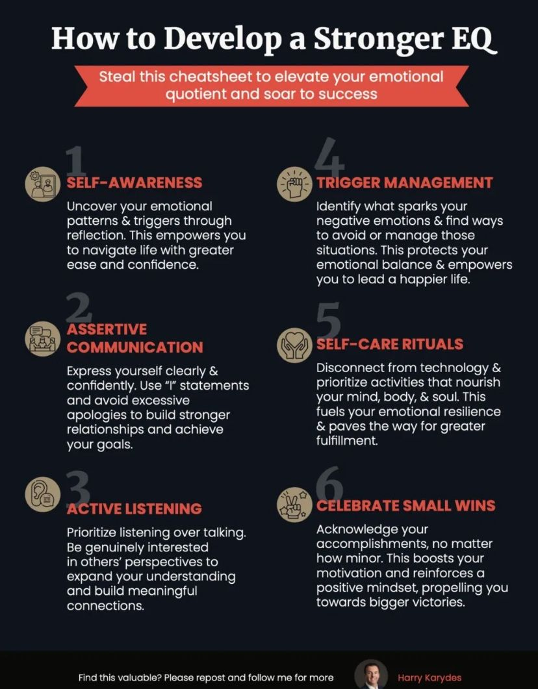
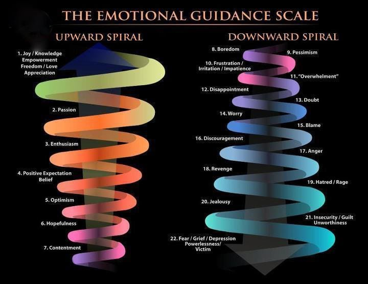

# Emotional regulation

## humans suck at managing their emotions

## stages of crisis

1. feeling locked in to a current bad situation
2. rising need to escape
3. things boil, action is taken
4. re-building, a new life aligns
5. settling in to a new life

## DEPRESSION IS SADNESS MONETIZED  

## Shame

Shame is a complex and multifaceted emotion that involves a negative evaluation of oneself as a whole person. It is characterized by feelings of inadequacy, worthlessness, and powerlessness, often accompanied by a sense of exposure, embarrassment, and humiliation. Shame can arise from perceived failures, mistakes, or transgressions, and can be triggered by internal or external stimuli.

**Key Components of Shame**

1. **Self-evaluation**: Shame involves a global, negative assessment of one's self-worth, often based on perceived flaws or shortcomings.
2. **Emotional intensity**: Shame can be an intensely painful and distressing experience, often accompanied by feelings of anxiety, depression, and hopelessness.
3. **Loss of autonomy**: Shame can lead to feelings of helplessness and powerlessness, as individuals may feel trapped in their perceived inadequacies.
4. **Social comparison**: Shame often involves comparisons with others, leading to feelings of inferiority and inadequacy in relation to societal norms or expectations.
5. **Hiddenness**: Shame can prompt individuals to hide or conceal their perceived flaws or mistakes, leading to secrecy and isolation.

**Types of Shame**

1. **Existential shame**: Arises from a sense of fundamental flaw or imperfection, often related to one's existence or being.
2. **Situational shame**: Triggered by specific events or circumstances, such as a mistake or failure.
3. **Narcissistic shame**: Involves shame related to perceived defects or shortcomings in one's self-image or ego.
4. **Class shame**: Based on social class or status, often involving feelings of inferiority or inadequacy due to one's social position.

**Consequences of Shame**

1. **Low self-esteem**: Chronic shame can lead to persistent feelings of inadequacy and low self-worth.
2. **Anxiety and depression**: Shame can contribute to the development of anxiety disorders and depression.
3. **Avoidance behaviors**: Shame can prompt individuals to avoid situations or people that might trigger feelings of shame.
4. **Social withdrawal**: Shame can lead to social isolation and withdrawal, as individuals may feel embarrassed or humiliated by their perceived flaws.

**Healing and Recovery**

1. **Acknowledgment**: Recognizing and accepting one's shame can be a crucial step towards healing.
2. **Self-compassion**: Practicing self-compassion and understanding can help alleviate shame's negative effects.
3. **Reframing**: Challenging negative self-talk and reframing shame-inducing experiences can promote a more balanced and realistic self-image.
4. **Social support**: Building and maintaining social connections can help individuals feel less isolated and more supported in their struggles with shame.

**Conclusion**

Shame is a complex and pervasive emotion that can have significant consequences for an individual's mental health and well-being. Understanding the psychology of shame can help individuals recognize and address its effects, ultimately promoting greater self-acceptance, self-compassion, and resilience.

## Guilt

Guilt is a complex and multifaceted emotion that arises from the perception of having violated one's own moral standards, values, or principles. It is a self-conscious emotion, characterized by feelings of regret, remorse, and responsibility for a perceived wrong or harm caused to oneself or others.

**Theories and Models**

Several psychological theories and models attempt to explain the concept of guilt:

1. **Freudian Psychoanalysis**: Sigmund Freud viewed guilt as a result of the conflict between the ego (conscious) and the superego (unconscious moral component). Guilt arises when the ego fails to meet the superego's moral expectations, leading to feelings of shame and anxiety.
2. **Social Learning Theory**: According to Albert Bandura, guilt is learned through observing and imitating others' behaviors and moral standards. Individuals internalize these standards and experience guilt when they fail to meet them.
3. **Evolutionary Theory**: Some researchers propose that guilt evolved to promote cooperation and social harmony by encouraging individuals to repair harm caused to others and maintain relationships.
4. **Cognitive Appraisal Theory**: This perspective suggests that guilt arises from a cognitive evaluation of one's behavior as violating moral standards, leading to feelings of distress and responsibility.

**Key Components**

Guilt typically involves:

1. **Perceived wrongdoing**: The individual believes they have caused harm or violated their own moral standards.
2. **Self-blame**: Guilt involves attributing responsibility for the wrongdoing to oneself.
3. **Emotional distress**: Guilt is often accompanied by feelings of sadness, regret, and anxiety.
4. **Motivation to repair**: Guilt can motivate individuals to make amends, apologize, or change their behavior to rectify the situation.

**Differences from Shame**

Guilt is distinct from shame in several ways:

1. **Focus**: Guilt focuses on a specific behavior or action, whereas shame is more general and concerns the self as a whole.
2. **Attribution**: In guilt, the individual takes responsibility for the wrongdoing, whereas in shame, the blame is often attributed to the self as a whole.
3. **Emotional tone**: Guilt tends to be accompanied by feelings of sadness and regret, whereas shame is often characterized by feelings of worthlessness and inadequacy.

**Developmental Aspects**

Guilt develops throughout childhood and adolescence, influenced by:

1. **Parental modeling**: Children learn moral standards and expectations from caregivers.
2. **Social interactions**: Observing and imitating others' behaviors and moral standards.
3. **Moral reasoning**: Developing an understanding of right and wrong, and the consequences of one's actions.

**Clinical Relevance**

Excessive or disproportionate guilt can be a symptom of various mental health conditions, including:

1. **Depression**: Chronic feelings of guilt can contribute to depressive episodes.
2. **Anxiety disorders**: Guilt can exacerbate anxiety symptoms.
3. **Post-Traumatic Stress Disorder (PTSD)**: Guilt can arise from perceived responsibility for traumatic events.

**Conclusion**

Guilt is a complex emotion rooted in an individual's moral standards, values, and principles. Understanding the psychological theories, components, and developmental aspects of guilt can help individuals recognize and manage their own guilt, as well as provide insight into the clinical relevance of guilt in various mental health conditions.

## Beware of Tricks

## Beware of Toxic Traits

### Emotional Blackmail

Emotional blackmail is a dysfunctional form of manipulation that people use to place demands and threaten victims to get what they want. The undertone of emotional blackmail is if you don't do what I want when I want it, you will suffer.

The emotional blackmailer typically does not have any other coping or go-to methods for how to communicate and interact in a healthy manner. They fall back to stonewalling, slamming doors, threatening, and engaging in other damaging behaviors to get what they want. They typically do not have the tools available to understand how to convey their needs.

#### Some examples

- "If you ever stop loving me I will kill myself."
- "I've already discussed this with our (pastor, therapist, friends, family) and they agree that you are being unreasonable."
- "I'm taking this vacation with or without you."
- "How can you say you love me and still be friends with them?"

## Sensitive

Control your emotional spikes

## Happiness

- You're unhappy because you're not in alignment with who you are. Not because of what anyone else is doing. Now read that again.

**self-agency** (or personal agency) as the power individuals have over their own lives. It emphasizes that self-agency reflects the degree of control one feels over their actions and environment, influencing overall happiness.

recognize your own inherent agency and work towards enhancing it for a better quality of life.

- **Types of Agency**: Most people have low to medium agency, with high agency individuals being rare (less than 1% of the population).
- **Subjective Measure**: Agency is subjective and cannot be precisely quantified; it's based on personal perception.
- **Improving Agency**: Individuals can enhance their agency by reducing reliance on artificial stimulants and focusing on productivity.
- **Self-Control Connection**: There is a direct correlation between self-control and agency; higher self-control typically leads to higher agency.
- **Agency Theory**: This theory explores why different people have varying levels of agency and how they can improve it.

## Former Gifted Child Syndrome

Based on the provided search results, "Gifted Kids Syndrome" (also referred to as "Gifted Kid Burnout" or "Former Gifted Child Syndrome") appears to be a phenomenon where children who were previously identified as gifted or high-achieving in academics or extracurricular activities experience emotional exhaustion, apathy, and underachievement as they progress through adolescence and young adulthood.

Some common characteristics associated with Gifted Kids Syndrome include:

1. Unrealistic expectations: Gifted children are often pushed to excel from an early age, leading to burnout and pressure to maintain an unsustainable pace.
2. **Lack of study skills and work ethic**: Gifted children may not develop essential study skills and persistence due to being able to achieve academic success with minimal effort, making it difficult for them to adapt to more challenging situations later in life.
3. Identity crisis: As gifted children transition from being "the best" in their class to facing more competition and challenges, they may struggle with feelings of inadequacy and loss of identity.
4. Burnout: Prolonged stress and pressure can lead to physical and mental collapse, causing gifted children to feel exhausted and disconnected from activities they once enjoyed.
5. Apathy and isolation: Gifted children may withdraw from activities and social interactions due to feelings of overwhelm and frustration.
6. Irritability: Gifted children may exhibit irritability and mood swings as they struggle to cope with the demands placed upon them.

The search results suggest that Gifted Kids Syndrome is not a formally recognized medical condition but rather a descriptive term for this phenomenon. It is often linked to the consequences of:

 Unrealistic expectations from parents, teachers, and peers
 Overemphasis on academic achievement
 Lack of opportunities for relaxation and leisure activities
 Insufficient support for mental health and well-being

To overcome Gifted Kids Syndrome, it is essential to recognize the signs and symptoms and provide a supportive environment that acknowledges the unique challenges faced by gifted children. This may involve:

 Encouraging realistic expectations and goal-setting
 Fostering study skills and work ethic development
 Promoting relaxation and leisure activities
 Providing mental health support and resources

- Normalizing imperfection and acknowledging that it's okay to make mistakes

## Adaptive anger

Adaptive anger refers to a healthy and constructive form of anger that can be beneficial in certain contexts. Unlike maladaptive anger, which may lead to destructive behavior or emotional turmoil, adaptive anger serves a purpose in helping individuals respond to perceived injustices or threats. Here are some key aspects:

1. **Purposeful Response**: Adaptive anger can motivate individuals to address problems, stand up for themselves, or advocate for others. It often arises in response to unfairness or mistreatment.

2. **Emotional Awareness**: Recognizing and understanding feelings of anger can lead to better emotional regulation. This awareness helps individuals differentiate between justified anger and anger that may be excessive or misplaced.

3. **Communication**: Expressing adaptive anger can facilitate communication. It allows individuals to convey their feelings and needs assertively, which can lead to constructive discussions and resolutions.

4. **Boundary Setting**: Healthy anger can help individuals establish and maintain boundaries. It signals when something is unacceptable and prompts action to protect oneself or others.

5. **Motivation for Change**: Experiencing adaptive anger can motivate social or personal change. It can inspire activism, drive improvements in personal life, or encourage the pursuit of goals.

In summary, adaptive anger is a constructive emotional response that can lead to positive actions and outcomes when managed effectively.