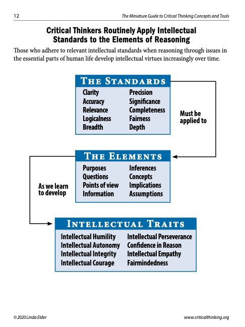
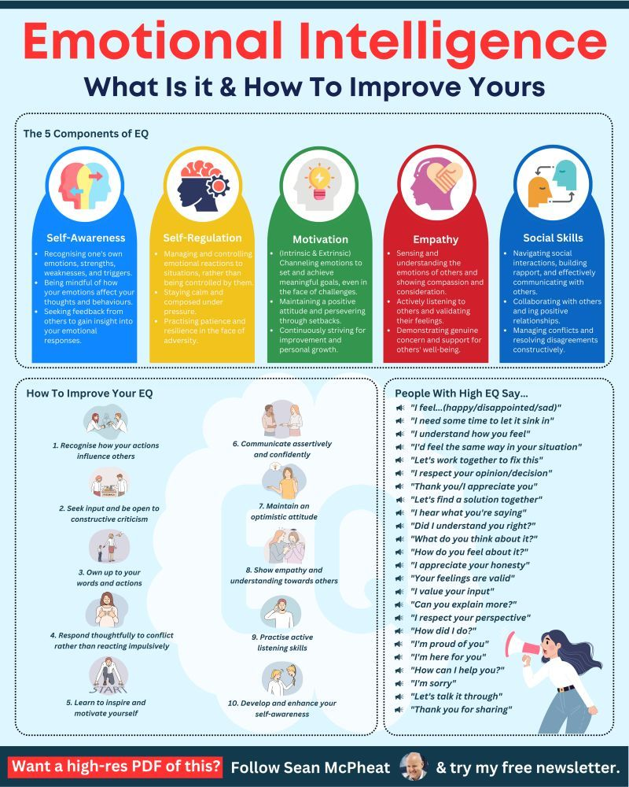

It's an interesting premise to explore the relationship between impulsivity, intelligence, and reactions to anger triggers like "ragebait." Let's break down what research suggests:

### Impulsivity and IQ/Intelligence

Generally, research indicates an **inverse relationship between impulsivity and intelligence**. This means that higher impulsivity tends to be associated with lower intelligence, particularly in areas related to crystallized intelligence (accumulated knowledge and skills).

- Studies have found a negative correlation between impulsivity and academic achievement.

- Impulsivity may act as a moderator between intellectual resources and achievements, meaning that even individuals with high intellectual capacity may perform worse academically if they have high levels of impulsivity.

- Some research suggests that children classified as impulsive tend to score lower on IQ tests.

- However, it's also important to note that the relationship isn't always straightforward or universally strong across all measures of impulsivity and intelligence. Some studies, particularly with high IQ individuals, have not found significant differences in IQ scores between "fast accurates" and "impulsives" (fast inaccurates), suggesting the distinction may be less useful in very high IQ ranges.

### Intelligence and Emotional Regulation (Anger Triggers, Ragebait)

While intellectual intelligence (IQ) and emotional intelligence are distinct, they often interact.

- **Emotional Intelligence (EQ)** plays a significant role in how individuals manage anger and react to provocations like "ragebait." EQ encompasses self-awareness, self-regulation, motivation, empathy, and social skills.

- **Self-regulation**, a core component of emotional intelligence, is crucial for managing emotional responses. Individuals with higher emotional intelligence are generally better at controlling their impulses and moods, allowing them to pause and think before reacting.

- **Ragebait** is deliberately designed to trigger strong emotional reactions, usually anger or outrage, to generate engagement (clicks, comments, shares), control narratives, or distract from other issues. People who fall for ragebait often react impulsively, feeding into the baiter's agenda.

- **Emotionally intelligent individuals** are better equipped to navigate ragebait and anger triggers by:

  - **Recognizing emotional triggers:** They are self-aware of what makes them angry.

  - **Practicing emotional regulation:** They use strategies like deep breathing, stepping away, or cognitive restructuring (changing the way they think about the situation) to keep anger in check.

  - **Choosing their battles:** They understand that not every provocation is worth their energy or a direct response.

  - **Maintaining composure:** They choose to remain calm, composed, and in control rather than lashing out.

  - **Focusing on solutions:** They may try to redirect conversations toward constructive outcomes.

  - **Setting boundaries:** They clearly define what they will and will not tolerate.

### Smart People and Insults

The idea that "smart people won't react to insults" aligns with the concept of emotional intelligence, rather than strictly intellectual intelligence. While a high IQ might allow someone to understand the mechanics of an insult or its potential intent, it doesn't automatically confer the emotional regulation skills to *not react*.

- **Emotionally intelligent people** tend to respond to insults with composure, not anger. They prioritize maintaining their self-respect and dignity by choosing a measured and thoughtful response, or no response at all, rather than reacting impulsively.

- They may also employ empathy to consider the other person's motivations for delivering the insult, which can help defuse the situation.

- They understand that reacting with anger often leads to poor decision-making and escalates conflict, and that controlling their response is a way to protect their power and peace.

In summary, while impulsivity has an inverse relationship with intellectual intelligence, the ability to effectively manage anger, ragebait, and insults is more directly linked to **emotional intelligence**. Highly emotionally intelligent individuals, regardless of their IQ, are better at regulating their emotions and choosing considered responses over impulsive reactions.

**Crystallized intelligence** refers to the ability to use knowledge, experience, and skills acquired over time to solve problems and make decisions. It involves applying learned information and is typically associated with vocabulary, general knowledge, and expertise.

**Fluid intelligence** is the capacity to reason quickly and think abstractly, enabling individuals to solve novel problems without relying on prior knowledge. It involves logical thinking, pattern recognition, and adaptability in unfamiliar situations.

## Impulsivity

Impulsivity is a multifaceted construct, encompassing **motor impulsivity** (difficulty suppressing actions), **cognitive impulsivity** (lack of planning and attention), and choice impulsivity (preference for immediate gratification). These are linked to specific brain regions like the prefrontal cortex, basal ganglia, and amygdala, and neurotransmitter systems such as dopamine and serotonin.

impulsivity as a complex construct, encompassing suboptimal temporal decision-making, a strong preference for immediate rewards (temporal discounting), and difficulties in suppressing inappropriate motor responses.

**motor impulsivity**' (inability to withhold action) and 'choice impulsivity' (preference for immediate rewards, also known as temporal discounting).

Intelligence is defined as a general mental ability for reasoning, problem-solving, and learning, with distinctions made between fluid intelligence (novel problem-solving), crystallized intelligence (applying learned knowledge), and emotional intelligence (managing emotions).

## Impulsivity and Intelligence

Impulse control is understood as a tendency to act without sufficient forethought, encompassing motor impulsivity (difficulty suppressing actions) and cognitive/choice impulsivity (difficulty with planning, attention, and delaying gratification). Key brain regions involved include the prefrontal cortex, basal ganglia, and amygdala, with dopamine and serotonin systems also playing a role. For intelligence, I've identified it as a general mental ability for reasoning, problem-solving, and learning, integrating various cognitive functions. I've also distinguished between fluid intelligence (novel problem-solving, quick reasoning, linked to prefrontal cortex and working memory) and crystallized intelligence (applying learned knowledge, linked to long-term memory).

empirical relationships between impulsivity and intelligence. There appears to be a general inverse relationship, particularly with crystallized intelligence, where higher impulsivity correlates with lower scores. Impulsivity may also act as a moderator, influencing the link between intellectual resources and academic achievement. For instance, high impulsivity in adolescents has been linked to increased academic failure. While the relationship with fluid intelligence is somewhat mixed, some studies suggest a negative correlation, with lower delay discounting (less impulsivity) being associated with higher fluid intelligence and executive functions.

The ability to perceive emotions negatively correlates with impulsivity, and higher emotional intelligence is associated with less impulsive buying behavior. studies that employ diverse measures of impulsivity (e.g., behavioral tasks like Go/No-Go, Stop-Signal Task, Delay Discounting) and intelligence. My aim is to clarify the somewhat mixed findings regarding fluid intelligence and to delve deeper into the complex and potentially counter-intuitive aspects of the relationship with emotional intelligence.
