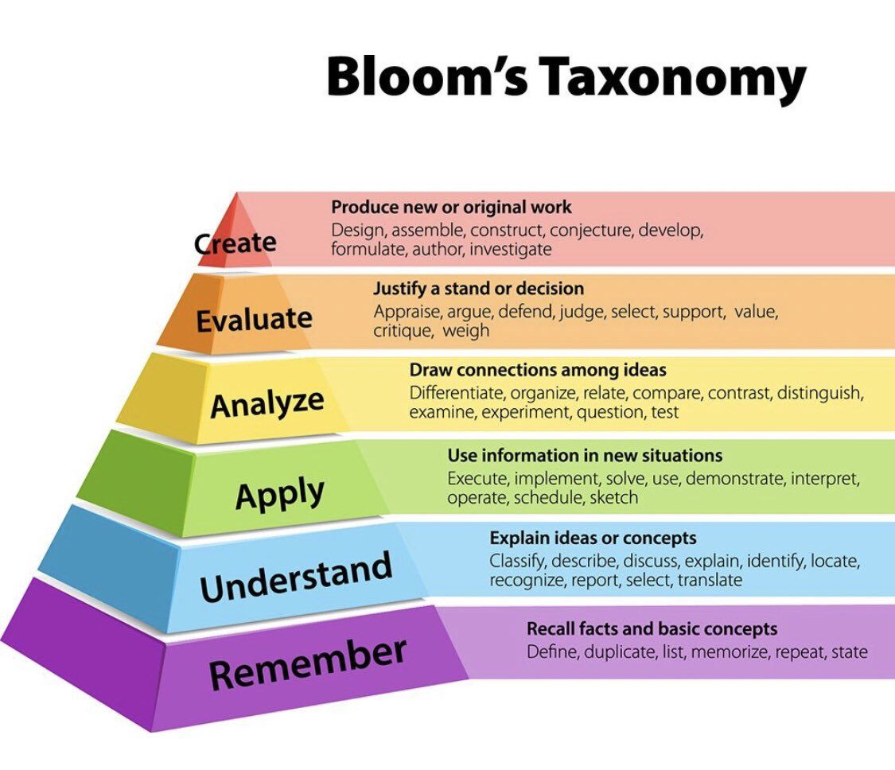

# Learning

## Reading

**Learning and Conditioning:** **Classical** and **operant conditioning** are two types of learning that influence our behaviors. **Classical conditioning** involves associating a stimulus with a response, while **operant conditioning** involves learning through rewards and punishments.

## Learning Styles Categories

Learning styles such as auditory, visual, and kinesthetic are commonly discussed in educational contexts, although recent research has cast doubt on their effectiveness. Here’s a breakdown of each learning style and how they are typically described:

* **Auditory Learners**: These individuals learn best through hearing and listening. They might benefit from lectures, discussions, and audio recordings. Auditory learners often remember information by repeating it aloud or explaining concepts to themselves. They can be easily distracted by visual stimuli but are less affected by auditory distractions.

* **Visual Learners**: Visual learners absorb information primarily through sight. They excel with visual aids like diagrams, charts, and videos. They often take detailed notes and prefer to see information presented in a structured format. Visual learners may struggle with lengthy auditory presentations and prefer to see the information they are learning.

* **Kinesthetic Learners**: Also known as tactile learners, these individuals learn best through physical activity and hands-on experiences. They benefit from practical activities such as building models, role-playing, and experiments. Kinesthetic learners often need to move around or use their hands to understand and remember information.

Recent studies have shown that while people may have preferences for these learning styles, there is little evidence to suggest that tailoring lessons specifically to match a particular learning style significantly improves learning outcomes. Instead, a blended approach that incorporates various methods is often recommended to cater to diverse learning needs.

