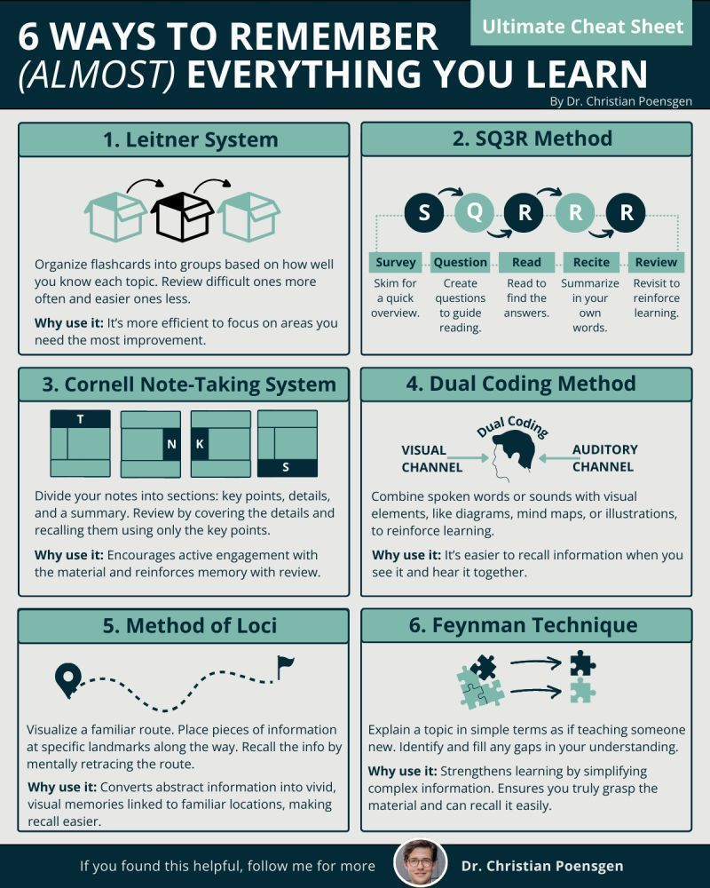

# Memory

Human memory is a complex neurobiological process involving the encoding, storage, and retrieval of information. It relies on intricate networks of neurons, synaptic plasticity, and various brain regions, primarily the hippocampus, prefrontal cortex, and amygdala.

## Stages of Memory

1. **Encoding**  
    Transformation of sensory input into a form that can be stored.

2. **Storage**  
    Maintenance of encoded information over time, involving both short-term and long-term memory systems.

3. **Retrieval**  
    Accessing stored information when needed.

---

## Age, Brain Maturity, and Decline

- **Childhood & Adolescence:**  
  Memory capacity and efficiency increase as the brain matures, with synaptic pruning and myelination enhancing neural processing.

- **Adulthood:**  
  Peak memory performance is typically reached in early adulthood.

- **Aging:**  
  Gradual decline in memory function is common, especially in episodic and working memory, due to neuronal loss, reduced synaptic plasticity, and changes in neurotransmitter levels.

---

## Long-Term Effects of Smoking and Alcohol

- **Smoking:**  
  - Chronic exposure to nicotine and other toxins impairs neurogenesis and synaptic plasticity.
  - Associated with increased risk of cognitive decline and dementia.

- **Alcohol:**  
  - Excessive, long-term consumption leads to neurotoxicity, particularly in the hippocampus.
  - Can cause persistent memory deficits and increase the risk of Wernicke-Korsakoff syndrome.

---

## Memory Consolidation, Dreams, and Cannabis

- **Memory Consolidation in Dreams:**  
  During sleep, especially REM stages, the brain consolidates memories by reactivating and reorganizing neural circuits. Dreaming is thought to facilitate this process.

- **Cannabis (Weed) Interference:**  
  THC, the psychoactive component of cannabis, disrupts REM sleep and impairs memory consolidation. Chronic use is linked to deficits in learning and long-term memory formation.

