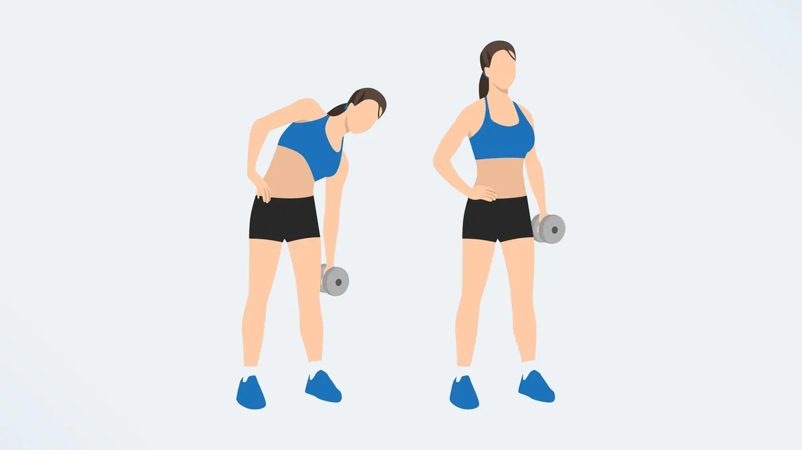
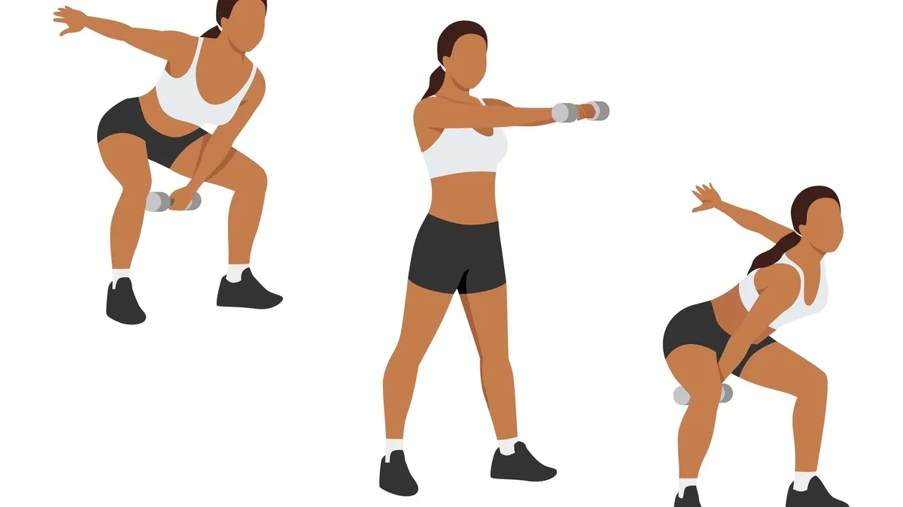

# Dumbbell

## Squats

1. 

Keeping your chest tall and core tight, hold a pair of dumbbells and throw your hips back, then pop your hips forward and clean the weight up to your shoulders. Squat down until your hips are parallel to the floor, then drive through the heels and explode up. Use the momentum of the squat to press the weight up, then lower it back down to starting position before performing another rep.

## Biceps curl

## Floor chest press

## FLYs

## Abs

### Wood Chop

- standing twists
- russian twists

### Side Bend

- Obliques

### Crunch

## Butterfly sit-ups

Butterfly sit-ups remove your hips from the equation, fully loading your ab muscles during the exercise. Sit-ups target the rectus abdominis, transverse abdominis, and internal and external obliques, making the move a total ab attack. Having a wall in front of you helps support your feet and forces you to reach forward at the top, achieving a fuller range of motion.

## seated windshield wipers

## Farmer's Walk

