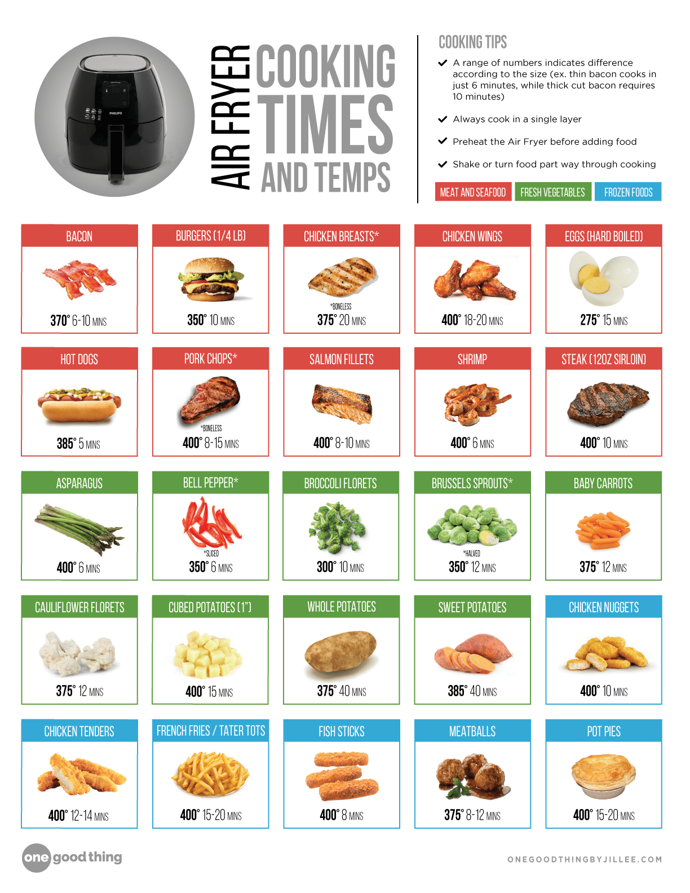

## Bathroom

### Toilet

[pubmed Microbial Biogeography of Public Restroom Surfaces](https://pmc.ncbi.nlm.nih.gov/articles/PMC3223236/)

## Toilet Cleaning Frequency by Occupancy

The frequency of cleaning a toilet depends on various factors, including the number of users, usage patterns, and personal hygiene habits. From a scientific perspective, toilets can harbor a significant amount of microbes, germs, and bacteria, which can spread illnesses and infections.

**Single Person with No Guests:**

* For a single person with no guests, the toilet can be cleaned once a week, focusing on the seat, lid, handle, and bowl.
* However, if the individual has a weakened immune system or is prone to illnesses, it's recommended to clean the toilet every 3-4 days to minimize the risk of infection.

**Family or Roommates with Multiple Users:**

* For households with multiple users, the toilet should be cleaned more frequently, ideally every 2-3 days.
* This is because the increased usage and potential for cross-contamination among family members or roommates can lead to a higher risk of illness transmission.
* Additionally, if there are young children or pets in the household, it's recommended to clean the toilet daily, as they may be more prone to touching the toilet handle or seat and then putting their hands in their mouths.

**Key Areas to Focus on:**

* Toilet seat and lid: These areas should be cleaned with a disinfectant after each use, especially if there are multiple users.
* Toilet handle: The handle should be cleaned daily, as it's a high-touch area that can harbor bacteria and viruses.
* Toilet bowl: The bowl should be cleaned every 2-3 days, or as needed, to prevent the buildup of bacteria and mineral deposits.

**Additional Tips:**

* Always wear gloves when cleaning the toilet to prevent the spread of bacteria and viruses.
* Use a disinfectant that's effective against a broad spectrum of microbes, including bacteria, viruses, and fungi.
* Regularly cleaning the toilet can help reduce the risk of illness transmission and maintain a healthy environment.

By following these guidelines, individuals can help maintain a clean and hygienic toilet, reducing the risk of illness transmission and promoting a healthy environment.

## Bed

### Pillow

Pillow Life Expectancy and Hygiene

**Pillow Hygiene and Lifespan: When to Replace Cheap Pillows Due to Microbes**

Cheap pillows can harbor a variety of microorganisms, including bacteria, fungi, and dust mites, which can exacerbate allergies and respiratory issues. The lifespan of a cheap pillow depends on factors such as material, usage, and maintenance. Here are some guidelines:

1. **Material:** Pillows filled with synthetic materials like polyester or foam tend to have a shorter lifespan (1-2 years) due to their porous nature, making it easier for microorganisms to penetrate and accumulate.
2. **Usage:** Pillows used frequently or by multiple people may need to be replaced more often (every 1-2 years) due to increased exposure to sweat, saliva, and skin cells.
3. **Maintenance:** Regular cleaning and drying can extend the lifespan of a pillow. However, if you notice:

* Odors or stains that persist after cleaning
* Lumps or flat spots
* Allergic reactions or respiratory issues
* Visible signs of mold or mildew

it's likely time to replace the pillow.

**Signs to Throw Out a Cheap Pillow:**

1. **Dust mites:** If you notice a significant amount of dust or debris accumulating on the pillow, it may be infested with dust mites.
2. **Mold or mildew:** Visible growth or a musty smell indicates the presence of mold or mildew, which can exacerbate allergies and respiratory issues.
3. **Bacterial growth:** If you notice an unusual odor or staining that persists after cleaning, it may indicate bacterial growth.
4. **Fungal growth:** Fungal hyphae or spores can cause allergic reactions and respiratory issues.

**Recommendations:**

1. **Replace pillows every 1-2 years** for synthetic-filled pillows or those used frequently.
2. **Wash pillowcases regularly** in hot water (at least 130°F) to reduce microbial growth.
3. **Dry pillows properly** after washing or cleaning to prevent moisture buildup.
4. **Use a pillow protector** to create a barrier between the pillow and your skin, reducing exposure to allergens and microorganisms.
5. **Consider upgrading to a higher-quality pillow** made from breathable, hypoallergenic materials like natural latex or bamboo.

Remember, even with proper maintenance, cheap pillows may not provide adequate support or hygiene. If you experience persistent discomfort, allergies, or respiratory issues, consider replacing your pillow with a higher-quality option.

[cleaning life hacks](https://www.instagram.com/reel/C1u7XH_L10k/)

## Ultrasonic Cleaning

## Heated carpet steam cleaners

Heated carpet steam cleaners offer significant advantages over non-heated ones due to several scientific principles:

* **Increased Molecular Activity and Chemical Effectiveness:** Heat increases the kinetic energy of water molecules, making them more active. This enhanced molecular activity helps to break down dirt, grease, and grime more effectively. Cleaning solutions also become more potent at higher temperatures, allowing them to penetrate carpet fibers and react with soils more efficiently. This often means you can use less cleaning solution for better results.

* **Loosening of Dirt and Stains:** Just like hot water is more effective for washing dishes, heated water or steam helps to loosen the physical bond between dirt, oils, and stains and the carpet fibers. The heat helps to "melt" or soften sticky residues and break down oily substances, making them easier to extract.

* **Improved Sanitization:** The high temperature of steam (which is often what heated carpet cleaners produce, or at least very hot water) is excellent for killing bacteria, dust mites, allergens, and other microorganisms that can thrive in carpets. This provides a more hygienic clean, which is especially beneficial for households with pets, children, or allergy sufferers.

* **Faster Drying Times:** While it might seem counterintuitive, using hotter water can actually lead to faster drying times. The increased heat promotes quicker evaporation of the moisture from the carpet. This is crucial for preventing the growth of mold and mildew, which thrive in damp environments, and also reduces the downtime before you can walk on or replace furniture on your carpet.

* **Restoration of Carpet Texture:** Heated cleaning can help to "fluff up" and restore the original loft and resilience of carpet fibers, making them appear refreshed and more vibrant.

**In summary, the addition of heat in carpet cleaning enhances the cleaning process by:**

* **More effectively dissolving and lifting embedded dirt and oils.**
* **Improving the performance of cleaning agents.**
* **Providing sanitizing benefits.**
* **Contributing to faster drying.**

While unheated carpet cleaners can still provide a basic clean, heated models offer a deeper, more effective, and more hygienic solution for maintaining your carpets.

## Kitchen

* Soda-lime glass is used in everything from jars to windows. It's the most common type of glass produced.
* Borosilicate glass is a type of glass that is able to heat and cool rapidly without breaking. It has many applications, but for home use you're probably most familiar with it as bakeware, such as the old Pyrex baking dish your mom used to use.

### non stick pans

made after 2013 are made without polytetrafluoroethylene (PTFE) and perfluorooctanoic acid (PFOA), also known as C8.

**PFAS** (Per- and Polyfluoroalkyl Substances) accumulates in your body and can stay around for a while. Which means your levels can keep rising even if you are not exposed to a lot of PFAS at one time. Simply because you keep adding PFAS with every exposure and your body is not flushing them out.

### air fryers

* Teflon

PFAS (Per- and Polyfluoroalkyl Substances) are chemicals used in non-stick coatings, waterproofing, and other applications. Some kitchen appliances, including air fryers, may contain PFAS. Here's a breakdown of general categories and specific air fryer brands:

### Best Buy Disclosure

**General Categories:**

1. **Non-stick cookware**: Many non-stick pans and cookware sets contain PFAS.
2. **Small kitchen appliances**: Some air fryers, toaster ovens, and slow cookers may have PFAS-coated surfaces.
3. **Cookware and bakeware**: Some stainless steel cookware and bakeware may contain PFAS.

**Air Fryer Brands with PFAS:**

Based on available information, some air fryer brands may contain PFAS:

1. **Cosori**: Although Cosori claims to be PFAS-free, some models may still contain these chemicals. It's essential to verify the specific model and manufacturer's statement.
2. **Black+Decker**: Some Black+Decker air fryer models may contain PFAS.

**Air Fryer Brands without PFAS:**

Based on available information, some air fryer brands are PFAS-free:

1. **KitchenAid**: KitchenAid's air fryer products are designed without PFAS.
2. **Our Place**: Our Place's Wonder Oven air fryer is certified PFAS-free.
3. **Other brands**: Some smaller, niche brands, like Sustainably Chic's top 9 non-toxic air fryers, prioritize PFAS-free materials.
4. Ninja

**What to Look for in Product Descriptions:**

When searching for air fryers on Amazon or Temu, pay attention to the following:

1. **Material descriptions**: Look for phrases like "PFAS-free," "non-toxic," or "eco-friendly" in the product description.
2. **Certifications**: Check for certifications like Greenguard Gold, CertiPUR-US, or Oeko-Tex, which indicate compliance with stricter chemical standards.
3. **Manufacturer statements**: Verify the manufacturer's claims about PFAS-free materials and coatings.
4. **Customer reviews**: Read customer reviews and look for comments about non-stick coatings, durability, and any potential health concerns.

**Tips for Safe Air Fryer Use:**

1. Always follow the manufacturer's cleaning and maintenance instructions to minimize exposure to potential chemicals.
2. Avoid using abrasive cleaners or scouring pads, which can damage non-stick coatings and release particles into the air.
3. Keep your air fryer clean and well-maintained to reduce the risk of chemical leaching.

Remember that even PFAS-free air fryers may still contain other chemicals or materials that could potentially cause health concerns. Always prioritize proper use and maintenance to minimize exposure.

## Coffee Filters' Leaching Effects

Based on the provided search results, here's a summary of the findings:

1. **Paper filters:** Some studies suggest that paper filters, particularly those from third-world countries or China, may contain chemicals like formaldehyde, which can leach into coffee. However, the extent of this leaching is unclear, and more research is needed to confirm the risks.
2. **Micro-plastics:** The use of paper filters can also contribute to micro-plastic pollution in the environment, as the filters can break down into smaller particles. However, this is more of an environmental concern than a direct health risk to consumers.
3. **Chemex natural coffee filters:** A study tested Chemex natural coffee filters for PFAS (per- and polyfluoroalkyl substances) and found no indications of PFAS contamination. However, it's essential to note that this study only tested one specific brand and type of filter.
4. **Plastic containers:** Research has shown that fluorinated high-density polyethylene (HDPE) plastic containers, used for household cleaners, pesticides, and personal care products, can leach PFAS into food and solvents. While not directly related to coffee filters, this finding highlights the potential for PFAS contamination in plastic products.
5. **Coffee maker plastics:** A study mentioned that plastics used in coffee makers can contain potentially dangerous chemicals, including BPA and PFAS. However, the study emphasized that the risk is low, as long as the coffee maker is not damaged or exposed to boiling water for extended periods.

In summary, while some studies suggest that plastics used in coffee filters or strainers may leach chemicals, including PFAS, the evidence is limited and inconclusive. More research is needed to fully understand the risks associated with specific types of coffee filters and strainers.

**Recommendations:**

1. Choose paper filters from reputable sources, such as those from Europe or the United States, which may have stricter regulations and testing for chemicals like formaldehyde.
2. Consider switching to metal or mesh filters, which can reduce the risk of chemical leaching and micro-plastic pollution.
3. Opt for reusable filters made from stainless steel or glass, which eliminate the need for disposable filters and reduce plastic waste.
4. When purchasing coffee makers, look for models with BPA-free and PFAS-free plastics, and ensure that the manufacturer has implemented safe manufacturing practices.

**Future research directions:**

1. Conduct comprehensive testing of various coffee filters and strainers for PFAS and other chemicals.
2. Investigate the potential for micro-plastic pollution from coffee filters and strainers.
3. Study the effects of different brewing methods and temperatures on chemical leaching from coffee filters and strainers.
4. Evaluate the environmental and health impacts of different coffee filter and strainer materials and manufacturing processes.
