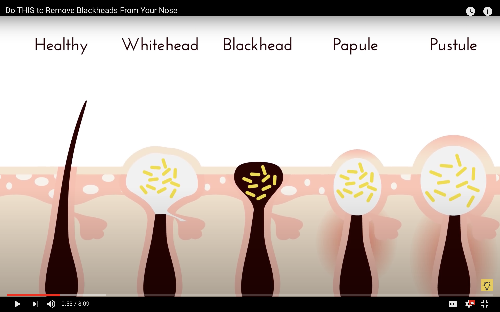

# Skin / Dermatology

## Pimples

 

## Skin care routine

Keep skin moist. Stay away from taking long, hot showers or baths. Limit them to 5 to 10 minutes and use warm water, not hot. If your skin is often dry, think about washing with soaps that are labeled fragrance-free.

### Does Ice Help Pimples?

Rubbing ice on your face can help with pimples by reducing redness, swelling, and pain, particularly in inflammatory-type pimples such as pustules and cysts The cold temperature from the ice causes blood vessels to constrict, which can help minimize the appearance of pores and reduce inflammation However, it is important to use the right technique to avoid damaging your skin. You should cleanse your face first and then wrap the ice in a clean, thin fabric before applying it to your face for 1-2 minutes at a time Avoid direct contact with the skin to prevent frostbite, ice burns, and other skin irritations

While ice can provide temporary relief and benefits for your skin, it is not a permanent solution for acne and breakouts. A comprehensive skincare regimen is necessary to manage acne effectively If you are unsure about how your skin will react to ice, consult a dermatologist before trying this method

- hot showers
- Nutrient Deficiencies

### Aztec Clay

## Dry Skin Causes

- [vitamin A](https://www.medicalnewstoday.com/articles/219486)
- [vitamin C](https://www.medicalnewstoday.com/articles/219352)
- [vitamin D](https://www.medicalnewstoday.com/articles/161618)
- [vitamin E](https://www.medicalnewstoday.com/articles/vitamin-e)
- [zinc](https://www.medicalnewstoday.com/articles/263176)
- [selenium](https://www.medicalnewstoday.com/articles/287842)

### tea tree oil

Tea tree oil
White toothpaste
Acne stickers

3 steps
Toner

### Hyaluronic Acid

1. Exfoliating Scrub
2. Charcoal cleanser

## dermatitis

## Best Foods for Healthy Skin

1. **Fatty Fish**: Rich in omega-3 fatty acids, which help keep skin moisturized and reduce inflammation.

2. **Avocados**: High in healthy fats and vitamins E and C, avocados improve skin elasticity and protect against oxidative damage.

3. **Walnuts**: A good source of essential fatty acids and antioxidants, walnuts help reduce inflammation.

4. **Sunflower Seeds**: Packed with healthy fats and vitamin E, sunflower seeds support skin health and may lower inflammation.

5. **Sweet Potatoes**: High in beta carotene, which converts to vitamin A, sweet potatoes help protect skin from sun damage.

6. **Red or Yellow Bell Peppers**: Excellent sources of beta carotene and vitamin C, essential for collagen production and skin health.

7. **Broccoli**: Contains vitamins A, C, and K, as well as sulforaphane, which offers protection against sun damage.

8. **Tomatoes**: Rich in vitamin C and lycopene, tomatoes help protect skin from UV damage and improve overall skin health.

9. **Dark Chocolate**: High in antioxidants, dark chocolate can improve skin hydration and reduce sensitivity to sunburn.

10. **Green Tea**: Contains catechins that protect against sun damage and improve skin health.

11. **Red Grapes**: Rich in resveratrol, red grapes may help slow skin aging and protect against free radical damage.

Overall, a diet rich in these foods can significantly benefit skin health, providing essential nutrients and antioxidants that combat aging and environmental damage.

## Diet and Acne Connection

Acne and pimples are influenced by diet, particularly foods high in glycemic index, dairy, and certain types of meat. Foods with a high glycemic index, such as white bread, white rice, and cake, can increase blood sugar levels, leading to higher insulin production. This hormonal change can boost oil production in the skin, contributing to acne

Chocolate, especially those with high sugar content, has also been linked to increased acne severity. However, the exact reason is not clear, and it might not be due to cocoa itself

Dairy products, particularly milk and ice cream, have been shown to exacerbate acne in certain populations, especially adolescents  The hormones and antibiotics found in dairy products can disrupt the body's hormone balance, leading to stress and breakouts.

Processed meats and red meats, such as chicken and mutton, can increase sebum production, which can contribute to acne  These meats contain the amino acid leucine, which can also increase sebum production, similar to high glycemic foods

Foods rich in Omega-6 fats, such as cornflakes and soybean oil, are known to increase the risk of acne due to their inflammatory nature

In summary, foods that can increase the problem of acne and pimples include high glycemic index foods, dairy products, processed meats, red meats, and foods rich in Omega-6 fats

Acne and pimples are influenced by various factors, including diet. Research indicates that certain foods can exacerbate acne in some individuals. In an omnivore Indian diet, foods high in glycemic load and dairy products are commonly associated with increased acne severity.

Foods with a high glycemic load cause rapid spikes in blood sugar levels, leading to increased insulin production. This can stimulate the production of sebum, a substance in the skin that can contribute to acne. Examples of such foods include white bread, corn flakes, puffed rice, potato chips, white potatoes or fries, doughnuts, pastries, sugary drinks like milkshakes, and white rice

Dairy products, particularly those high in fat like cheese, full-fat yogurt, and ice cream, are also linked to acne. Cow's milk contains amino acids that can stimulate the liver to produce more insulin-like growth factor 1 (IGF-1), which is associated with acne development

Additionally, foods loaded with refined grains such as bread, white pasta, cereals, and maida noodles are said to trigger acne

While these dietary factors can contribute to acne, it is important to note that genetics and hormonal influences also play significant roles in the development of acne
