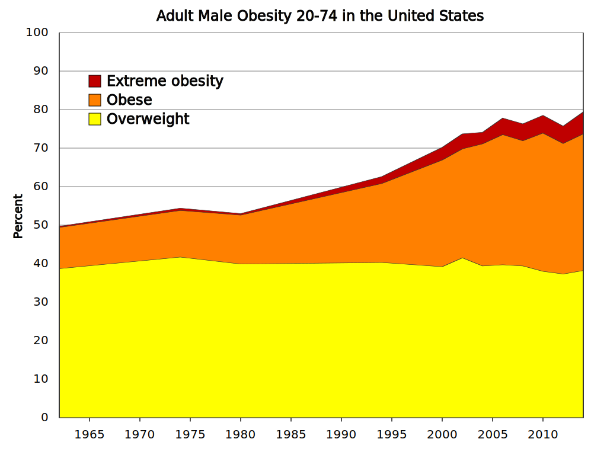

# Obesity

[NIDDK](https://www.niddk.nih.gov/health-information/health-statistics/overweight-obesity)

## BMI of Adults Ages 20 and Older

| BMI | Classification |
| --- |  --- |
| 18.5 to 24.9 | Normal, or healthy, weight |
| 25 to 29.9 | Overweight |
| 30+ | Obesity (including severe obesity) |
| 40+ | Severe obesity |

the estimated population of the United States for ages 20-74 is approximately 156 million.

| Weight Category | Percent | Estimated Population |
| --- | --- | --- |
| Obese | 42.4% | 66,142,400 |
| **Overweight** | 73.6% | 114,649,600 |

## Children and Adolescents (ages 2-19)

- **Obese**: According to the Centers for Disease Control and Prevention (CDC), in 2021-2023, approximately 18.5% of children and adolescents (ages 2-19) were obese. (Source: CDC, National Health and Nutrition Examination Survey, 2021-2023)

## Prediabetes

2019-2020, approximately 34.6% of adults (ages 20 and over) had prediabetes.

## how sugary diets can lead to fat storage:

- **Excess Sugar Intake:** When you consume more sugar than your body needs for immediate energy, it has to find a way to store the excess.
- **Glycogen Storage:** Initially, the body stores excess sugar as glycogen in the liver and muscles. However, these storage capacities are limited.
- **Lipogenesis:** Once glycogen stores are full, the liver converts excess sugar into fatty acids through a process called lipogenesis.
- **Fat Storage:** These fatty acids are then packaged into triglycerides and stored in fat cells (adipocytes) throughout the body.

**Factors that contribute:**

- **High Sugar Intake:** Consuming large amounts of added sugar, especially from sugary drinks, processed foods, and desserts, significantly increases the risk of fat storage.
- **Insulin Resistance:** Frequent high sugar intake can lead to insulin resistance, where cells become less responsive to insulin. This impairs glucose uptake and promotes fat storage.
- **Lack of Physical Activity:** When you don't burn off excess calories through physical activity, the likelihood of sugar being converted to fat increases.

**Important Note:** This is a simplified explanation. The relationship between sugar and fat storage is complex and influenced by various factors, including genetics, hormones, and overall diet and lifestyle.
