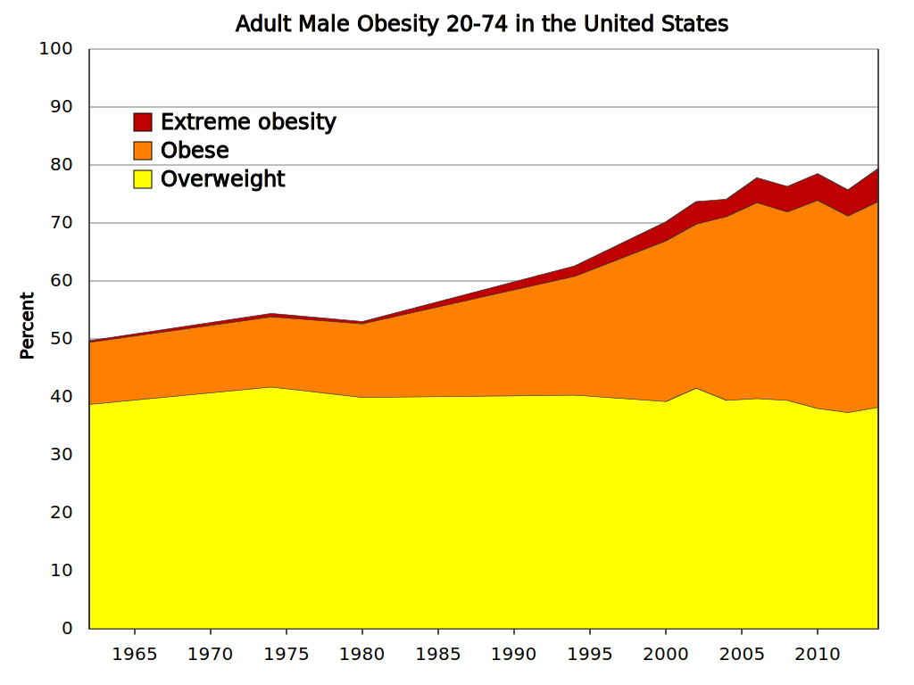

# Obesity

[NIDDK](https://www.niddk.nih.gov/health-information/health-statistics/overweight-obesity)

## BMI of Adults Ages 20 and Older

| BMI | Classification |
| --- |  --- |
| 18.5 to 24.9 | Normal, or healthy, weight |
| 25 to 29.9 | Overweight |
| 30+ | Obesity (including severe obesity) |
| 40+ | Severe obesity |

the estimated population of the United States for ages 20-74 is approximately 156 million.

## Body Fat Percentage

| Weight Category | Percent | Estimated Population |
| --- | --- | --- |
| Obese | 42.4% | 66,142,400 |
| **Overweight** | 73.6% | 114,649,600 |

## Children and Adolescents (ages 2-19)

- **Obese**: According to the Centers for Disease Control and Prevention (CDC), in 2021-2023, approximately 18.5% of children and adolescents (ages 2-19) were obese. (Source: CDC, National Health and Nutrition Examination Survey, 2021-2023)

## Prediabetes

2019-2020, approximately 34.6% of adults (ages 20 and over) had prediabetes.

## how sugary diets can lead to fat storage:

- **Excess Sugar Intake:** When you consume more sugar than your body needs for immediate energy, it has to find a way to store the excess.
- **Glycogen Storage:** Initially, the body stores excess sugar as glycogen in the liver and muscles. However, these storage capacities are limited.
- **Lipogenesis:** Once glycogen stores are full, the liver converts excess sugar into fatty acids through a process called lipogenesis.
- **Fat Storage:** These fatty acids are then packaged into triglycerides and stored in fat cells (adipocytes) throughout the body.

**Factors that contribute:**

- **High Sugar Intake:** Consuming large amounts of added sugar, especially from sugary drinks, processed foods, and desserts, significantly increases the risk of fat storage.
- **Insulin Resistance:** Frequent high sugar intake can lead to insulin resistance, where cells become less responsive to insulin. This impairs glucose uptake and promotes fat storage.
- **Lack of Physical Activity:** When you don't burn off excess calories through physical activity, the likelihood of sugar being converted to fat increases.

**Important Note:** This is a simplified explanation. The relationship between sugar and fat storage is complex and influenced by various factors, including genetics, hormones, and overall diet and lifestyle.

## don't blame genetics that you're fat

1. **Genetic variation**: Research suggests that multiple genetic variants contribute to body shape and composition. For example, studies have identified genetic associations with body mass index (BMI), waist circumference, and percentage of body fat.
2. **Genetic pathways**: Genetic variants can influence the expression of genes involved in metabolism, energy homeostasis, and fat storage. For instance, variants in genes like FTO, MC4R, and PPARG2 have been linked to obesity and body composition.
3. **Epigenetic modifications**: Epigenetic changes, such as DNA methylation and histone modification, can also impact gene expression and influence body composition. For example, epigenetic marks on genes involved in fat metabolism can affect the development of obesity.

**Neuroscience Perspective**

Neurobiological factors also play a crucial role in shaping body composition and influencing the ectomorph, mesomorph, and endomorph phenotypes.

1. **Hormonal regulation**: Hormones like leptin, ghrelin, and insulin regulate energy balance, appetite, and metabolism. Imbalances or variations in these hormonal systems can contribute to differences in body composition.
2. **Brain-body interactions**: The brain's reward system, stress response, and cognitive processes all influence food intake and physical activity patterns, which in turn affect body composition.
3. **Neurotransmitters**: Neurotransmitters like dopamine, serotonin, and norepinephrine modulate appetite, satiety, and motivation, which can impact eating habits and exercise behaviors.

**Integration of Genetic and Neuroscientific Perspectives**

1. **Complex interactions**: Genetic and neuroscientific factors interact and influence each other, making it challenging to pinpoint a single "ectomorph" or "mesomorph" gene. Instead, a polygenic architecture, with multiple genetic variants and epigenetic modifications, contributes to individual differences in body composition.
2. **Environmental influences**: Lifestyle factors, such as diet, exercise, and stress levels, can also shape body composition and interact with genetic and neurobiological predispositions.
3. **Interindividual variability**: The ectomorph, mesomorph, and endomorph categories are not strict or mutually exclusive. Individuals may exhibit characteristics from multiple categories, and their body composition can change over time in response to environmental and lifestyle factors.

In conclusion, while the concept of ectomorph, mesomorph, and endomorph body types remains useful for understanding general patterns in body composition, a more accurate understanding incorporates the complex interplay between genetic, epigenetic, and neurobiological factors. This perspective acknowledges the variability and plasticity of human body composition, influenced by both genetic predispositions and environmental factors.
