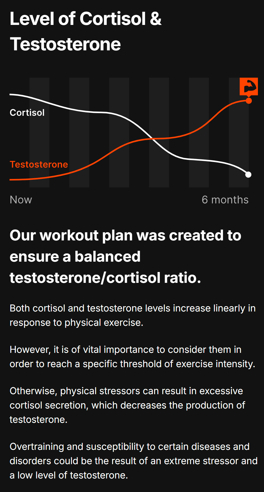

# Fitness, Diet, Health

- **Counting backwards**: Start counting down from a high number during reps to focus on the contraction and avoid losing count.
- **Plyometrics**: Incorporate explosive movements (e.g., jump squats) before lower-body workouts to improve power.
- **Med ball throws**: Use medicine balls for dynamic movements (e.g., rotational throws) before upper-body workouts to enhance engagement.
- **Focus on muscle contractions**: Concentrate on specific muscle contractions to make workouts more effective.

<https://madmuscles.com/step-goal>

